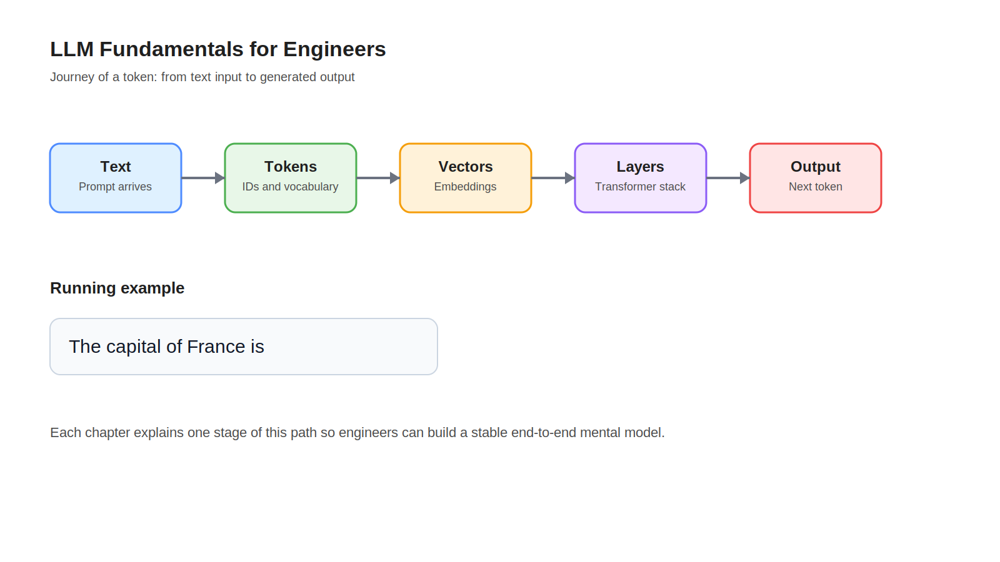

# Course Overview

## Learning Objectives

- Understand what this course covers and what it intentionally leaves out.
- See how the chapters connect through the journey of a token.
- Build a mental model for how text becomes tokens, hidden states, and generated output.

## Key Concepts

- Engineering-first LLM education
- Journey of a token
- Running example: `The capital of France is`
- Book-style learning path

## Diagram

## Explanation

This course teaches how an LLM works from the perspective of an engineer who operates complex systems, not from the perspective of a researcher proving new theory.

The core teaching device is the journey of a token. We start with a plain text string, split it into tokens, convert those tokens into vectors, move those vectors through transformer layers, train the model to predict the next token, and finally run inference efficiently using prefill, decode, and KV cache.

The running example `The capital of France is` stays with us across the course. That consistency matters. It lets readers focus on what changes at each stage of the system rather than repeatedly learning new examples.

This course does not try to cover infrastructure scale-out topics such as tensor parallelism or distributed inference. Those topics are real and important, but they are easier to learn after the fundamentals are stable.

## Example

If you already understand how a Kubernetes scheduler moves work through a system, think of this course in a similar way. We are tracing a unit of work, not studying every possible implementation detail at once. The unit of work here is a token.

By the end of the course, you should be able to explain this sentence end to end:

`The capital of France is` -> tokens -> embeddings -> hidden states -> logits -> next-token prediction -> generated output.

## Key Takeaways

- The course is organized around one engineering story: the journey of a token.
- Each chapter adds one new layer of understanding to the same running example.
- The goal is operational intuition, not research depth.

## References

- [Introduction](01-introduction.md)
- [The Illustrated Transformer](https://jalammar.github.io/illustrated-transformer/)
- [Attention Is All You Need](https://arxiv.org/abs/1706.03762)
