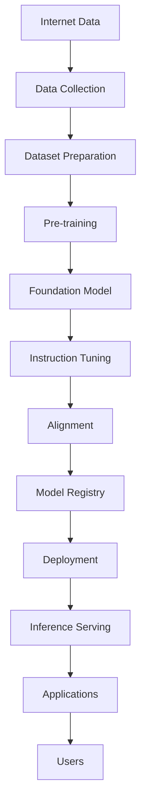
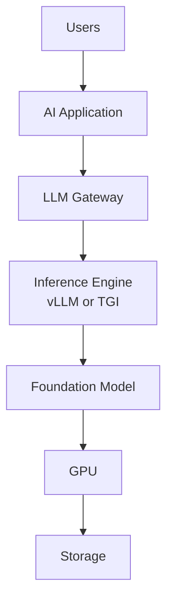

# Chapter 0 – Introduction to Large Language Models

## Learning Objectives

- Understand what a **Large Language Model** is in practical engineering terms.
- See why LLMs matter to platform, infrastructure, and application teams.
- Learn the high-level lifecycle from raw data to production inference.
- Understand where LLMs fit in a modern AI platform stack.
- Know the roadmap for the rest of this repository.

---

## Why Should Platform Engineers Learn LLMs?

AI is becoming another production workload.

For many teams, this means Kubernetes clusters no longer run only web services, APIs, queues, and databases. They also run model-serving systems, vector databases, data pipelines, GPU workloads, and AI gateways. The platform surface area gets larger, not smaller.

This shift changes the job of infrastructure teams:

- they deploy **models**, not only application containers
- they manage **GPUs** as a limited and expensive compute resource
- they handle **model artifacts** that can be tens or hundreds of gigabytes
- they design for **latency**, **throughput**, and **cost** under unpredictable traffic
- they secure prompts, outputs, model endpoints, and training data
- they add observability for token rates, queue depth, GPU memory, and request behavior

You do not need to become an ML researcher to support these systems well. But you do need a clear mental model of what the workload is doing.

If you understand LLM fundamentals, you can make better decisions about:

- capacity planning
- storage and model distribution
- scheduling GPU workloads
- autoscaling inference services
- debugging latency spikes
- evaluating serving stacks such as vLLM or Triton
- understanding where fine-tuning or RAG fits

That is the purpose of this repository. It explains the system from an engineering point of view so you can build reliable AI platforms.

---

## What Is a Large Language Model?

A **Large Language Model** is a software system trained to predict the next piece of text in a sequence.

That piece of text is usually called a **token**. A token is not always a full word. It may be a word, part of a word, punctuation, or whitespace pattern. You do not need the internal details yet. The important idea is simple: an LLM reads input text as a sequence of tokens and predicts what token should come next.

During training, the model sees enormous amounts of text and learns statistical patterns:

- grammar
- common phrasing
- code structure
- factual associations
- document formats
- question and answer patterns

Because it learns from so much data, the model can generate language that appears fluent and useful. In practice, that means it can:

- answer questions
- summarize documents
- generate code
- rewrite text
- classify content
- extract structure from unstructured text
- translate between languages
- act as the reasoning engine behind chatbots and copilots

From an engineering perspective, the most useful definition is this:

> An LLM is a trained prediction system that turns text input into text output by repeatedly choosing the next likely token.

That may sound narrow, but it is enough to power a surprisingly wide range of applications.

It is also important to understand what an LLM is not:

- it is not a search engine by itself
- it is not a database by itself
- it is not guaranteed to be correct
- it does not inherently know your private business context unless you provide it through data, fine-tuning, or retrieval

In production systems, LLMs are usually one component inside a larger application architecture.

---

## The LLM Lifecycle

- **Internet Data**: Public text, code, documents, and other large-scale sources are the raw material used to build training datasets.
- **Data Collection**: Teams gather source data from approved locations and define what should and should not be included.
- **Dataset Preparation**: Data is cleaned, filtered, deduplicated, and formatted so it can be used safely and efficiently for training.
- **Pre-training**: The model learns general language and pattern recognition by processing a massive dataset over a long training run.
- **Foundation Model**: The result is a general-purpose base model that can complete text and encode broad language knowledge.
- **Instruction Tuning**: The base model is further adapted to follow prompts and respond in more useful task-oriented ways.
- **Alignment**: Additional tuning and evaluation try to make outputs safer, more consistent, and better matched to user intent.
- **Model Registry**: Trained models are versioned, stored, tracked, and promoted like other critical production artifacts.
- **Deployment**: The selected model is packaged into a serving environment with infrastructure, policy, and runtime configuration.
- **Inference Serving**: A serving engine runs the model to process prompts and generate outputs under real traffic.
- **Applications**: Chatbots, coding assistants, search copilots, support tools, and internal automations call the model as a backend capability.
- **Users**: End users interact with the application, not usually with the raw model directly.

This lifecycle matters because different teams often own different stages. Data teams, ML teams, platform teams, security teams, and application teams all meet somewhere along this path.

---

## Where LLMs Fit in a Modern AI Stack

Most production systems do not expose a raw model directly to users.

Instead, the model sits inside a stack:

- **Users** interact with a product such as a chatbot, assistant, search tool, or automation workflow.
- The **AI Application** manages prompts, business logic, session state, and integrations with internal systems.
- The **LLM Gateway** can enforce authentication, rate limits, routing, policy, logging, and model selection.
- The **Inference Engine** loads the model and performs efficient token generation on GPU-backed infrastructure.
- The **Foundation Model** is the trained artifact being served.
- The **GPU** provides the parallel compute needed for practical latency.
- **Storage** holds model weights, adapters, caches, and related artifacts.

Later chapters explain these layers in more detail, especially the parts that affect production performance and Kubernetes operations.

---

## Training vs Inference

| Aspect | Training | Inference |
| --- | --- | --- |
| Purpose | Teach the model from data | Use the model to answer requests |
| Compute Pattern | Large batch jobs with repeated parameter updates | Online or batch request processing with fixed parameters |
| Hardware | Large GPU clusters are common | GPUs are common, sometimes optimized for serving efficiency |
| Duration | Days to months | Milliseconds to seconds per request |
| Cost | Very high upfront investment | Ongoing operational cost per workload |
| Output | A new or updated model | Generated text, code, or structured responses |

This distinction is important for engineers.

Training creates the artifact. Inference operates the artifact. Many infrastructure teams will never train a frontier model from scratch, but they will still need to serve, scale, secure, and observe inference workloads.

---

## What You'll Learn

### Chapter 1
**Tokens and Embeddings**

Learn how raw text becomes token IDs and then machine-readable representations.

### Chapter 2
**Positional Encoding**

Understand how the model keeps track of token order and why sequence position matters.

### Chapter 3
**Transformer Architecture**

Understand the high-level structure of the model before diving into its individual components.

### Chapter 4
**Self-Attention**

See how the model decides which earlier tokens matter when generating the next token.

### Chapter 5
**Feed Forward, Residuals, and LayerNorm**

Learn how the rest of the Transformer block transforms and stabilizes token representations.

### Chapter 6
**Multi-Head Attention**

Understand why modern Transformers use many attention heads at once.

### Chapter 7
**One Complete Transformer Forward Pass**

Connect all earlier concepts into one end-to-end model execution path.

### Chapter 8
**Training Foundation Models**

Learn how pretraining works and why large-scale training is so expensive.

### Chapter 9
**From Foundation Models to Chat Models**

Understand how pretrained models become instruction-following chat assistants.

### Chapter 10
**Parameter-Efficient Fine-Tuning**

Learn how teams customize models with LoRA, adapters, and related techniques.

### Chapter 11
**Inference**

Understand how runtime generation works in production and why latency is token-driven.

### Chapter 12
**KV Cache**

See how serving systems avoid recomputing attention state during decoding.

### Chapter 13
**Quantization**

Learn how production systems trade precision for lower memory use and better throughput.

### Chapter 14
**Model Serving**

Explore how inference engines, batching, and schedulers turn GPUs into shared multi-user systems.

### Chapter 15
**Model Storage**

Understand how large model artifacts are stored, cached, and distributed to serving nodes.

### Chapter 16
**Distributed Inference**

Learn how large models run across multiple GPUs and nodes.

### Chapter 17
**LLMs on Kubernetes**

Connect model workloads to scheduling, GPUs, autoscaling, observability, and platform operations.

### Chapter 18
**Building AI Applications**

See how retrieval, tools, context construction, and orchestration turn models into useful products.

### Chapter 19
**Production AI Platform Architecture**

Bring the whole stack together, from user traffic and gateways down to GPUs, storage, and observability.

---

## Key Takeaways

- **LLMs are production workloads**, not just research artifacts.
- A practical definition of an LLM is **a system trained to predict the next token**.
- The LLM lifecycle spans data, training, tuning, registry, deployment, serving, and application integration.
- Most engineers will interact more with **inference and serving** than with large-scale pre-training.
- LLMs usually sit inside a larger AI stack that includes gateways, serving engines, GPUs, and storage.
- Platform teams need to understand model behavior well enough to make good decisions about reliability, performance, security, and cost.
- The rest of this repository will build that understanding step by step.

---

## Next Chapter

Next: Chapter 1 – Tokens and Embeddings
