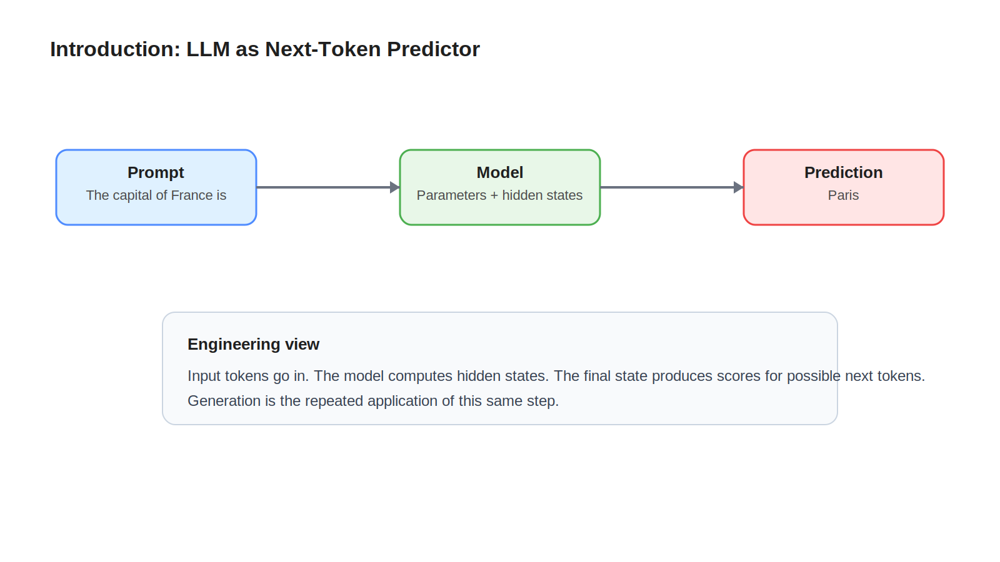

# 01 Introduction

## Learning Objectives

- Understand what an LLM is in practical engineering terms.
- Learn the difference between text, tokens, parameters, and predictions.
- Build a simple system view before diving into internals.

## Key Concepts

- LLM as next-token predictor
- Prompt in, probabilities out
- Parameters as stored behavior
- Hidden states as in-flight computation

## Diagram

## Explanation

At a high level, an LLM is a system that reads a sequence of tokens and predicts what token should come next. That sounds simple, but the internal computation is rich enough to model grammar, facts, style, and patterns learned during training.

From an engineering perspective, an LLM has a clear contract. Input text arrives. The text is tokenized. Tokens move through the model. The model produces scores for possible next tokens. A decoding strategy selects one token. Then the loop repeats.

An important mindset shift is that the model does not directly store answers as full sentences. It stores learned numerical patterns in parameters. During execution, those parameters transform the current token sequence into hidden states, and hidden states are used to predict the next token.

For engineers, hidden states are like the live internal state of a request moving through a service pipeline. They are not the final answer. They are the current working representation.

## Example

Take the prompt `The capital of France is`.

An LLM does not begin by thinking in words the way a human does. It first turns that text into tokens. It then computes internal representations for those tokens and outputs a probability distribution over candidate next tokens such as ` Paris`, ` Lyon`, or punctuation.

If ` Paris` gets the highest useful score after decoding rules are applied, that token is emitted. The updated sequence becomes `The capital of France is Paris`, and the model can continue from there.

## Key Takeaways

- An LLM is best understood as a next-token prediction engine.
- Parameters hold learned behavior, not explicit sentence templates.
- Hidden states are the live intermediate representations produced during a forward pass.

## References

- [Tokenization](02-tokenization.md)
- [OpenAI Tokenizer concepts](https://platform.openai.com/tokenizer)
- [Hugging Face Transformers documentation](https://huggingface.co/docs/transformers/index)
