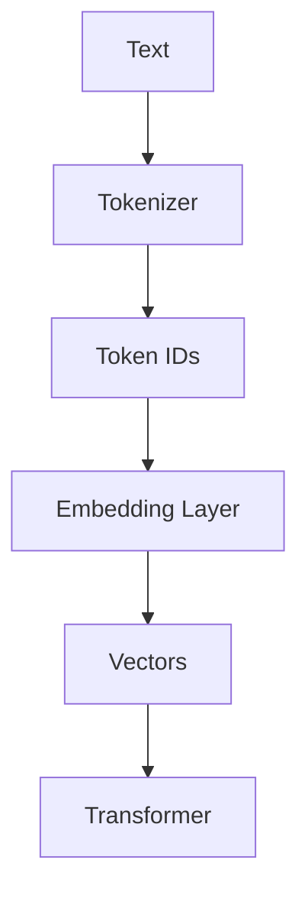
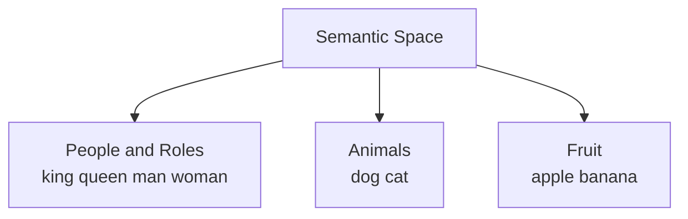

# Chapter 1 — From Text to Numbers: Tokens and Embeddings

## Learning Objectives

By the end of this chapter, you should understand:

- Why computers cannot process text directly
- What a **token** is
- Why tokenization exists
- What **token IDs** are
- Why **embeddings** are needed
- The difference between token IDs and embeddings
- Why embeddings make semantic understanding possible

---

## Why This Matters

Every LLM request starts with text, but no model actually computes on raw strings.

Before a GPU can run attention, matrix multiplies, or token generation, the system must convert human language into a numeric form the model can process. That conversion path determines:

- how prompts are counted and billed
- how much context fits into one request
- how input text turns into tensors on GPU
- why vector search and embedding databases exist at all

If you understand tokens and embeddings, you understand the first stage of every LLM system.

---

## Section 1 — Why Text Must Become Numbers

The first problem is simple: humans read text, but computers execute numeric operations.

You can store a string like `hello world` in memory, but an LLM cannot reason over raw characters the way a human does. Every neural network ultimately operates on **tensors**, and tensors are just structured collections of numbers. If you want a model to process language, you must first turn language into numbers.

Why can we not just feed plain text into the model directly?

- Text is symbolic, not numeric.
- Neural networks perform arithmetic, not dictionary lookups on natural language.
- GPUs are optimized for parallel math on arrays of numbers.

So the system needs a conversion pipeline.



This pipeline is the front door of every modern LLM system.

- **Text** is the human-readable input.
- The **Tokenizer** splits the text into smaller units.
- Those units become **Token IDs**, which are integers.
- The **Embedding Layer** converts each integer into a dense vector.
- Those **Vectors** become the numerical input used by the rest of the model.

> [!NOTE]
> **Why this matters in production**
> Every inference request starts with this conversion. Before the model generates a single token, the platform has already tokenized the input and turned it into tensors.

For engineers, this is the first useful mental model: LLMs do not operate on sentences. They operate on numeric representations derived from sentences.

---

## Section 2 — What Is a Token?

The next problem is deciding how to break text into units.

Why can we not just use characters?

- Character sequences are too small and inefficient for large-scale language modeling.
- Meaning often spans multiple characters.
- Long inputs would become unnecessarily long token sequences.

Why can we not just use full words?

- Natural language has too many words, names, typos, and variants.
- Code has identifiers, symbols, and mixed naming styles.
- New words appear constantly.
- A strict word-level vocabulary would become huge and still fail on unseen words.

LLMs solve this by using **subword tokenization**.

A **token** is a chunk of text chosen by the tokenizer. Depending on the text, a token might be:

- a character
- a full word
- part of a word
- punctuation
- leading whitespace plus text

Examples:

```text
ChatGPT
-> ["Chat", "G", "PT"]

unbelievable
-> ["un", "believ", "able"]
```

This is useful because common text fragments can be reused efficiently across many words.

For example:

- `un` appears in many English words
- `able` appears in many English words
- code tokens like `get`, `user`, `http`, or `json` are reused constantly in technical text

Subword tokenization gives the model a practical middle ground:

- smaller vocabulary than full-word systems
- shorter sequences than character-only systems
- better handling of rare or previously unseen words

If a word is not present as one full token, the tokenizer can still break it into known smaller pieces instead of failing completely.

> [!IMPORTANT]
> **Common misconception**
> A token is not the same thing as a word. Some words are one token, some are many tokens, and punctuation or spaces may also be part of tokens.

For engineers, tokenization is not just a model detail. It affects:

- context length
- cost per request
- latency
- truncation behavior
- prompt design

---

## Section 3 — Token IDs

Once text has been split into tokens, the next problem is representation.

The model cannot use raw token strings like `hello` or `world` directly. It needs a compact numerical identifier for each token in the vocabulary.

So each token maps to an integer.

Example:

```text
hello -> 15339
world -> 1917
```

These integers are called **token IDs**.

The important point is that token IDs do **not** carry semantic meaning by themselves. They are just lookup keys.

A good analogy is a primary key in a database.

- User ID `42` does not mean the user is twice as important as user `21`
- Order ID `9001` is not semantically close to order `9002`
- The number is just a reference used to find the real data

Token IDs work the same way.

- `15339` means “look up the token entry for `hello`”
- `1917` means “look up the token entry for `world`”

That is all.

> [!NOTE]
> **Things to remember**
> Token IDs are identifiers, not meanings. The model uses them to find learned representations, not to reason directly from the integer values.

---

## Section 4 — Why Token IDs Are Not Enough

Now we hit the next problem.

If `hello` becomes `15339` and `world` becomes `1917`, can the model learn meaning directly from those integers?

No.

Why not?

- Integer IDs are arbitrary assignments.
- Nearby integers do not imply nearby meaning.
- Arithmetic on IDs does not reflect language relationships.

For example:

```text
15339
15340
```

These numbers look mathematically close, but that tells you nothing about the relationship between the tokens they represent. One might map to `hello` and the other to `;` or `Kubernetes` or `banana`.

If the model only saw token IDs, it would have no structured way to understand:

- similarity
- category
- related meaning
- grammatical behavior

This is why token IDs are necessary but not sufficient.

They identify tokens, but they do not describe them.

That leads to the next layer: **embeddings**.

---

## Section 5 — Embeddings

An **embedding** is a dense vector associated with a token.

This solves the problem token IDs could not solve. Instead of treating a token as a meaningless integer, the model converts it into a learned numerical representation.

Conceptually:

```text
hello
-> [0.23, -0.81, 0.54, ...]
```

Do not focus on the numbers themselves. The point is that the token is now represented as a vector, not a simple ID.

Why is that useful?

- Vectors can participate in meaningful numerical computation.
- Similar tokens can end up with similar vector patterns.
- The model can learn relationships that IDs alone cannot express.

This is how the LLM starts to build semantic structure.

For example, tokens related to greetings, cities, programming languages, or cloud infrastructure may end up with patterns that are useful in downstream computation. The model does not hardcode those relationships by hand. It learns them from data.

The key distinction is:

- **Token ID**: an index
- **Embedding**: a learned representation

> [!NOTE]
> **Why this matters in production**
> The embedding layer is part of the model itself. It consumes memory, participates in inference, and contributes to total model size.

---

## Section 6 — Embedding Matrix

The next question is where embeddings come from.

They come from a large table usually called the **embedding matrix**.

The standard notation is:

```text
E ∈ R^(V × d)
```

You do not need to read this like a math paper. Read it like a storage layout.

- `V` = vocabulary size
- `d` = embedding dimension

That means:

- there is one row for each token in the vocabulary
- each row contains `d` numeric values

Given token ID `i`, the embedding is simply:

```text
Embedding = E[i]
```

In plain English: go to row `i` in the embedding matrix and return that row vector.

This is a lookup operation.

```mermaid
flowchart TD
    A[Token ID i] --> B[Embedding Matrix E]
    B --> C[Row Lookup E[i]]
    C --> D[Embedding Vector]
```

Visually, you can think of the embedding matrix like a giant table:

- row 0 -> token 0 embedding
- row 1 -> token 1 embedding
- row 15339 -> embedding for `hello`

This is one of the first foundational mechanics in an LLM. Before any deeper model logic happens, the system performs this lookup for every input token.

> [!IMPORTANT]
> **Common misconception**
> The embedding matrix is not a dictionary of hand-written meanings. It is a learned parameter table inside the model.

---

## Section 7 — Why Embeddings Work

Why do embeddings help so much?

Because they allow the model to represent useful relationships numerically.

Think about these examples:

- `king`
- `queen`
- `man`
- `woman`
- `dog`
- `cat`
- `apple`
- `banana`

Even without seeing exact numbers, you can expect some relationships:

- `king` and `queen` are related
- `man` and `woman` are related
- `dog` and `cat` are related
- `apple` and `banana` are related

The model learns vector representations where semantically similar tokens often end up near each other in the broader representation space.

This does not mean the vectors are human-readable. It means the structure is useful for computation.

Here is the intuition:

- related concepts produce related patterns
- unrelated concepts produce more different patterns
- the model can build on those patterns in later layers



This diagram is intentionally high level. Real embeddings live in high-dimensional space, not a simple 2D map. But the engineering intuition is still useful: embeddings give the model a way to organize language into a learnable numeric structure.

Without embeddings, every token would just be an arbitrary ID with no meaningful geometry.

---

## Section 8 — Why Engineers Should Care

At this point, it is fair to ask: why should a platform or software engineer care about any of this?

Because embeddings are not abstract theory. They affect real systems.

- Every inference request begins by converting text into embeddings.
- Large embedding tables consume **GPU memory** and contribute to model footprint.
- The **embedding dimension** affects parameter count, memory usage, and compute cost.
- Input text always becomes tensors before the rest of inference can run.
- Many **vector databases** and semantic search systems reuse the idea of embeddings outside the core model.

This matters in practice.

If you are serving models in production, you will care about:

- how many tokens fit in context
- how much memory the model consumes
- how input length affects latency
- why text preprocessing is required before inference
- how retrieval systems generate vectors for semantic matching

Embeddings also connect model internals to platform architecture. When a RAG pipeline stores document vectors in a vector database, it is using the same general idea: represent text as numbers that preserve useful meaning relationships.

> [!NOTE]
> **Why this matters in production**
> If you understand tokens and embeddings, you can reason more clearly about prompt cost, context limits, model size, semantic search, and the first stage of every LLM request path.

---

## Section 9 — Key Takeaways

- Computers do not process raw language the way humans do; LLMs operate on **numbers**.
- Every LLM input follows the path: **text -> tokens -> token IDs -> embeddings -> tensors for the model**.
- A **token** is a text chunk, not necessarily a full word.
- **Subword tokenization** balances vocabulary size, efficiency, and handling of unseen text.
- **Token IDs** are lookup keys, not semantic representations.
- Integer closeness between token IDs does not imply language similarity.
- **Embeddings** convert token IDs into dense vectors the model can compute on.
- The **embedding matrix** is a learned table with one vector per token.
- Similar meanings often produce embeddings that are useful together in downstream model computation.
- Engineers should care because tokenization and embeddings affect cost, latency, memory, and production architecture.

---

## Common Misconceptions

### "A token is the same as a word"

No. Tokens may be full words, parts of words, punctuation, or whitespace-linked text fragments.

### "Token IDs already contain meaning"

No. Token IDs are lookup keys. Meaning comes from the learned embedding vectors, not the integer values themselves.

### "Embeddings are only useful for vector databases"

No. Vector databases reuse the concept, but embeddings are first and foremost the model's own numeric input representation.

### "This is just preprocessing"

It is preprocessing, but it is also part of the model contract. Tokenization and embedding choices affect latency, cost, context length, and downstream model behavior.

---

## Next Chapter

Next: **Chapter 2 — Positional Encoding**

Tokens alone have no concept of order. The next chapter explains how Transformers understand sequence order.
