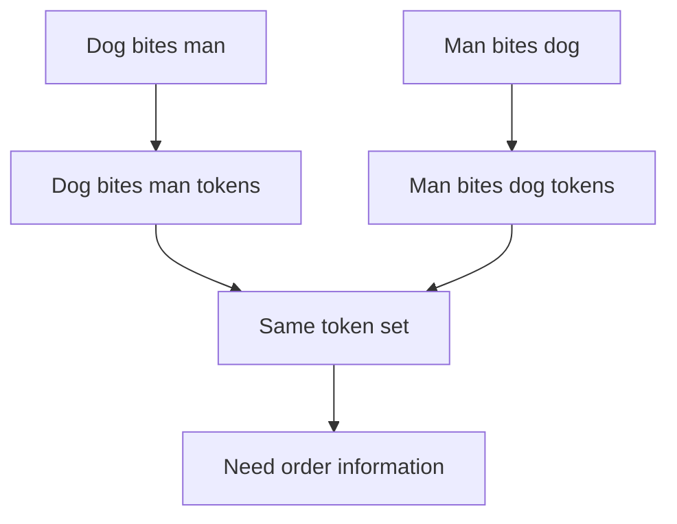
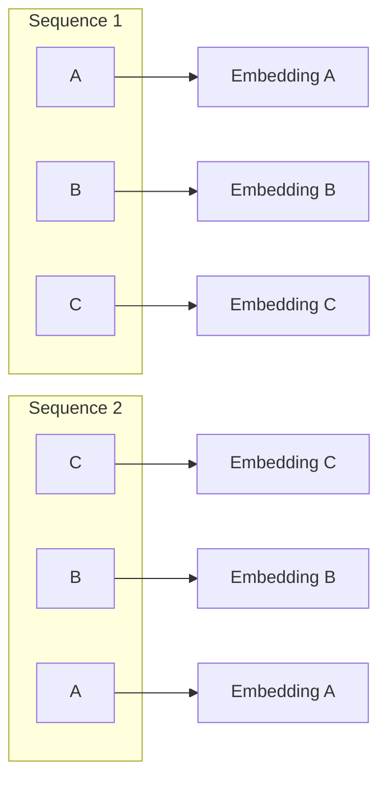
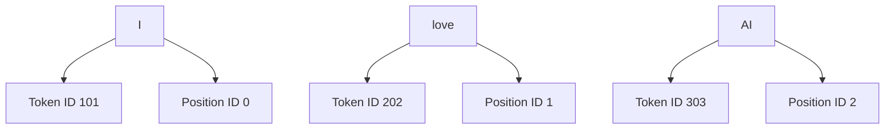
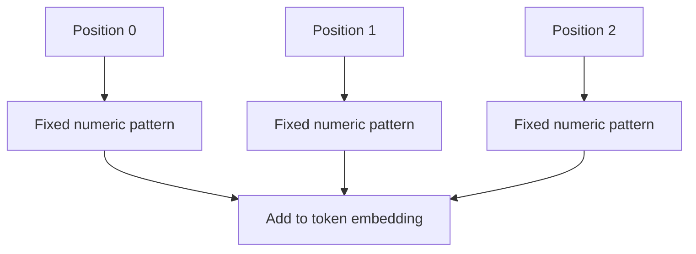
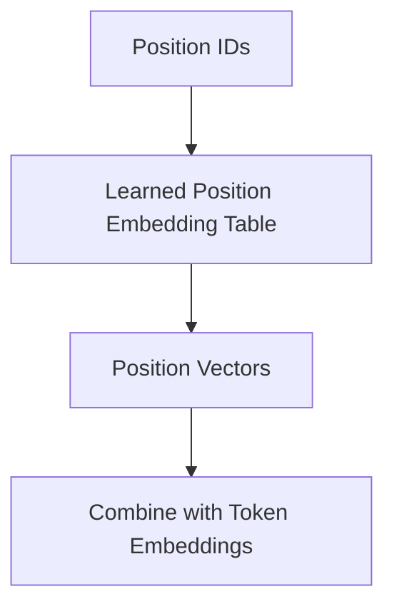
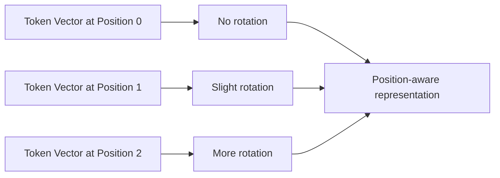
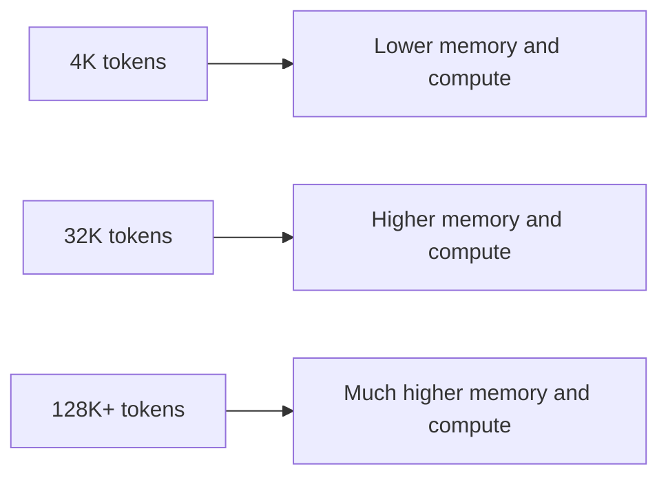

# Chapter 2 — Understanding Context with Positional Encoding

## Learning Objectives

By the end of this chapter, you should understand:

- Why embeddings alone are insufficient
- Why token order matters
- What positional information is
- Different approaches to positional encoding
- Why modern LLMs use **Rotary Position Embedding (RoPE)**
- How context windows relate to positional encoding

---

## Why This Topic Matters

In Chapter 1, we converted text into token IDs and then into embeddings. That solved the first problem: how to turn language into numbers a model can process.

But a second problem appears immediately.

Embeddings tell the model what each token is. They do not tell the model where each token is in the sequence.

That matters because language is ordered. Code is ordered. Logs are ordered. API requests are ordered. Chat history is ordered.

If a model cannot track order, it cannot reliably distinguish:

- who did what to whom
- whether a `not` changes the meaning of a sentence
- whether a function call happens before or after a variable definition
- whether the latest user message overrides earlier chat context

So before we talk about Transformer internals, we need one more building block: **positional encoding**.

---

## Section 1 — The Problem

Start with two short sentences:

```text
Dog bites man
Man bites dog
```

These two sentences contain exactly the same words.

The token embeddings for `Dog`, `bites`, and `man` are the same regardless of which sentence they appear in. But the meaning is completely different.

That raises a practical question:

**How can the model distinguish them?**

This is the core problem positional encoding solves.

If the model only knows which tokens are present, but not their order, then both sentences look like the same bag of parts. That is not enough for language understanding.



Order is not a nice-to-have feature. It is part of the meaning.

> [!IMPORTANT]
> **Common misconception**
> Embeddings capture semantic information about tokens, but they do not automatically capture sequence order. You need an additional mechanism for that.

---

## Section 2 — Why Embeddings Cannot Represent Order

The problem exists because embeddings represent **individual tokens**, not **sequences**.

Think about three tokens:

```text
A B C
```

Now reverse them:

```text
C B A
```

If the model only receives the token embeddings for `A`, `B`, and `C`, then the raw embedding lookup step has no built-in notion of first, second, or third.

It knows what each token means in isolation. It does not know where each token sits in the sentence.



Without position, the model has a token identity problem solved but a sequence interpretation problem unsolved.

Why is this necessary?

- Natural language meaning depends on order.
- Source code meaning depends on order.
- Conversation state depends on order.
- Retrieval context depends on order.

If the model is going to operate on sequences, it needs a way to encode sequence position.

---

## Section 3 — Position IDs

The simplest solution is to assign each token a **position ID**.

Example:

```text
I      love     AI
0        1       2
```

Now every token has two identifiers:

- a **token ID** that says what the token is
- a **position ID** that says where the token appears

That gives the model two kinds of information:

- semantic identity
- sequence location



This is the core idea behind positional encoding. The model needs some representation of location in addition to the representation of meaning.

Position IDs themselves are not enough, just like token IDs were not enough in Chapter 1. They still need to be turned into something numerically useful for the model.

So the next question becomes: how should position information be represented?

---

## Section 4 — Absolute Positional Encoding

The original Transformer paper used **absolute positional encoding**.

The intuition is straightforward:

- each position in the sequence gets its own numeric pattern
- that pattern is combined with the token embedding
- the model can now distinguish the same token appearing in different positions

One fixed approach uses sine and cosine functions:

```text
PE(pos,2i)   = sin(pos / 10000^(2i/d))
PE(pos,2i+1) = cos(pos / 10000^(2i/d))
```

You do not need to derive these equations. Just understand what the symbols mean:

- `pos` = token position in the sequence
- `i` = part of the embedding dimension index
- `d` = full embedding dimension size
- `sin` and `cos` = wave patterns used to generate smooth, repeatable position signals

Why use sine and cosine?

- they create distinct patterns for different positions
- nearby positions produce related patterns
- the patterns are deterministic, so the model can compute them even for positions not explicitly seen during training

That last point is important. Because the encoding follows a formula instead of a learned table, the model can generalize position signals to unseen sequence lengths more naturally.



This approach is elegant and simple. But fixed encodings are not the only option.

> [!NOTE]
> **Engineering tip**
> Fixed positional encoding means the position signal does not consume learned parameters for every position. That can simplify the design, but newer models often prefer other approaches for better long-context behavior.

---

## Section 5 — Learned Positional Embeddings

Another approach is to treat positions the same way we treated tokens in Chapter 1.

Instead of generating position values with sine and cosine, the model learns a **position embedding table**.

That means:

- position `0` has a learned vector
- position `1` has a learned vector
- position `2` has a learned vector
- and so on

These position vectors are then combined with token embeddings.



This gives the model flexibility. Instead of relying on a fixed mathematical pattern, it can learn whatever position representations work best during training.

Comparison:

- **Fixed positional encoding**
  - deterministic
  - no learned position table required
  - can generalize more naturally to unseen positions

- **Learned positional embeddings**
  - flexible
  - model can adapt position patterns from data
  - often limited by the maximum trained position range

The tradeoff is practical. Learned positional embeddings can work well, but they usually tie the model more tightly to the context lengths it was trained with. If the model only learned position vectors up to a certain length, extending beyond that can become awkward.

---

## Section 6 — Rotary Position Embedding (RoPE)

Modern LLMs such as **Llama**, **Qwen**, **Gemma**, **DeepSeek**, and **Mistral** generally use **Rotary Position Embedding**, usually called **RoPE**.

Why does RoPE exist?

Absolute position methods answer the question “where is this token?” But LLMs often benefit even more from understanding **relative relationships**, such as:

- how far apart two tokens are
- whether one token is near the current token
- how local or distant a dependency is

RoPE handles position differently.

Instead of adding a separate position vector to the token embedding, RoPE conceptually **rotates parts of the representation according to token position**.

You do not need the full rotation matrix to understand the engineering intuition.

Think of it like this:

- token meaning still comes from the embedding
- position changes the orientation of that representation
- relative distance between tokens is preserved in a way the model can use effectively



Why do modern models like this?

- it captures position in a way that supports relative relationships well
- it often behaves better for longer contexts than simple absolute methods
- it has become a practical default in many open models used in production

A useful mental model is this:

**Absolute encoding says “this token is at slot 57.” RoPE says “this token’s representation is adjusted in a way that preserves where it sits relative to other tokens.”**

That relative behavior is especially useful in long prompts, long code files, and chat histories.

> [!IMPORTANT]
> **Common misconception**
> RoPE does not replace token embeddings. It augments them with position-aware structure.

---

## Section 7 — Context Window

Positional encoding is tightly connected to the **context window**.

The context window is the maximum number of tokens the model can meaningfully process in one request.

Examples you will see in real systems:

- `4K`
- `8K`
- `32K`
- `128K`
- `1M+`

Why does this matter?

Because the model needs a way to represent token positions across the full active sequence. If the sequence gets longer, the positional mechanism must still work well enough for the model to interpret order and distance.

Longer context sounds purely better, but it is not free.

- more tokens means more GPU memory usage
- more tokens means more compute
- longer prompts increase latency
- larger active context makes serving more expensive

Even before we discuss attention internals, the high-level rule is simple:

**Longer sequences are harder and more expensive to process.**



This is why context window size is both a product feature and an infrastructure concern.

If a team says, “We want 200 pages of docs in a single prompt,” that request directly affects:

- model choice
- GPU sizing
- latency targets
- batching efficiency
- serving cost

> [!NOTE]
> **Why this matters in production**
> Bigger context windows often look attractive in demos, but they can drive up GPU memory usage and cost quickly. Platform teams need to treat context length as a capacity-planning variable, not just a model capability bullet point.

---

## Section 8 — Production Considerations

Why should platform and software engineers care about positional encoding at all?

Because sequence length and token order are everywhere in real AI systems.

### Long-document summarization

If you summarize large PDFs, incident reports, or design docs, the model must preserve order across long inputs. Positional handling affects how well the model understands early sections versus later ones.

### Chat history

Multi-turn chat only works if the model can distinguish earlier messages from later ones. Order tells the model what happened first, what was corrected, and what the latest user instruction is.

### Code generation

In code, ordering is critical. Imports, variable declarations, function calls, and surrounding context all depend on sequence position.

### RAG

In retrieval-augmented generation, fetched chunks are inserted into the prompt. Their placement matters. If chunks are too long or badly ordered, the model may lose important context or exceed prompt limits.

### Context limits

Every system has a practical ceiling. When prompts exceed the effective context window, you must decide what to keep, what to drop, and what to summarize.

### Prompt truncation

If a request is too long, some part of it gets removed or compressed. Engineers should understand that truncation is not just a string operation. It changes the information the model sees and the positions those tokens occupy.

### GPU memory usage

Longer sequences consume more runtime memory. This affects concurrency, batching, and the number of requests a serving stack can handle per GPU.

Why should engineers care?

- context length affects infrastructure sizing
- prompt design affects cost and latency
- long chats and documents stress serving systems differently from short prompts
- truncation policies can change product behavior
- model selection depends partly on positional strategy and context support

Positional encoding may sound like a model-internal topic, but it shows up directly in product limits and platform economics.

> [!NOTE]
> **Engineering tip**
> When debugging poor long-context behavior, do not only look at the application prompt. Also consider the model’s supported context window, effective long-range behavior, and whether your serving stack is trimming tokens before the request reaches the model.

---

## Section 9 — Key Takeaways

- Embeddings describe token meaning, but they do not describe token order.
- Order matters because the same tokens in a different sequence can mean something completely different.
- Positional encoding gives the model a way to represent where tokens appear.
- Position IDs are the starting point, but they still need a usable numeric representation.
- **Absolute positional encoding** uses fixed patterns such as sine and cosine.
- **Learned positional embeddings** let the model learn position vectors directly.
- **RoPE** is widely used in modern LLMs because it preserves relative position information effectively.
- Context window size is tightly connected to positional handling and real serving cost.
- Longer context increases GPU memory usage, compute, and latency.
- Engineers should understand positional encoding because it affects prompt limits, chat systems, RAG design, and production capacity planning.

---

## Common Misconceptions

### "Embeddings already include order information"

No. Embeddings tell the model what tokens are. Positional encoding tells the model where tokens are.

### "Context window is only a product feature"

No. It is also a GPU memory, latency, and cost constraint.

### "RoPE is just another extra vector added on top"

No. RoPE changes the representation in a position-aware way rather than simply attaching one more learned token-like vector.

### "Longer context is always better"

Longer context can help, but it also increases memory use, attention cost, and serving complexity.

---

## Next Chapter

Next: [Chapter 3 — Inside a Transformer](../03-transformer-architecture/README.md)

Now that tokens contain both semantic meaning and positional information, we are ready to see how a Transformer processes them.
