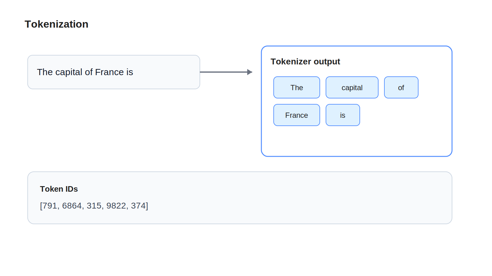

# Tokenization

## Learning Objectives

- Understand why LLMs operate on tokens instead of raw strings.
- Learn how tokenization splits text into reusable subword units.
- See how token boundaries affect cost, context length, and output behavior.

## Key Concepts

- Tokens vs characters vs words
- Vocabulary
- Subword tokenization
- Token IDs
- Context window pressure

## Diagram



## Explanation

Models do not read UTF-8 strings directly. They read token IDs. Tokenization is the translation layer that turns human-readable text into pieces the model can consume.

Why not use full words? Because languages are messy. New words appear, names vary, punctuation matters, and spaces matter. A fixed word list would either be too small to handle real text or too large to be efficient. Subword tokenization is the compromise. Common chunks get their own tokens, while rarer strings are assembled from smaller pieces.

This has real engineering consequences. Cost is often measured in tokens. Latency depends partly on token count. Context window limits are also token-based, not word-based. Two prompts with the same visible length can have different token counts.

## Example

Suppose the sentence is `The capital of France is`.

One tokenizer might split it into tokens like:

- `The`
- ` capital`
- ` of`
- ` France`
- ` is`

Another tokenizer could split some of those differently. The exact split depends on the vocabulary used by the model family.

The important point is that the model receives something closer to this:

```text
[791, 6864, 315, 9822, 374]
```

Those numbers are token IDs. They are the real input to the model.

## Key Takeaways

- Tokenization converts text into token IDs.
- Tokens are often subword pieces, not full words.
- Token count affects cost, latency, and usable context length.

## References

- [Embeddings](03-embeddings.md)
- [SentencePiece](https://github.com/google/sentencepiece)
- [Hugging Face Tokenizers](https://huggingface.co/docs/tokenizers/index)
