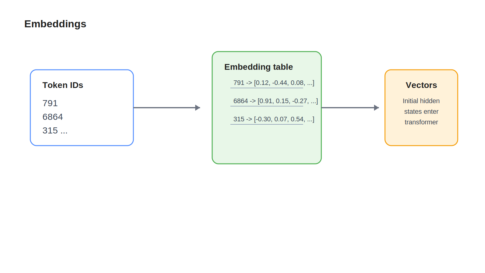

# 03 Embeddings

## Learning Objectives

- Understand how token IDs become vectors.
- Learn why embeddings are the starting point for model computation.
- Build intuition for semantic closeness without relying on heavy math.

## Key Concepts

- Embedding table
- Dense vectors
- Learned representation
- Positional information
- Hidden state initialization

## Diagram



## Explanation

A token ID by itself has no useful geometry. Token `791` is not naturally close to token `792` in any meaningful semantic sense. The model therefore looks up each token ID in an embedding table and returns a learned vector.

You can think of the embedding table as a very large lookup table where each token gets mapped to a dense list of numbers. Those numbers are learned during training. The values are not manually assigned by humans.

Embeddings give the model a starting representation for each token. Similar patterns in language often lead to embeddings that behave similarly during downstream computation. That does not mean the embedding alone fully captures meaning. It means it gives the model a useful starting point.

Most transformer models also add positional information so the system can distinguish `France is` from `is France`. Without order information, token vectors would look like an unordered bag.

## Example

After tokenization, `The capital of France is` might become token IDs like:

```text
[791, 6864, 315, 9822, 374]
```

The model looks up each ID in the embedding matrix and gets vectors like:

```text
token 791  -> [0.12, -0.44, 0.08, ...]
token 6864 -> [0.91,  0.15, -0.27, ...]
token 315  -> [-0.30, 0.07, 0.54, ...]
```

Those vectors then become the first hidden states that enter the transformer stack.

## Key Takeaways

- Embeddings convert token IDs into learned vectors.
- The embedding layer is the model's input lookup system.
- Positional information is required so token order affects meaning.

## References

- [Transformer](04-transformer.md)
- [Word2Vec explained visually](https://jalammar.github.io/illustrated-word2vec/)
- [Attention Is All You Need](https://arxiv.org/abs/1706.03762)
