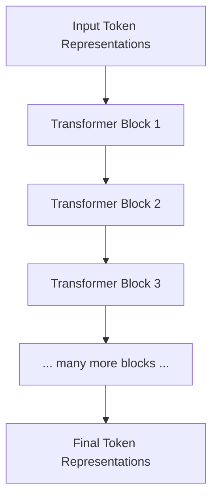
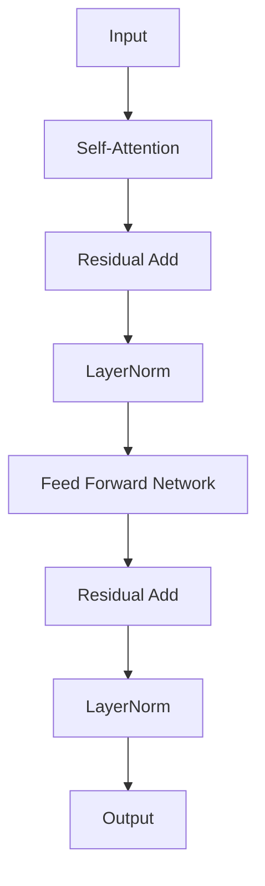
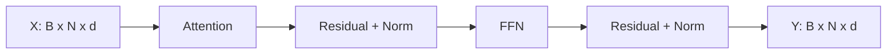
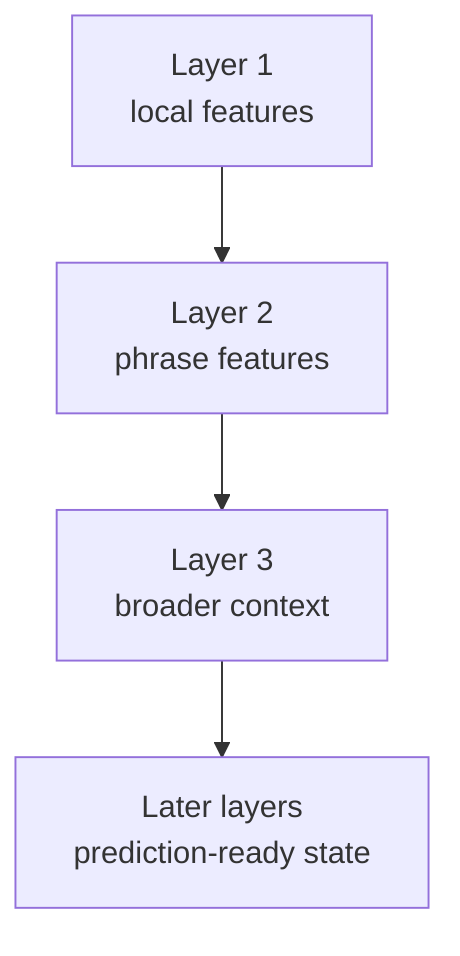
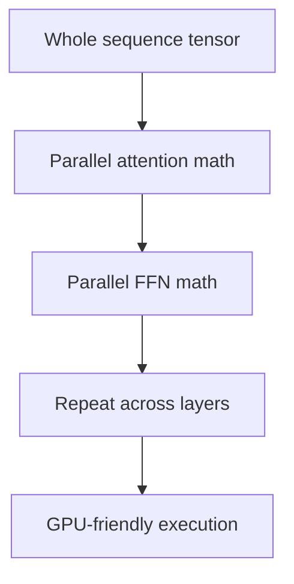

# Chapter 3 — Inside a Transformer

## Learning Objectives

By the end of this chapter, you should understand:

- Why token embeddings and positional information are still not enough
- What a **Transformer block** is at a high level
- The role of **self-attention**, **feed forward networks**, **residual connections**, and **LayerNorm**
- Why Transformer blocks are repeated many times
- How tensor shapes stay consistent across the stack
- Why this architecture maps well to GPUs and production inference systems

---

## Why This Matters

By this point in the course, we have taken text and turned it into vectors with positional meaning.

That solves the input problem. It does not solve the computation problem.

The model still needs a way to:

- compare tokens with other tokens
- combine information across the sequence
- transform each token representation into something richer
- do this repeatedly across many layers without becoming unstable

That full compute pattern is what the **Transformer architecture** gives us.

If you understand the Transformer at a block level, the rest of the course gets easier:

- self-attention becomes one well-defined stage instead of a mysterious formula
- KV cache later makes sense as an optimization of attention state reuse
- model size starts to look like repeated blocks plus projection layers
- serving cost starts to map cleanly onto sequence length, hidden size, and number of layers

For engineers, the Transformer is the execution engine of the model.

> [!NOTE]
> **Why this matters in production**
> When you deploy an LLM, you are not serving “AI magic.” You are serving a very deep stack of repeated tensor operations. Transformer structure is what turns prompt length, model size, and GPU memory into real latency and cost.

---

## Section 1 — The Problem

What problem exists?

After tokenization, embeddings, and positional encoding, the model has a sequence of vectors:

```text
[token_1_vector, token_2_vector, token_3_vector, ...]
```

Each vector says something about:

- what token it represents
- where that token appears

But the model still does not know how to reason over the whole sequence.

Take a simple prompt:

```text
The capital of France is
```

To predict the next token well, the model needs to combine information across multiple positions:

- `capital`
- `France`
- `is`

That means the architecture needs to support both:

- **cross-token interaction**
- **per-token transformation**

Why is this needed?

Because language understanding is not just a lookup problem. It is a repeated transformation problem. The model must refine token representations layer by layer until the final token position contains enough context to predict the next token.

---

## Section 2 — What Is a Transformer?

A **Transformer** is a stack of repeated computation blocks that process the full token sequence.

At a high level, a block does four main things:

1. let tokens look at other tokens
2. update each token using that context
3. apply deeper per-token transformation
4. keep the entire system numerically stable



The key design idea is repetition.

Instead of one giant custom network, the model reuses the same block pattern many times. That makes the system easier to scale conceptually:

- same outer tensor shape
- same broad compute stages
- deeper stack means more representational capacity

Why should engineers care?

Because this repeated-block design is one reason modern LLMs are so scalable. It also means many serving costs repeat per layer, which is why layer count matters directly in production latency.

---

## Section 3 — The Main Components of a Transformer Block

A standard Transformer block contains four key components:

- **Self-Attention**
- **Feed Forward Network (FFN)**
- **Residual Connections**
- **Layer Normalization**



What does each one solve?

### Self-Attention

Self-attention answers:

**Which other tokens matter for understanding this token?**

It is the context-gathering stage.

### Feed Forward Network

The FFN answers:

**Now that the token has context, how should its representation be transformed?**

It is the deeper per-token computation stage.

### Residual Connections

Residual paths help preserve the original signal while adding learned updates.

This is one reason deep Transformer stacks remain trainable and stable.

### LayerNorm

LayerNorm keeps values in a healthier range so repeated deep computation remains numerically manageable.

Together, these components form one reusable compute block.

---

## Section 4 — How Data Flows Through One Block

Let:

- `B` = batch size
- `N` = sequence length
- `d` = model dimension

The input to one block is typically:

```text
X: [B, N, d]
```

That means:

- `B` sequences in a batch
- `N` token positions per sequence
- `d` features per token

The most important high-level property is that the block usually preserves the outer shape:

```text
Input : [B, N, d]
Output: [B, N, d]
```

Why does that matter?

Because it makes block stacking straightforward.

One block can feed directly into the next without changing the sequence structure.



Self-attention mixes information across tokens, but still returns one updated vector per token position.

The FFN then processes each token independently but still returns the same outer shape.

This shape stability is a big engineering advantage.

---

## Section 5 — Why Repeating Blocks Works

One Transformer block is useful, but not usually enough.

Why is this needed?

Because different layers can learn different levels of representation.

Early layers may focus more on:

- local syntax
- punctuation
- simple phrase structure

Middle layers may capture:

- relationships between subject and object
- longer-range references
- broader phrase meaning

Later layers may become more useful for:

- prediction at the final token position
- task-specific formatting behavior
- stronger high-level associations

This is similar to a multi-stage processing pipeline in distributed systems:

- earlier stages prepare and normalize information
- later stages make more refined decisions

The Transformer does this through repeated representational updates rather than through branching service calls.



Why should engineers care?

Because a 7B or 70B model is not “one huge matrix.” It is a deep stack of repeated blocks. Layer count has direct implications for:

- latency
- memory use
- checkpoint size
- distributed inference design

---

## Section 6 — Why Transformers Enable Parallel Processing

Older sequence models often processed tokens more sequentially inside the model itself.

The Transformer architecture changed that.

What problem did this solve?

It made large-scale sequence processing much more compatible with GPU hardware.

Why?

Because the model operates on full tensors and large matrix operations across the whole sequence, especially during prompt processing.

At a high level:

- all token embeddings can be processed together
- attention compares tokens in parallel through matrix operations
- FFNs process all token positions in parallel
- the same block structure repeats efficiently across layers

That means the model maps well to:

- GPUs
- tensor cores
- large batched matrix multiplication



Important nuance:

During **prefill**, this parallelism is strong because the full prompt is known.

During **decode**, generation is still sequential across output time steps, but the math inside each step still benefits from parallel tensor execution.

> [!NOTE]
> **Engineering tip**
> “Transformer parallelism” usually means efficient parallel math within a layer or pass. It does not mean the model can generate all future tokens at once during autoregressive inference.

---

## Section 7 — Where the Cost Comes From

From a production perspective, a Transformer block is not free in any dimension.

Major cost drivers include:

- number of layers
- model dimension `d`
- FFN hidden size
- sequence length `N`
- attention head count
- KV cache size during inference

A useful mental model is:

```text
runtime cost ~= repeated block cost x number of layers x sequence activity
```

That is not a precise formula. It is an operator’s intuition.

If you increase:

- prompt length
- output length
- hidden size
- layer count

then you are increasing the amount of repeated work the model must do.

This is why understanding the block structure matters so much for serving and capacity planning.

---

## Section 8 — Why Engineers Should Care

The Transformer architecture is directly connected to real platform concerns.

### GPUs

Transformers are built from dense tensor operations that run efficiently on GPUs. That is one reason GPU memory and throughput matter so much for LLM serving.

### Latency

Every request passes through the full stack of layers. More layers and larger hidden sizes mean more compute per token.

### Memory

Model weights, activations, and KV cache all depend on architectural choices such as depth and width.

### Distributed Inference

When one GPU is not enough, engineers must split repeated Transformer blocks across devices using tensor parallelism, pipeline parallelism, or both.

### Model Serving

Continuous batching, runtime scheduling, and cache reuse all exist to make these repeated Transformer computations economically viable under real traffic.

This is why platform engineers should not treat the Transformer as an abstract ML diagram. It is the main compute shape that determines how the workload behaves in production.

---

## Common Misconceptions

### “The Transformer is just attention”

No. Attention is central, but the block also includes FFNs, residual paths, and normalization.

### “Every layer does something completely different”

The same broad block pattern is repeated many times. What changes are the learned weights and the role the layer plays in the overall representation stack.

### “If the tensor shape stays the same, nothing important changed”

The outer shape can stay the same while the meaning of the representation changes significantly.

### “Parallel-friendly means inference is fully parallel”

Only partly. Prompt processing is highly parallel. Autoregressive generation still remains sequential across output tokens.

---

## Key Takeaways

- The Transformer is the repeated compute architecture that powers modern LLMs.
- One Transformer block combines **self-attention**, **FFN**, **residual connections**, and **LayerNorm**.
- Self-attention mixes information across tokens.
- FFNs transform each token representation more deeply.
- Residual paths preserve signal while allowing learned updates.
- LayerNorm helps keep deep stacks numerically stable.
- The outer tensor shape usually stays constant as `[B, N, d]`, which makes stacking blocks straightforward.
- Transformer design maps well to GPU execution and is one reason modern LLMs scale effectively.
- Layer count, sequence length, and model width all affect real serving cost.

---

## Next Chapter

Next: **Chapter 4 — Self-Attention**

Now that you have the high-level block structure, the next chapter zooms in on the most famous piece: how self-attention lets tokens decide which other tokens matter.
