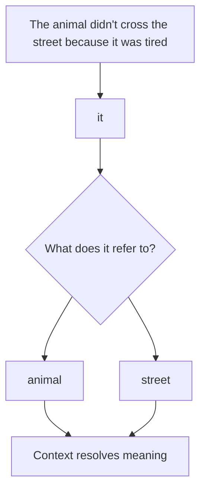
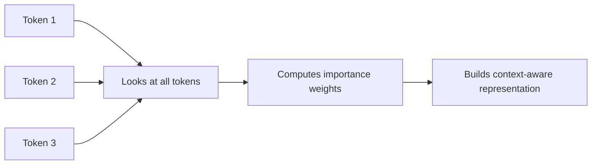
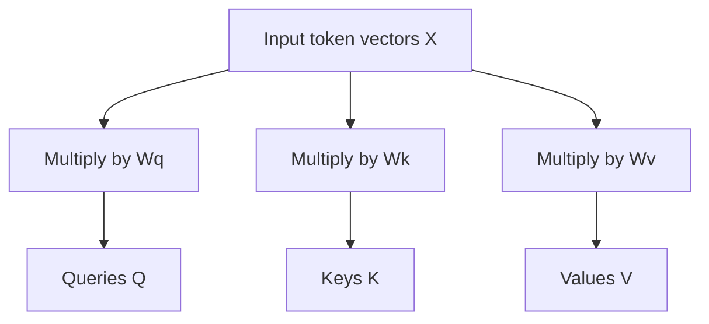
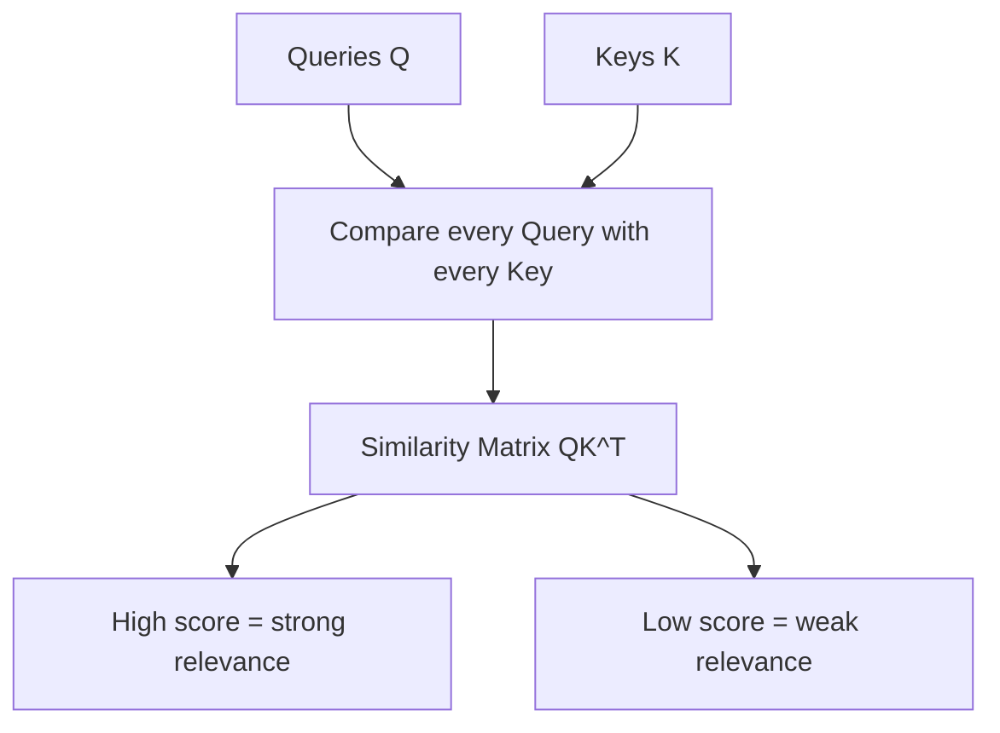
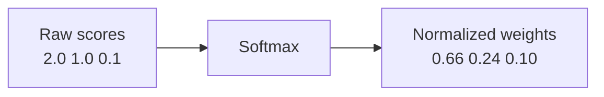
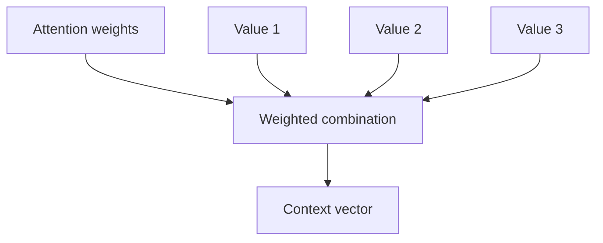
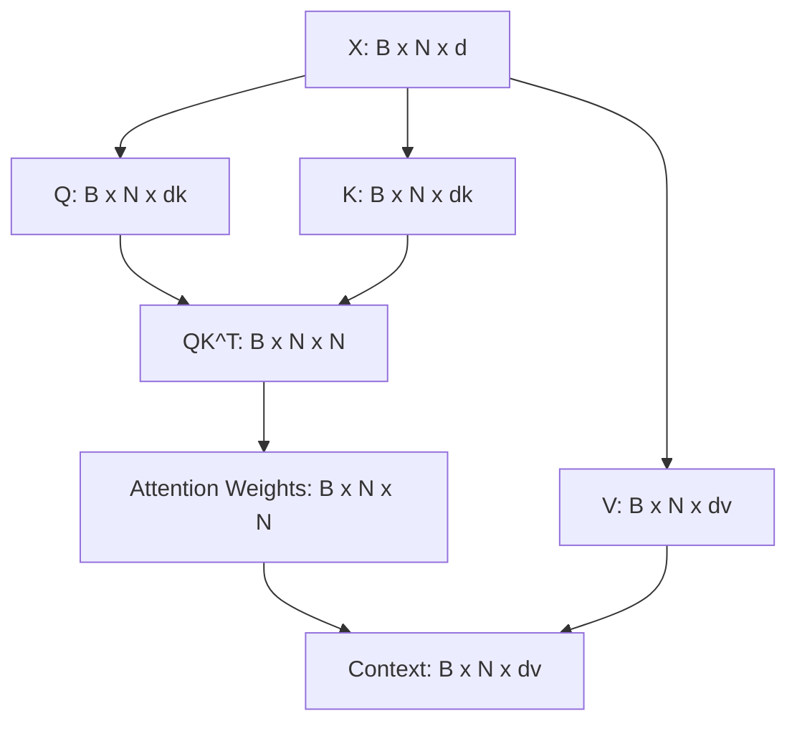

# Chapter 4 — Self-Attention: The Core of the Transformer

## Learning Objectives

By the end of this chapter, you should understand:

- Why attention exists
- What contextual understanding means
- Query, Key, and Value
- Attention scores
- Scaling
- Softmax
- Context vectors
- Why attention enables parallel processing
- The complete attention pipeline

---

## Why This Topic Matters

In the earlier chapters, we converted text into token vectors and added positional information so the model could tell both **what** each token is and **where** it appears.

That still leaves a major problem unsolved.

The model must figure out **which other tokens matter** when interpreting the current token.

This is the job of **self-attention**.

Self-attention is one of the most important ideas in modern LLMs because it allows the model to build contextual meaning from a sequence of tokens. It is also one of the most expensive parts of inference, which makes it highly relevant for engineers working on GPUs, model serving, latency, and context window limits.

This chapter focuses on one thing only: understanding the mechanics and intuition of self-attention.

---

## Section 1 — The Problem

Start with a sentence like this:

```text
The animal didn't cross the street because it was tired.
```

What does `it` refer to?

Most humans quickly infer that `it` refers to `the animal`, not `the street`.

Now consider these two examples:

```text
The bank approved the loan.
The boat reached the bank.
```

In the first sentence, `bank` means a financial institution.

In the second, `bank` means the side of a river.

The token is the same. The meaning is different.

What problem exists?

- words cannot always be understood independently
- the same token can mean different things in different contexts
- a later token may depend on a much earlier token

Why is this needed?

Because language is contextual. If a model only looked at tokens in isolation, it would fail on pronouns, ambiguity, code dependencies, chat history, and long-range references.

How does the model solve it?

It lets each token look at other tokens in the same sequence and decide which ones are relevant.



Why should engineers care?

Because this contextual lookup happens for every token during inference. It drives model quality, latency, memory usage, and GPU cost.

> [!NOTE]
> **Why this matters in production**
> If your product depends on multi-turn chat, long prompts, document summarization, or code understanding, then attention is doing a large share of the heavy lifting.

---

## Section 2 — What Is Self-Attention?

Self-attention is the mechanism that lets each token inspect other tokens in the same sequence and decide which ones matter.

Conceptually, every token asks:

**Which other tokens are important for understanding me right now?**

That is why it is called **self-attention**. The sequence attends to itself.

An intuitive analogy is a meeting:

- everyone enters with their own information
- before speaking, each person listens to everyone else
- each person pays more attention to the participants most relevant to their current question
- after listening, each person updates their understanding

That is roughly what self-attention does for tokens.



How does it work at a high level?

1. Every token produces three derived vectors.
2. Those vectors are used to compare tokens to one another.
3. The model computes importance weights.
4. The model mixes information from all tokens using those weights.
5. The result is a new representation for each token that includes context.

Why should engineers care?

Because self-attention is both the source of the model's contextual power and a major source of its runtime cost.

---

## Section 3 — Query, Key and Value

To understand self-attention, start with three concepts.

### Query

The **Query** asks:

**What information am I looking for?**

### Key

The **Key** says:

**What information do I contain?**

### Value

The **Value** is:

**What actual information do I contribute if I am selected?**

An easy analogy is a search engine:

- **Query** -> the search keywords
- **Key** -> the indexed metadata used to decide relevance
- **Value** -> the actual document content returned

Each token produces its own Query, Key, and Value.

Why is this necessary?

Because the model needs one representation for asking, one for matching, and one for carrying content forward.

How does it work?

The model starts with an input matrix `X`.

- `X` = the current token representations for the sequence

It then applies three learned linear projections:

```text
Q = XWq
K = XWk
V = XWv
```

Shapes:

```text
X   : [B, N, d]
Wq  : [d, dk]
Wk  : [d, dk]
Wv  : [d, dv]
Q   : [B, N, dk]
K   : [B, N, dk]
V   : [B, N, dv]
```

Plain-English explanation:

- `Q` = Query matrix
- `K` = Key matrix
- `V` = Value matrix
- `X` = input token representations
- `Wq`, `Wk`, `Wv` = learned weight matrices that transform the input into Queries, Keys, and Values

So the model does not store one universal Query or one universal Key. Each token creates its own Q, K, and V based on the current input representation.



Why should engineers care?

Because this is the first major tensor transformation inside attention, and these projections consume memory bandwidth and GPU compute during every forward pass.

> [!IMPORTANT]
> **Common misconception**
> Query, Key, and Value are not external data structures. They are learned projections of the token representations inside the model.

---

## Section 4 — Computing Attention Scores

Now that every token has a Query and a Key, the model needs to measure similarity.

What problem exists?

Each token must decide which other tokens are relevant.

How does it do that?

Every Query compares against every Key.

The core operation is:

```text
Score = QK^T
```

Shapes:

```text
Q    : [B, N, dk]
K^T  : [B, dk, N]
Score: [B, N, N]
```

Plain-English explanation:

- `Q` contains all Query vectors
- `K^T` is the transposed Key matrix
- multiplying them gives a matrix of similarity scores

Each score answers a question like:

**How much should token A pay attention to token B?**

The similarity measure here is a **dot product**.

Intuition:

- large value -> strong relationship
- small value -> weak relationship
- negative value -> low or opposing alignment



If the current token is `it`, the model may assign high similarity to `animal` and lower similarity to unrelated words.

Why should engineers care?

Because this comparison step grows quickly with sequence length. If there are more tokens, there are more pairwise comparisons.

---

## Section 5 — Why Scale by `sqrt(dk)`?

The raw score is useful, but there is a stability problem.

As vector dimensions grow, dot products tend to become larger in magnitude.

That creates trouble for the next step, which uses Softmax.

So the score is scaled like this:

```text
Score = QK^T / sqrt(dk)
```

Shapes:

```text
QK^T / sqrt(dk): [B, N, N]
```

Plain-English explanation:

- `dk` = the dimensionality of each Key vector
- `sqrt(dk)` = the square root of that dimension
- dividing by `sqrt(dk)` reduces the size of large dot products

Why is this necessary?

If the raw scores get too large, Softmax becomes too peaky.

That means:

- one token can dominate too aggressively
- gradients during training become less stable
- the model becomes harder to optimize

You do not need a proof here. The intuition is enough:

**higher-dimensional vectors naturally produce bigger dot products, so we scale them back down before converting them into attention weights.**

Why should engineers care?

Because many model tricks that look like small equations are actually there to keep large GPU computations numerically stable and trainable.

> [!NOTE]
> **Engineering tip**
> In large-scale systems, small numerical stability choices often have major operational impact. Unstable math becomes unstable training, unstable inference, or both.

---

## Section 6 — Softmax

After similarity scores are computed and scaled, the model still does not have usable weights.

Why not?

Because the scores can be any real numbers: positive, negative, big, or small. The model needs a normalized way to express importance.

That is what **Softmax** does.

```text
Attention Weights = Softmax(Score)
```

Shapes:

```text
Score            : [B, N, N]
Attention Weights: [B, N, N]
```

Plain-English explanation:

Softmax converts arbitrary scores into a probability-like distribution.

Properties:

- all values are positive
- all values sum to `1`
- larger scores get larger weights

Simple example:

```text
Scores: [2.0, 1.0, 0.1]
Softmax: [0.66, 0.24, 0.10]   # approximate
```

Interpretation:

- the first token gets most of the attention
- the second gets some attention
- the third gets a small amount



Why is this needed?

Because the model is not making a single hard choice. It is distributing attention across the sequence.

Why should engineers care?

Because this normalized weighting is how the model blends information instead of simply picking one token and ignoring the rest.

---

## Section 7 — Building the Context Vector

Now the model has attention weights. The next problem is how to turn those weights into a useful new representation.

The answer is a weighted combination of the Value vectors.

The full expression is:

```text
Context = Softmax(QK^T / sqrt(dk))V
```

Shapes:

```text
Softmax(QK^T / sqrt(dk)) : [B, N, N]
V                        : [B, N, dv]
Context                  : [B, N, dv]
```

Plain-English explanation:

- first compute Query-Key similarity
- then scale it
- then apply Softmax to get attention weights
- then use those weights to mix the Value vectors

This produces a **context vector** for each token.

That context vector is no longer just the token's original embedding-like representation. It now contains information gathered from other relevant tokens in the sequence.

Example intuition:

If the token is `it`, and the model gives high attention to `animal`, then the resulting context vector for `it` will carry more information related to `animal`.



Why is this needed?

Because the model needs an updated representation for each token that includes context, not just isolated token meaning.

Why should engineers care?

Because this weighted aggregation is the core mechanism that turns a sequence of token vectors into context-aware token vectors.

> [!NOTE]
> **Why this matters in production**
> The better the model can build context vectors, the better it can handle long prompts, ambiguous instructions, code dependencies, and references across a conversation.

---

## Section 8 — The Complete Attention Equation

Now we can put the whole pipeline together.

The complete self-attention equation is:

```text
Attention(Q, K, V) = Softmax(QK^T / sqrt(dk))V
```

Shapes:

```text
Q                     : [B, N, dk]
K                     : [B, N, dk]
V                     : [B, N, dv]
QK^T                  : [B, N, N]
Softmax(QK^T / sqrt(dk)): [B, N, N]
Attention(Q, K, V)    : [B, N, dv]
```

Plain-English explanation:

- compare Queries against Keys
- scale the scores
- normalize them with Softmax
- use the resulting weights to combine the Values

That looks compact, but it hides several distinct stages.

```mermaid
flowchart TD
    A[Input Embeddings] --> B[Q K V Projection]
    B --> C[Similarity QK^T]
    C --> D[Scaling by sqrt(dk)]
    D --> E[Softmax]
    E --> F[Weighted Values]
    F --> G[Context Vector]
```

Step by step:

1. **Input Embeddings**
   The model begins with token representations that already include token meaning and positional information.

2. **Q, K, V Projection**
   Each token is projected into Query, Key, and Value spaces.

3. **Similarity**
   Every Query compares against every Key to produce relevance scores.

4. **Scaling**
   The scores are divided by `sqrt(dk)` to keep values numerically manageable.

5. **Softmax**
   The scaled scores are converted into normalized attention weights.

6. **Weighted Values**
   The attention weights are applied to the Value vectors.

7. **Context Vector**
   The result is a new representation for each token that includes context from other tokens.

Why does this enable parallel processing?

Because the model can compute attention for all tokens in the sequence at the same time using matrix operations. Unlike older recurrent models, it does not have to process tokens strictly one by one during the core layer computation.

Why should engineers care?

Because this is one reason Transformers map so well to GPU hardware: the math is built around large parallel tensor operations.

---

## Section 9 — Matrix Shapes

Engineers usually understand systems better when they can see the data shapes.

Let:

- `B` = batch size
- `N` = sequence length
- `d` = embedding dimension
- `dk` = Query and Key dimension
- `dv` = Value dimension

Now walk through the main tensors.

### Input

```text
X: [B, N, d]
```

This means:

- `B` sequences in a batch
- each sequence has `N` tokens
- each token representation has size `d`

### Query, Key, Value

```text
Q: [B, N, dk]
K: [B, N, dk]
V: [B, N, dv]
```

Each token now has a Query, a Key, and a Value vector.

### Similarity Matrix

When `Q` is multiplied by `K^T`, the result is:

```text
QK^T: [B, N, N]
```

This is the attention score matrix.

Interpretation:

- for each sequence in the batch
- for each token position
- compute a score against every token position

That is why the matrix is `N x N`.

### Attention Weights

After scaling and Softmax, the shape stays:

```text
Attention Matrix: [B, N, N]
```

### Context Output

Then the attention matrix multiplies `V`:

```text
Context: [B, N, dv]
```

Each token gets a new context-aware vector.



Why should engineers care?

Because the `N x N` attention matrix is where sequence length becomes expensive. Double the sequence length and the number of pairwise attention scores grows much faster than linearly.

---

## Section 10 — Why Engineers Should Care

At this point, the main question is not “can I derive the equation?”

The main question is “what does this mean for real systems?”

Here are the production implications.

### Every inference computes attention

Attention is not a rare feature. It runs constantly during inference.

### Attention dominates GPU compute

For long prompts, attention becomes one of the most expensive computations in the model.

### Sequence length greatly affects compute

More tokens means more Query-Key comparisons and more memory movement.

### Attention complexity grows quadratically

Because attention compares each token with every other token, the comparison matrix grows with `N x N`.

### Context windows consume memory

Longer context windows mean larger attention structures and more runtime memory pressure.

### Latency and throughput are directly affected

If your platform supports longer prompts, your latency and throughput characteristics change.

### KV cache will matter later

In a later chapter, we will see how **KV cache** avoids recomputing everything during autoregressive generation. That is one of the key optimizations that makes production inference practical.

Why should platform engineers care?

- GPU sizing depends on sequence length
- serving performance depends on attention cost
- model choice depends partly on context window tradeoffs
- prompt design influences memory and latency
- long chats and RAG pipelines can stress inference infrastructure quickly

> [!NOTE]
> **Engineering tip**
> When you see latency spikes on long prompts, attention cost is one of the first places to look. Sequence length is often a stronger predictor of cost than raw request count.

---

## Section 11 — Common Misconceptions

### Attention is not memory

Attention helps the model build contextual representations inside the current sequence. It is not the same as persistent memory across sessions.

### Attention does not search the Internet

Attention only works over the tokens already present in the model's active context window.

### Attention does not retrieve documents

Document retrieval is a separate system concern, often handled by RAG pipelines or search infrastructure.

### Every token attends to every other token inside the context window

That is the basic self-attention picture in this chapter. Later chapters add more structure and optimizations, but the core idea is token-to-token interaction within the sequence.

### Attention is not understanding by itself

Attention is a mechanism for routing information. It is a major part of contextual processing, but it is not a magic explanation for all model behavior.

> [!IMPORTANT]
> **Common misconception**
> If a product team says “the model should just pay attention to the right part,” that still has real compute and memory cost. Attention is powerful, but it is not free.

---

## Section 12 — Key Takeaways

- Self-attention exists because token meaning depends on surrounding context.
- Each token produces a **Query**, **Key**, and **Value** representation.
- Queries compare to Keys to measure relevance.
- Dot-product similarity creates the raw attention scores.
- Scores are scaled by `sqrt(dk)` to keep the computation numerically stable.
- Softmax converts raw scores into normalized attention weights.
- Those weights are used to combine Value vectors into context-aware outputs.
- The full attention equation is `Attention(Q, K, V) = Softmax(QK^T / sqrt(dk))V`.
- Attention is highly parallelizable, which is one reason Transformers work well on GPUs.
- Attention cost grows quickly with sequence length, which makes it a major production concern.

---

## Next Chapter

Next: **Chapter 5 — Feed Forward Networks, Residual Connections, and Layer Normalization**

Self-attention explains how tokens exchange information. The next chapter covers the rest of the Transformer block: how each token is transformed, how deep stacks stay stable, and how the full block fits together.
