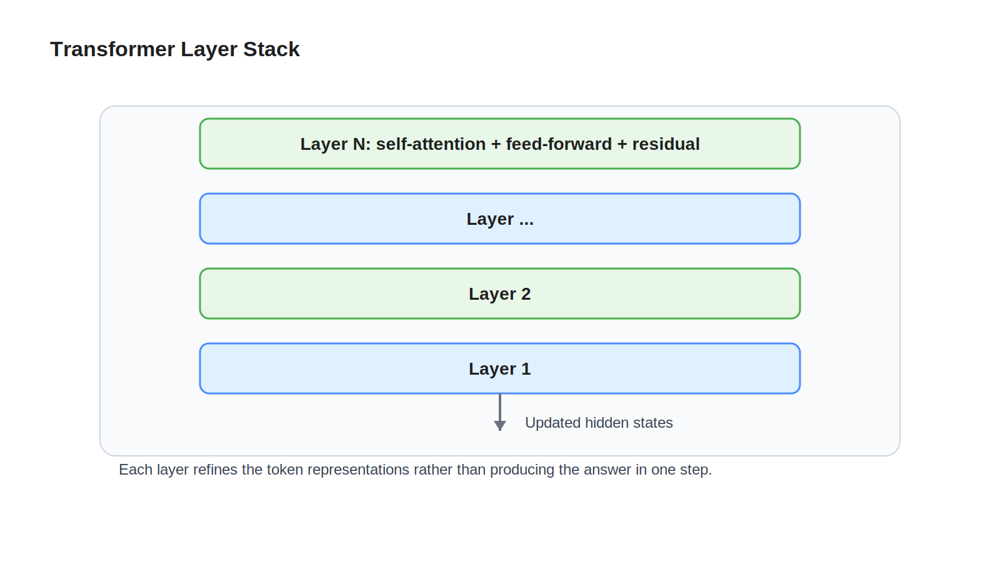

# 04 Transformer

## Learning Objectives

- Understand the main blocks inside a transformer model.
- Learn how hidden states are updated layer by layer.
- Build a systems view of residual paths, normalization, and feed-forward blocks.

## Key Concepts

- Transformer layer stack
- Self-attention block
- Feed-forward network
- Residual connection
- Layer normalization
- Hidden state evolution

## Diagram

## Explanation

The transformer is the main compute engine of a modern LLM. After token embeddings are created, they pass through many repeated layers. Each layer refines the hidden states.

A typical layer has two major sub-blocks. First, self-attention lets each token gather information from earlier tokens in the sequence. Second, a feed-forward network applies additional learned transformation to each token position.

Residual connections matter because they make deep stacks trainable and stable. Instead of replacing the old hidden state entirely, each block adds new information on top of the current representation. Layer normalization helps keep the values numerically well-behaved.

For engineers, this is similar to a deep processing pipeline where each stage enriches the request context while preserving a clean path for stable flow through the system.

## Example

For the sequence `The capital of France is`, the early layers may mostly capture local grammar and phrase structure. Middle layers may strengthen the relationship between `capital` and `France`. Later layers may make the final token position strongly predictive of ` Paris`.

The important detail is that the model does not jump directly from token IDs to the answer. The answer emerges after many rounds of hidden-state updates.

## Key Takeaways

- A transformer is a stack of repeated layers that update hidden states.
- Attention mixes information across token positions.
- Feed-forward blocks add depth and transformation capacity.
- Residual connections and normalization make deep models practical.

## References

- [Attention](05-attention.md)
- [The Illustrated Transformer](https://jalammar.github.io/illustrated-transformer/)
- [Attention Is All You Need](https://arxiv.org/abs/1706.03762)
