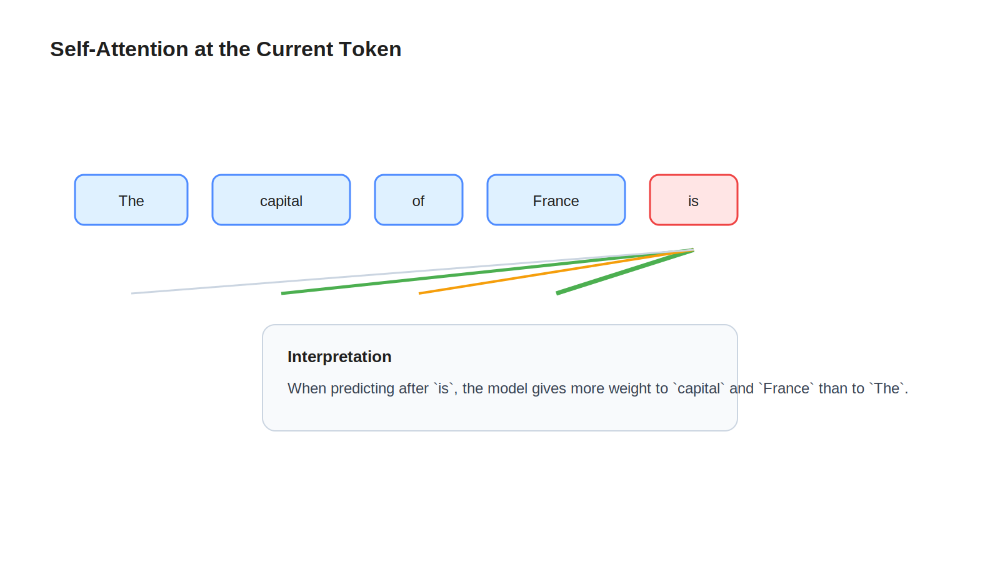

# Attention

## Learning Objectives

- Understand what self-attention is doing during a forward pass.
- Learn the role of queries, keys, and values without proof-heavy math.
- See how attention helps the model connect related tokens.

## Key Concepts

- Query, key, value
- Attention scores
- Weighted aggregation
- Causal masking
- Multi-head attention

## Diagram

## Explanation

Attention answers a practical question: when computing the representation for one token position, which earlier tokens should matter most?

Each token position produces a query, a key, and a value. You can think of the query as "what information am I looking for right now?" The keys describe what each earlier token offers. The values are the payloads that can be pulled in if a match is useful.

The model compares the query with available keys, converts those comparisons into attention weights, and builds a weighted combination of values. That weighted result updates the hidden state for the current position.

In decoder-only LLMs, causal masking prevents a token from looking ahead into the future. When predicting the next token after `The capital of France is`, the model can use `France`, but it cannot peek at `Paris` because that token has not been generated yet.

## Example

At the final position of `The capital of France is`, attention may place more weight on:

- `capital`
- `France`
- `is`

It may place less weight on `The` because that token is less important for deciding the next word.

This does not mean only one token matters. Attention is usually distributed. Multiple heads can learn different relationships at the same time, such as syntax, topic, or factual association.

## Key Takeaways

- Attention lets each token position gather information from earlier positions.
- Queries, keys, and values are learned projections used to route information.
- Causal masking prevents the model from cheating during generation.
- Multi-head attention allows different relationship patterns to be learned in parallel.

## References

- [Training](06-training.md)
- [The Annotated Transformer](https://nlp.seas.harvard.edu/2018/04/03/attention.html)
- [Attention Is All You Need](https://arxiv.org/abs/1706.03762)
