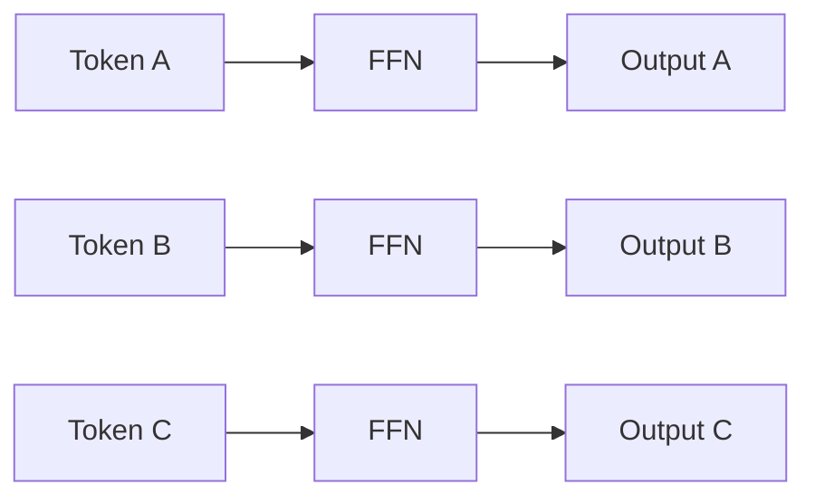
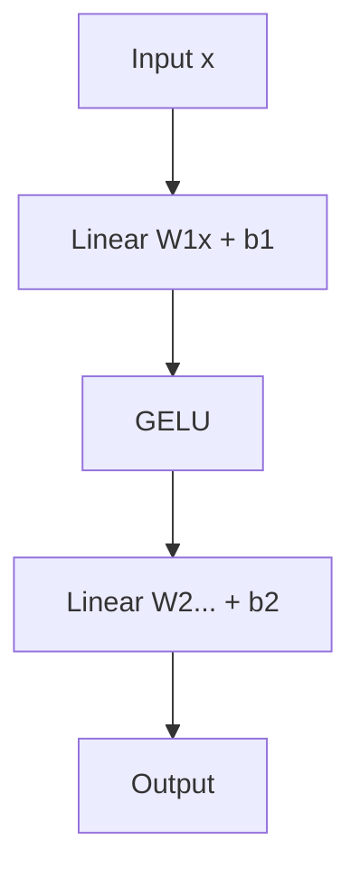
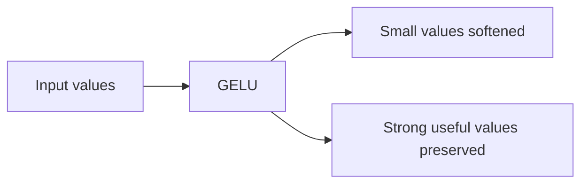
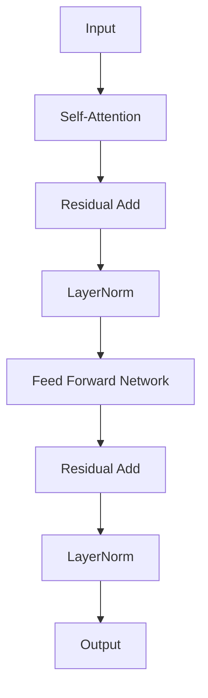
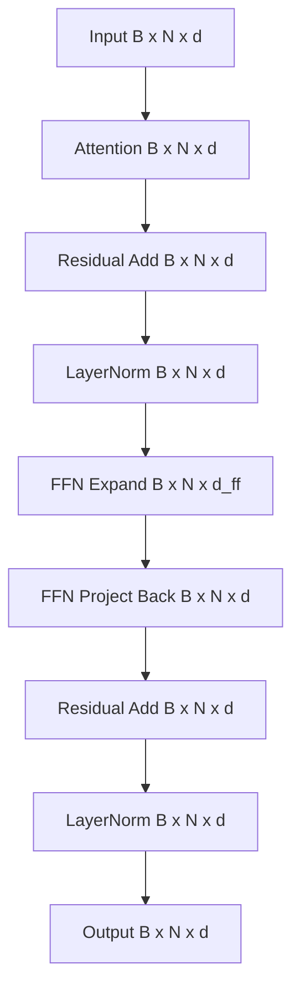

# Chapter 5 — Feed Forward Networks, Residual Connections, and Layer Normalization

## Learning Objectives

By the end of this chapter, you should understand:

- Why attention alone is not enough
- What a Feed Forward Network (FFN) does
- Why FFNs are applied independently to every token
- What activation functions do
- Why Transformers use GELU
- Why residual connections exist
- Why LayerNorm is necessary
- How these components complete a Transformer block

---

## Why This Topic Matters

In the last chapter, we covered self-attention. That gave us the core mechanism that lets tokens gather context from other tokens.

But a Transformer block is not just attention.

After attention updates a token representation, the model still needs more computation to transform that representation into something richer and more useful. It also needs a way to keep deep stacks stable enough to train and efficient enough to serve.

That is where three components come in:

- the **Feed Forward Network (FFN)**
- **Residual Connections**
- **Layer Normalization**

If attention is how tokens exchange information, these other pieces are how the model processes, stabilizes, and preserves that information across many layers.

This matters in production because these parts are not minor details:

- FFNs hold a large share of model parameters
- FFNs consume significant GPU compute during inference
- residual paths make deep models practical
- LayerNorm helps keep activations numerically stable

For engineers, this chapter completes the mental model of a basic Transformer block.

---

## Section 1 — Attention Isn't the Whole Story

Start with the obvious question:

**After self-attention produces contextual embeddings, what happens next?**

Attention solves an important problem: it tells each token which other tokens matter.

But attention does not do enough transformation by itself.

What problem exists?

- attention gathers information from the sequence
- it tells the model what is relevant
- but the model still needs additional computation to transform and refine each token representation

Why is this needed?

Because knowing which tokens matter is not the same as fully processing that information. The model must still reshape, compress, amplify, and filter features inside each token representation.

How does the Transformer solve it?

After attention, every token goes through a **Feed Forward Network**. This is where the model performs deeper per-token computation.

Why should engineers care?

Because attention often gets all the attention, but FFNs are a major part of both model capacity and inference cost.

> [!NOTE]
> **Why this matters in production**
> In many real model architectures, the FFN holds a larger share of total parameters than the attention projections. If you only think about attention, you will underestimate memory and compute requirements.

---

## Section 2 — What Is a Feed Forward Network?

A **Feed Forward Network**, or **FFN**, is a small neural network applied independently to every token.

The key word is **independently**.

During self-attention, tokens communicate with each other. During the FFN step, that communication stops. Each token is processed on its own.

What problem does this solve?

After attention mixes contextual information across tokens, each token still needs local computation to transform that information into a better representation.

Why is this needed?

Because not every useful transformation comes from token-to-token interaction. Some computation is about enriching the features inside one token vector.

How does it work?

- one token vector enters
- the FFN transforms it
- one updated token vector exits
- the same FFN is reused for every token position

Unlike attention:

- tokens do not compare with each other here
- there is no `N x N` interaction matrix
- processing is embarrassingly parallel across tokens



This is one reason Transformers map well to GPUs. Once the tokens have been contextualized by attention, the FFN can process all token positions in parallel using the same learned weights.

Why should engineers care?

Because FFN work scales with sequence length and hidden size, and it becomes a major part of runtime cost for large models.

---

## Section 3 — Inside the FFN

The standard Transformer FFN has a simple shape:

```text
Linear
-> Activation (GELU)
-> Linear
```

The equation is usually written like this:

```text
FFN(x) = W2(GELU(W1x + b1)) + b2
```

Shapes:

```text
x        : [B, N, d]
W1       : [d, d_ff]
b1       : [d_ff]
W1x + b1 : [B, N, d_ff]
GELU(...) : [B, N, d_ff]
W2       : [d_ff, d]
b2       : [d]
FFN(x)   : [B, N, d]
```

Plain-English explanation:

- `x` = input token representations
- `W1` = first learned weight matrix
- `b1` = bias for the first linear layer
- `GELU(...)` = non-linear activation applied after the first projection
- `W2` = second learned weight matrix
- `b2` = bias for the second linear layer

What is happening here?

1. The model projects from size `d` to a larger hidden size `d_ff`.
2. It applies a non-linear activation.
3. It projects back down to size `d`.

Why do this?

Because the larger hidden dimension gives the model more room to compute richer transformations before compressing back to the original model dimension.

Why not use only one linear layer?

Because one linear layer is limited. Two linear layers with a non-linear function between them allow the model to learn more expressive feature transformations.



Why should engineers care?

Because `d_ff` is often much larger than `d`. That means the FFN is frequently one of the biggest contributors to parameter count, memory usage, and FLOPs.

---

## Section 4 — Why GELU?

The next question is why the FFN includes an activation function at all.

What problem exists?

Without a non-linear activation, stacking linear layers does not buy you much.

Why?

Because multiple linear transformations can collapse into a single linear transformation.

That means:

- `Linear -> Linear` is still just one bigger linear mapping
- the model would lose a lot of expressive power

So the Transformer inserts a non-linearity between the two linear layers.

Modern LLMs commonly use **GELU** or **SiLU**. Earlier networks often used **ReLU**.

You do not need the full GELU equation for this chapter. The intuition is more useful:

**GELU smoothly decides how much of the incoming signal should pass through.**

It is not just an on/off gate. It behaves more smoothly than ReLU, which tends to work well in large Transformer models.



Why is this needed?

Because the model needs a way to express complex non-linear relationships inside each token representation.

Why should engineers care?

Because activation choice affects model quality, stability, and runtime behavior. When comparing model architectures, this is one of the small design choices that can have large effects at scale.

> [!IMPORTANT]
> **Common misconception**
> The activation function is not just a minor detail between two matrix multiplies. It is the reason the FFN can do meaningfully richer computation than a single linear layer.

---

## Section 5 — Residual Connections

Now move to the next problem.

Deep networks are hard to optimize.

As you stack more layers, it becomes easier for useful information to degrade, and harder for the model to learn clean updates.

Residual connections solve this with a simple idea:

```text
Output = Input + F(Input)
```

Shapes:

```text
Input     : [B, N, d]
F(Input)  : [B, N, d]
Output    : [B, N, d]
```

Plain-English explanation:

- `Input` = the incoming tensor
- `F(Input)` = the transformation produced by a sublayer, such as attention or FFN
- `Output` = the original input plus the learned update

What problem does this solve?

It gives the model a stable path to preserve information while still learning improvements.

Why is this needed?

Because asking every layer to fully replace its input is harder than asking it to learn a modification.

The intuition is:

- do not rebuild the entire representation from scratch
- keep what is already useful
- add a learned correction on top

An analogy:

Think of editing a configuration file.

It is usually safer to apply a small patch than to rewrite the whole file every time. Residual connections give the model a similar pattern: preserve the baseline, then apply the delta.

```mermaid
flowchart TD
    A[Input] --> B[F(Input)]
    A --> C[Skip path]
    B --> D[Add]
    C --> D
    D --> E[Output]
```

Why should engineers care?

Because without residual connections, very deep Transformer stacks would be much harder to train effectively. And without deep stacks, modern LLM capability would be far weaker.

---

## Section 6 — Layer Normalization

The next problem is numerical stability.

As activations pass through many layers, their values can drift into ranges that make optimization and inference less stable.

Layer Normalization, usually called **LayerNorm**, helps keep the activations in a healthier range.

You do not need the full statistics for this chapter. The important intuition is enough.

What problem does LayerNorm solve?

- activations can grow too large or become poorly distributed
- deep models become harder to train and less stable to run

Why is it needed?

Because the Transformer repeatedly applies large matrix operations across many layers. Without normalization, the signal can become harder to manage.

How does it work?

Conceptually, LayerNorm rescales and recenters each token representation so the values remain numerically well-behaved before or after major transformations.

Benefits:

- more stable training
- more stable inference
- better convergence
- easier optimization in deep networks


Why should engineers care?

Because stable activations are part of why these very deep models can exist at all. LayerNorm is one of the quiet components that makes the rest of the system practical.

> [!NOTE]
> **Engineering tip**
> Normalization layers are easy to overlook because they are small relative to the big matrix multiplies. But they often play an outsized role in numerical stability and model reliability.

---

## Section 7 — One Complete Transformer Block

Now put the pieces together.

One Transformer block can be viewed like this:

```text
Input
-> Self-Attention
-> Residual
-> LayerNorm
-> Feed Forward
-> Residual
-> LayerNorm
-> Output
```



What problem does this full block solve?

It combines:

- cross-token communication from attention
- per-token transformation from the FFN
- information preservation from residual connections
- numerical stability from LayerNorm

Why is each stage needed?

- **Self-Attention**
  - lets each token gather relevant context from other tokens

- **Residual after Attention**
  - preserves the incoming representation while adding contextual updates

- **LayerNorm**
  - stabilizes the tensor before deeper processing

- **Feed Forward Network**
  - performs local non-linear transformation on each token independently

- **Residual after FFN**
  - preserves the prior signal while adding learned per-token refinement

- **LayerNorm**
  - keeps the output well-behaved for the next block

This should become your mental model:

**attention mixes information across tokens, FFN transforms each token, residual paths preserve signal, and LayerNorm keeps the whole stack stable.**

Why should engineers care?

Because a large LLM is mostly a deep repetition of this block. Once you understand one block, you understand the core unit that gets stacked dozens of times.

---

## Section 8 — Tensor Shapes

Engineers usually understand deep learning systems much faster when the shapes stay visible.

Let:

- `B` = batch size
- `N` = sequence length
- `d` = model dimension
- `d_ff` = FFN hidden dimension

Now trace the main tensor through the block.

### Input

```text
Input: [B, N, d]
```

### Attention

```text
Attention output: [B, N, d]
```

The attention sublayer returns the same outer shape because each token still needs one output vector of size `d`.

### Residual Add

```text
Input + Attention(x): [B, N, d]
```

Residual addition only works because the shapes match.

### LayerNorm

```text
LayerNorm(...): [B, N, d]
```

LayerNorm changes values, not overall tensor shape.

### FFN Expansion

```text
After W1: [B, N, d_ff]
```

This is the wider hidden layer inside the FFN.

### FFN Return Projection

```text
After W2: [B, N, d]
```

The FFN comes back to model dimension `d` so the next residual add can work.

### Final Output

```text
Output: [B, N, d]
```



Why do shapes stay constant across the block?

Because stacking many layers is much easier when each block accepts and returns the same outer tensor shape.

That design makes Transformers modular:

- block in
- block out
- same interface repeated many times

Why should engineers care?

Because stable tensor shapes make implementation, optimization, sharding, and serving architecture much more predictable.

---

## Section 9 — Why Engineers Should Care

These components have direct production consequences.

### FFN contains a large percentage of model parameters

The FFN often expands from `d` to a much larger `d_ff`, then projects back. That means a lot of weights live in this sublayer.

### FFN contributes significantly to inference latency

Those large matrix multiplies run for every token in every layer.

### Larger hidden dimensions increase GPU memory usage

If `d` or `d_ff` grows, parameter memory and activation memory both grow.

### Residual connections enable very deep models

Without residual paths, today’s deep LLMs would be much harder to optimize.

### LayerNorm improves numerical stability

Stable activations help both training and inference behave predictably.

This affects real systems in obvious ways:

- larger FFNs increase model size on disk
- larger FFNs increase GPU memory requirements
- deeper models increase latency
- stable normalization improves reliability
- model architecture choices affect throughput and cost

Why should platform engineers care?

- serving capacity depends on model size and compute per token
- GPU memory limits how many requests you can batch
- architecture choices affect whether a model fits on one GPU or many
- latency budgets depend on repeated attention and FFN cost across all layers

> [!NOTE]
> **Why this matters in production**
> When people talk about “a 7B model” or “a 70B model,” a large amount of those parameters live in repeated FFN and projection layers. This is one reason model scale has such a direct effect on serving cost.

---

## Section 10 — Common Misconceptions

### Attention is not the only computation

Attention is central, but it is only one part of the block. The FFN performs major additional transformation.

### FFN is not a simple classifier

The FFN is a per-token transformation module inside every layer, not just a final decision layer.

### Residual connections are not shortcuts that skip computation

The computation still happens. The residual path simply preserves the original signal and adds the learned update.

### LayerNorm is not BatchNorm

LayerNorm is designed differently and fits sequence models much better than BatchNorm in this setting.

### FFN does not replace attention

Attention handles token-to-token interaction. FFN handles per-token transformation. You need both.

> [!IMPORTANT]
> **Common misconception**
> If attention mixes information across tokens, that does not mean the FFN is optional. Without the FFN, the model loses a large amount of its representational power.

---

## Section 11 — Key Takeaways

- Attention gathers context, but it is not the entire Transformer block.
- The **Feed Forward Network** performs non-linear per-token transformation after attention.
- FFNs process each token independently and in parallel.
- The standard FFN is `Linear -> GELU -> Linear`.
- GELU gives the FFN non-linear expressive power.
- Residual connections let the model learn updates instead of full replacements.
- LayerNorm helps keep activations numerically stable across deep stacks.
- A Transformer block keeps the outer tensor shape constant as `[B, N, d]`.
- FFNs contribute heavily to parameter count, memory usage, and inference cost.
- Understanding these components is essential for reasoning about model size, latency, and serving performance.

---

## Next Chapter

Next: **Chapter 6 — Multi-Head Attention**

So far we have seen one attention mechanism. Modern Transformers use many attention heads simultaneously, allowing the model to learn different relationships in parallel.
