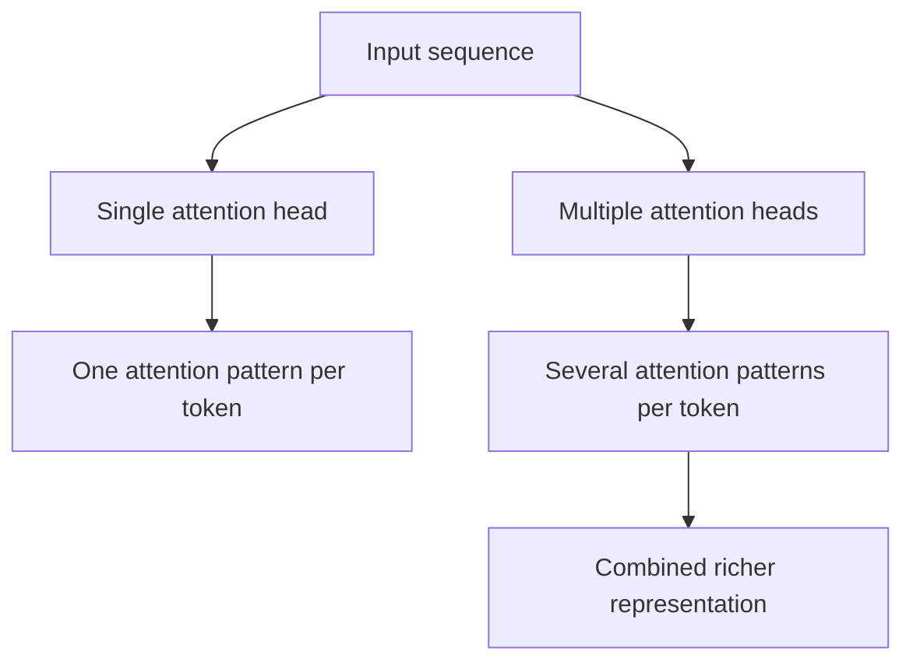
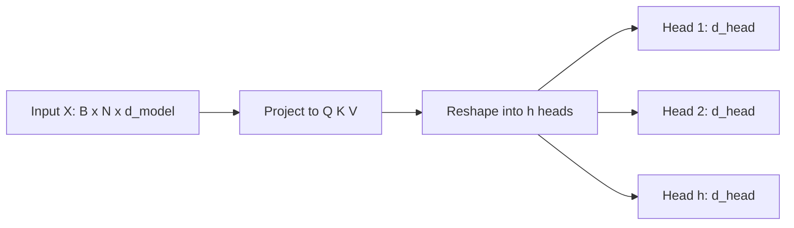
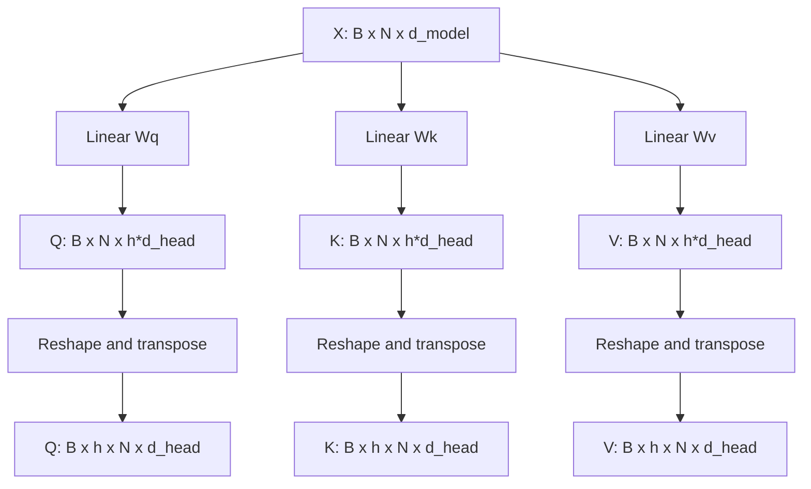
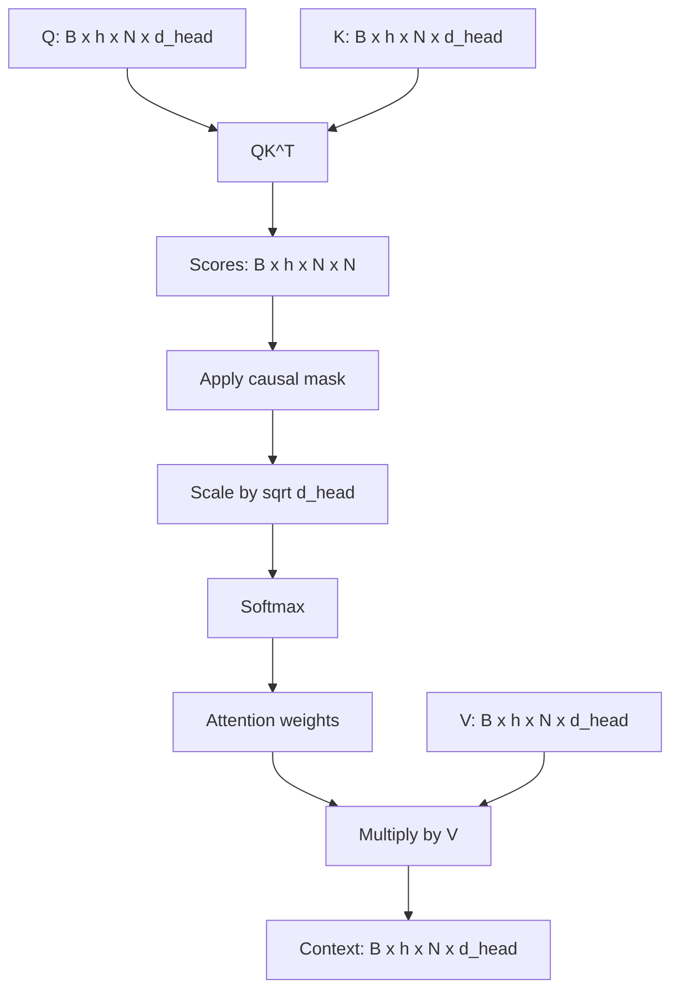
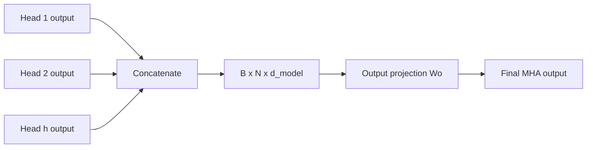
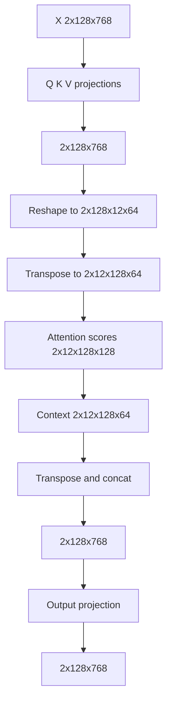
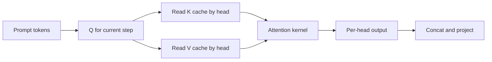

# Chapter 6 — Multi-Head Attention: Why Transformers Use Many Heads at Once

## Learning Objectives

By the end of this chapter, you should understand:

- Why a single attention head is usually not enough
- What a head is in practical tensor terms
- How the model splits the hidden dimension across heads
- How per-head Query, Key, and Value projections work
- How attention runs independently inside each head
- Why heads are concatenated and projected back to the model dimension
- What tensor shapes look like through the full multi-head attention path
- What multi-head attention means for memory, latency, and serving systems

---

## Why This Topic Matters

In the last chapter, we covered attention as if the model used one Query matrix, one Key matrix, and one Value matrix to compute one contextual output.

That explains the basic idea correctly, but modern Transformers do not stop there.

They use **multi-head attention**.

Instead of giving the entire hidden vector to one attention mechanism, the model splits the work into multiple smaller attention heads that run in parallel. Each head gets its own learned projections and can focus on different relationships in the same sequence.

This matters because one head has limited representational bandwidth. If one head must simultaneously track syntax, code structure, long-range references, punctuation patterns, speaker turns, and local token agreement, it becomes a bottleneck. Multiple heads give the model several independent ways to look at the same prompt.

This also matters operationally:

- the number of heads affects tensor layout and kernel efficiency
- head count changes KV cache structure during inference
- head dimension influences memory bandwidth and attention throughput
- serving systems must optimize attention across many heads, not one

For engineers, multi-head attention is where the high-level concept of attention turns into the actual implementation pattern used by production LLMs.

---

## Section 1 — Why One Attention Head Is Not Enough

Start with the simplest version of attention.

Each token produces Q, K, and V. Then each token compares against all others, computes weights, and builds a context-aware output.

That works, but it creates a practical limitation.

What problem exists?

- one head produces one attention pattern per token
- one head has one learned similarity space
- one head must compress all useful relationships into a single set of weights

Why is that a problem?

Because language and code contain several types of relationships at once.

In a prompt like this:

```text
If the pod crashes after mounting the secret, restart the deployment.
```

the model may need to track:

- the local grammatical role of `pod`
- the causal relationship around `after`
- the link between `restart` and `deployment`
- domain-specific structure such as Kubernetes resource terminology

One head can learn some of this, but many heads can divide the work.

You should not think of this as strict hand-assigned roles where one head is "the syntax head" and another is "the pronoun head." Real models are messier than that. But multiple heads give the model more subspaces in which different useful patterns can emerge.



Why should engineers care?

Because this is a core reason model quality improves with the Transformer design. It is also why inference engines must process a head dimension in addition to batch, sequence length, and hidden size.

> [!NOTE]
> **Why this matters in production**
> When you look at attention kernels, KV cache layouts, or model configs like `num_attention_heads`, you are seeing the concrete implementation of this design choice.

---

## Section 2 — What Is an Attention Head?

An **attention head** is one smaller attention mechanism operating on a slice of the model's representation space.

Suppose the model dimension is `d_model = 768` and the model uses `h = 12` heads.

Then each head usually gets:

```text
d_head = d_model / h = 768 / 12 = 64
```

So instead of one attention mechanism over dimension 768, the model runs 12 attention mechanisms over dimension 64.

Important detail:

The model does **not** simply chop the original token vector into 12 fixed pieces and reuse them directly. It first learns separate projection matrices for Q, K, and V, and those projections produce per-head representations.

Typical shapes:

```text
X        : [B, N, d_model]
d_model  : 768
h        : 12
d_head   : 64
```

Where:

- `B` = batch size
- `N` = sequence length
- `d_model` = full hidden dimension
- `h` = number of attention heads
- `d_head` = hidden dimension used inside one head



Why do this?

Because smaller independent attention mechanisms can learn different useful comparisons, and the model later recombines them.

Why should engineers care?

Because head count changes how tensors are reshaped, stored, and computed. If you are reading model configs or tracing GPU kernels, this is not an abstract concept. It is a first-class axis in the tensor.

---

## Section 3 — Per-Head Q, K, and V Projections

Now move from intuition to implementation.

The model starts with the input tensor:

```text
X : [B, N, d_model]
```

It applies learned linear projections to create Q, K, and V.

One common conceptual view is:

```text
Q = XWq
K = XWk
V = XWv
```

with:

```text
Wq : [d_model, h * d_head]
Wk : [d_model, h * d_head]
Wv : [d_model, h * d_head]
```

That gives:

```text
Q : [B, N, h * d_head]
K : [B, N, h * d_head]
V : [B, N, h * d_head]
```

Then the model reshapes those tensors into separate heads:

```text
Q : [B, N, h, d_head] -> [B, h, N, d_head]
K : [B, N, h, d_head] -> [B, h, N, d_head]
V : [B, N, h, d_head] -> [B, h, N, d_head]
```

The transpose is done so each head has direct access to all sequence positions.



Plain-English explanation:

- the projection matrices are learned parameters
- each head gets its own learned subspace inside those projections
- after reshaping, the model can run attention independently for each head

Why not create `h` completely separate linear layers in code?

You can think of it that way conceptually, but implementations usually fuse the work into larger matrix multiplications for efficiency.

Why should engineers care?

Because this is a standard pattern in optimized inference code: do one larger projection, then reshape into heads instead of launching many tiny operations.

> [!IMPORTANT]
> **Common misconception**
> The heads are not copies of the same attention calculation over the same features. They use different learned projections, so each head can learn different relevance patterns.

---

## Section 4 — Attention Runs Independently Inside Each Head

Once Q, K, and V are split into heads, each head performs scaled dot-product attention.

For one head:

```text
Attention(Q, K, V) = softmax(QK^T / sqrt(d_head)) V
```

For the full tensor with all heads:

```text
Q        : [B, h, N, d_head]
K        : [B, h, N, d_head]
V        : [B, h, N, d_head]
K^T      : [B, h, d_head, N]
Scores   : [B, h, N, N]
Weights  : [B, h, N, N]
Context  : [B, h, N, d_head]
```

If this is causal self-attention, the model also applies a mask so a token cannot attend to future tokens.



What changes relative to the single-head case?

- the math inside each head is the same
- the work is repeated across `h` heads
- the score matrix now has shape `[B, h, N, N]`

This means every head produces its own attention map.

For a given token, one head might place strong weight on nearby tokens, while another may place weight on a dependency much earlier in the sequence.

Why should engineers care?

Because the score tensor is one of the expensive parts of attention. Adding heads does not change the basic `N x N` attention pattern, but it does add another dimension that affects memory traffic and kernel design.

---

## Section 5 — Concatenation and Output Projection

After each head produces its contextual output, the model is not done.

It needs to combine the head outputs back into one tensor with model dimension `d_model`.

Start with:

```text
Context per head : [B, h, N, d_head]
```

Then transpose and reshape:

```text
[B, h, N, d_head] -> [B, N, h, d_head] -> [B, N, h * d_head]
```

Since `h * d_head = d_model`, this becomes:

```text
Concatenated : [B, N, d_model]
```

Then apply one more learned projection:

```text
Output = Concat(Context_heads) Wo
Wo     : [d_model, d_model]
Output : [B, N, d_model]
```

Why is the output projection needed?

- to mix information across heads
- to return the tensor to the standard model dimension
- to let the model learn how to combine the different head outputs



Without the output projection, the heads would simply sit next to one another. The projection lets the model remix those features into a new shared representation.

Why should engineers care?

Because this final projection is another large matrix multiplication in the attention block. It contributes to both parameter count and inference cost.

---

## Section 6 — End-to-End Tensor Shape Walkthrough

Use one concrete example.

Suppose:

- `B = 2`
- `N = 128`
- `d_model = 768`
- `h = 12`
- `d_head = 64`

Then the multi-head attention path looks like this:

```text
Input X                    : [2, 128, 768]

Q, K, V after projection   : [2, 128, 768]

Q, K, V after reshape      : [2, 128, 12, 64]

Q, K, V after transpose    : [2, 12, 128, 64]

Scores = QK^T              : [2, 12, 128, 128]

Weights after softmax      : [2, 12, 128, 128]

Context = Weights x V      : [2, 12, 128, 64]

Transpose back             : [2, 128, 12, 64]

Concatenate heads          : [2, 128, 768]

Output projection          : [2, 128, 768]
```



This walkthrough is worth internalizing because many Transformer implementation bugs are shape bugs.

Typical sources of mistakes:

- forgetting which axis is heads vs sequence length
- transposing the wrong dimensions before `QK^T`
- mismatching `d_model`, `h`, and `d_head`
- applying masks with the wrong broadcast pattern

Why should engineers care?

Because tensor layout directly affects correctness, performance, and whether optimized kernels can be used.

---

## Section 7 — Production Implications

Multi-head attention is not only an architecture detail. It drives several practical system behaviors.

### KV Cache Layout

During autoregressive inference, the model stores previous Keys and Values so it does not recompute them for every new token.

Those caches are usually shaped per head:

```text
K cache : [B, h, T, d_head]
V cache : [B, h, T, d_head]
```

where `T` is the number of already processed tokens.

More heads means more head slices to store and read during generation.

### Memory Bandwidth Pressure

Attention is often limited not only by raw FLOPs but by memory movement:

- load Q for the current token(s)
- read all past K and V from cache
- compute attention weights
- write updated cache entries

Long contexts increase `T`, and the per-head cache layout is part of that cost.

### Kernel Optimization

Serving engines use optimized attention kernels that depend on predictable head shapes and tensor layouts. Head dimension values like 64, 80, 96, or 128 can affect which kernels are available or how efficient they are.

### Parallelism and Sharding

Large training and inference systems may shard work across GPUs. Heads are one possible partitioning dimension in some implementations, especially when using tensor parallelism.



> [!NOTE]
> **Engineering note**
> If you are debugging slow generation for long prompts, attention cache reads across heads are part of the hot path. The model is not just doing math on the current token. It is repeatedly consulting stored per-head history.

---

## Common Misconceptions

- **"More heads always means better quality."**
  Not automatically. Head count is one design choice among many. Too many heads can create small per-head dimensions that are not very expressive.

- **"Each head has a fixed human-readable role."**
  Some heads show interpretable patterns, but real models distribute behavior across many components. Do not overfit to clean stories.

- **"Multi-head attention changes the basic attention equation."**
  Not really. The main equation stays the same. The model just runs it several times in parallel over learned subspaces.

- **"Concatenation is the final answer."**
  No. The output projection after concatenation is important because it mixes information across heads and returns to the model dimension.

- **"Heads are purely a training-time concept."**
  No. They remain visible at inference time in tensor shapes, cache structure, and kernel behavior.

---

## Key Takeaways

- Multi-head attention lets the model learn several attention patterns at once.
- A head is one smaller attention mechanism operating over dimension `d_head`.
- Q, K, and V are projected, reshaped into heads, and processed independently per head.
- Attention score tensors usually have shape `[B, h, N, N]`.
- Head outputs are concatenated and then passed through an output projection.
- Head count and head dimension affect quality, tensor layout, KV cache shape, and serving performance.

---

## Next Chapter

Now that we have all the major building blocks, the next chapter walks one prompt through **an entire Transformer forward pass** from raw text to next-token probabilities.
