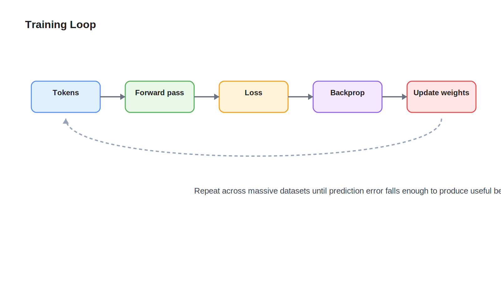

# Training

## Learning Objectives

- Understand how an LLM learns from text data.
- Learn the difference between forward pass and backpropagation.
- Build intuition for loss, gradient updates, and why training is expensive.

## Key Concepts

- Training corpus
- Forward pass
- Logits and probabilities
- Loss
- Backpropagation
- Gradient descent

## Diagram

## Explanation

Training is the process of repeatedly showing the model token sequences and adjusting parameters so its next-token predictions improve.

Each training step starts with a forward pass. Tokens move through the model, and the model outputs logits for the next token at each position. Logits are raw scores, not probabilities yet. A probability distribution is derived from them, and the model is compared against the known correct next token from the dataset.

That comparison produces a loss value. The loss is a compact measure of prediction error. Backpropagation then computes how much each parameter contributed to that error. An optimizer uses those gradients to update the parameters.

For engineers, this is like a closed feedback loop in a control system. The forward pass produces behavior. The loss measures error. Backpropagation traces responsibility backward. Parameter updates nudge the system so future behavior is better.

## Example

Consider the training sequence `The capital of France is Paris`.

During training, the model might be asked to predict:

- after `The`, predict ` capital`
- after `The capital`, predict ` of`
- after `The capital of France is`, predict ` Paris`

If the model gives low probability to ` Paris`, the loss increases. Backpropagation then pushes the parameters so that future hidden states for similar contexts become more supportive of ` Paris`.

## Key Takeaways

- Training improves the model by repeatedly correcting prediction errors.
- The forward pass computes outputs; backpropagation computes how to change parameters.
- Loss is the signal that tells the optimizer whether predictions were good or bad.
- Training is costly because this process runs across huge datasets and very large models.

## References

- [Fine-Tuning](07-fine-tuning.md)
- [Deep Learning Book: Optimization](https://www.deeplearningbook.org/)
- [Hugging Face Course: Training](https://huggingface.co/learn/nlp-course/chapter3)
