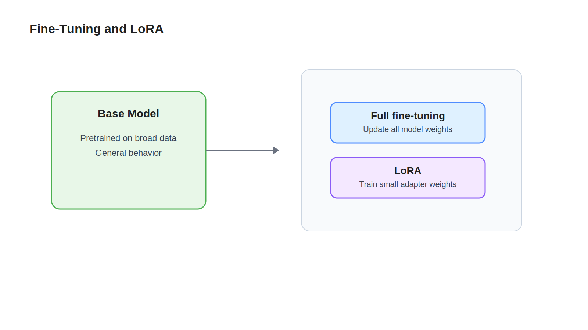

# Fine-Tuning

## Learning Objectives

- Understand why fine-tuning exists after base model training.
- Learn the difference between full fine-tuning and parameter-efficient methods.
- Build intuition for LoRA and where it fits.

## Key Concepts

- Base model
- Domain adaptation
- Instruction tuning
- Full fine-tuning
- LoRA
- Parameter-efficient fine-tuning

## Diagram



## Explanation

Base training teaches broad language behavior across large datasets. Fine-tuning is the step where a pretrained model is adapted for a narrower goal, such as following instructions better or working better in a specific domain.

Full fine-tuning updates all model parameters. That can work well, but it is expensive and operationally heavy. It requires storing a full modified copy of the model and running large-scale training jobs.

LoRA, short for Low-Rank Adaptation, takes a lighter approach. Instead of changing every weight directly, LoRA trains small adapter matrices that influence the original weights. The base model stays mostly frozen, while a compact learned delta captures the new behavior.

This matters to engineers because it changes the cost profile. Fine-tuning is no longer always a full model rewrite. In many cases, it becomes a smaller artifact that can be versioned, swapped, and tested more easily.

## Example

Suppose the base model already knows that `The capital of France is` should likely continue with ` Paris`.

Now imagine you want the model to answer in a strict enterprise support format, such as:

```text
Answer: Paris
Confidence: High
```

Instruction tuning or LoRA-based fine-tuning can teach that output behavior without retraining the whole model from scratch.

## Key Takeaways

- Fine-tuning adapts a pretrained model for a narrower task or behavior.
- Full fine-tuning changes all parameters and is expensive.
- LoRA is a parameter-efficient method that learns small adapter weights instead of rewriting the full model.
- Fine-tuning changes behavior, not the fundamental transformer architecture.

## References

- [Inference](08-inference.md)
- [LoRA paper](https://arxiv.org/abs/2106.09685)
- [Hugging Face PEFT documentation](https://huggingface.co/docs/peft/index)
