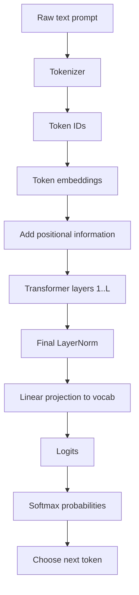
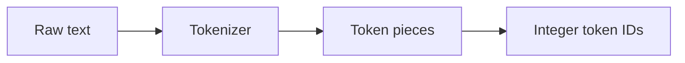
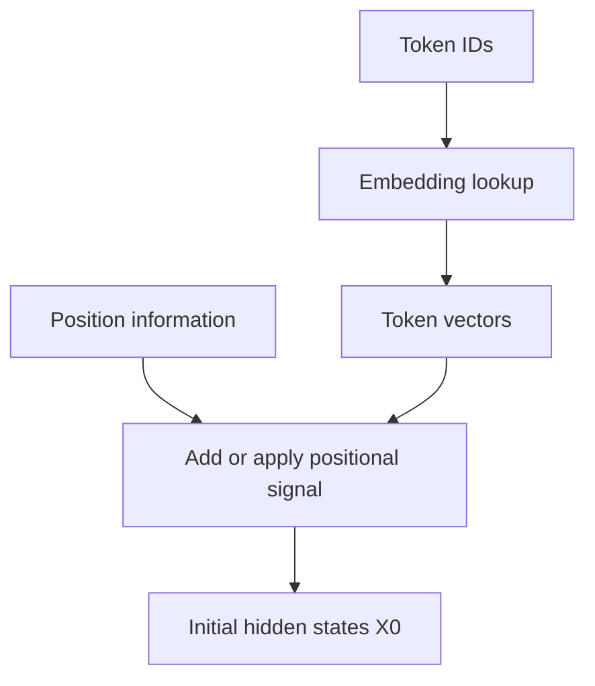
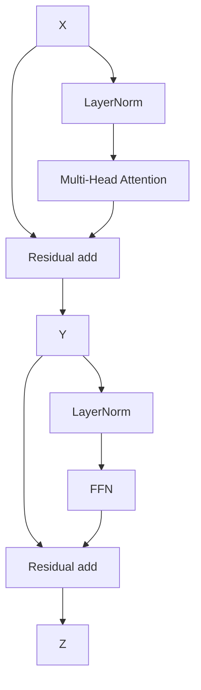
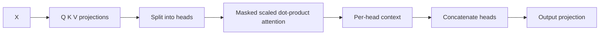
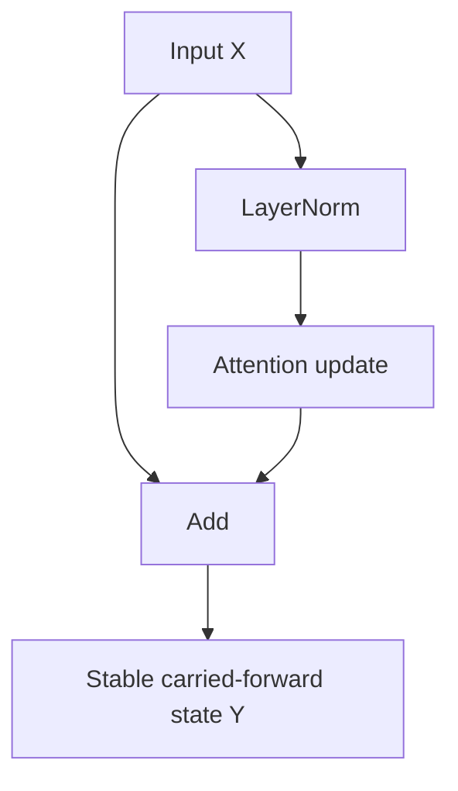
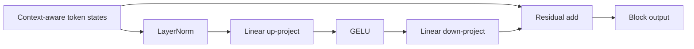
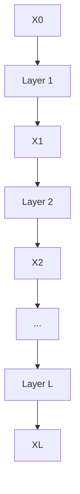
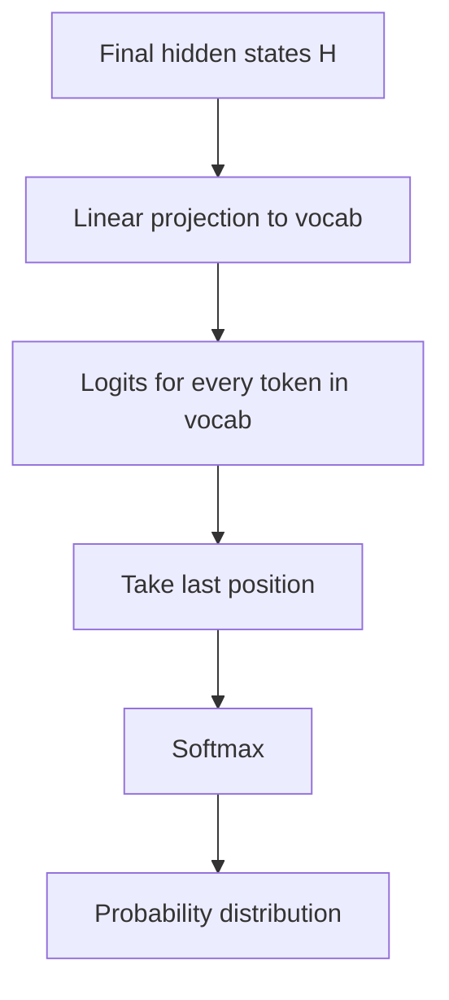

# Chapter 7 — One Complete Transformer Forward Pass

## Learning Objectives

By the end of this chapter, you should understand:

- How one prompt moves through a Transformer during inference
- Where tokenization fits into the pipeline
- How embeddings and positional information form the initial hidden states
- How multi-head attention, residual connections, LayerNorm, and FFN interact inside one block
- Why the same block is repeated `N` times
- How the final hidden state becomes logits, probabilities, and a next-token choice
- Which steps happen once per prompt and which repeat for each generated token

---

## Why This Topic Matters

By this point, we have covered most of the important components of a Transformer:

- tokens
- embeddings
- positional encoding
- self-attention
- multi-head attention
- feed-forward networks
- residual connections
- LayerNorm

But many engineers still feel a gap after learning the parts individually.

They understand the components, yet they cannot confidently answer a practical question:

**What exactly happens when I send a prompt to an LLM and it generates the next token?**

This chapter answers that question end to end.

That matters operationally because inference systems are built around this forward pass. Request latency, GPU memory use, batching behavior, KV cache growth, and token throughput all come from repeatedly executing this pipeline.

If you can trace one full forward pass, you have the right mental model for model serving.

---

## Section 1 — Start with a Concrete Prompt

Use a short example:

```text
Prompt: "Kubernetes schedules pods on"
```

The model's job is to predict the next token after `on`.

Important framing:

- the model does not directly predict a whole sentence
- it predicts one next token at a time
- after choosing that token, it appends it to the sequence and runs again

For this chapter, we focus on one forward pass that produces the next-token distribution.

High-level flow:



Why should engineers care?

Because this is the real runtime path behind every generated token in a served model.

---

## Section 2 — Tokenization: Text Becomes Token IDs

The model cannot process raw strings directly.

The prompt first goes through a tokenizer.

Example conceptually:

```text
"Kubernetes schedules pods on"
-> [15432, 9821, 4401, 389]
```

The exact IDs depend on the tokenizer, but the idea is stable.

What problem does tokenization solve?

- neural networks need numeric input
- language is too large to treat every full sentence as one symbol
- subword tokenization lets the model reuse pieces across many words

Typical shape after tokenization:

```text
input_ids : [B, N]
```

For one prompt in one batch:

```text
B = 1
N = 4
input_ids : [1, 4]
```



Why should engineers care?

Because prompt length in tokens, not characters, drives inference cost, KV cache size, and billing in many systems.

> [!NOTE]
> **Engineering note**
> Two prompts with similar character length can produce different token counts. For capacity planning, token count is the metric that matters.

---

## Section 3 — Embeddings and Positional Information

Each token ID is looked up in an embedding table.

If:

- vocabulary size = `V`
- model dimension = `d_model`

then the embedding table has shape:

```text
Embedding matrix : [V, d_model]
```

Looking up token IDs produces:

```text
X_token : [B, N, d_model]
```

Example:

```text
input_ids : [1, 4]
X_token   : [1, 4, 768]
```

These vectors encode token identity, but not position.

So the model adds positional information:

```text
X0 = X_token + X_pos
X0 : [B, N, d_model]
```

Depending on the architecture, positional information may come from learned position embeddings, sinusoidal encoding, or rotary position handling inside attention. For the mental model of a forward pass, the key point is simple:

**the model needs both token identity and token order**.



Why should engineers care?

Because by this stage the input is no longer text. It is a dense tensor moving through GPU kernels. From here on, nearly all runtime cost comes from tensor operations.

---

## Section 4 — One Transformer Block

Now the model sends `X0` through the first Transformer layer.

Each layer has two major sublayers:

1. Multi-head self-attention
2. Feed-forward network

Both are wrapped with residual connections and LayerNorm.

Modern implementations may use pre-norm or post-norm variants. The exact ordering differs across architectures. A common pre-norm view is:

```text
Y = X + MHA(LN(X))
Z = Y + FFN(LN(Y))
```

Shapes stay the same across the block:

```text
X : [B, N, d_model]
Y : [B, N, d_model]
Z : [B, N, d_model]
```



Why should engineers care?

Because this block is the repeating unit of the model. Once you understand one block, you understand the core of the full network.

---

## Section 5 — Inside Multi-Head Self-Attention During the Forward Pass

Take the normalized hidden states entering attention:

```text
X : [B, N, d_model]
```

The model computes:

```text
Q = XWq
K = XWk
V = XWv
```

Then reshapes into heads:

```text
Q, K, V : [B, h, N, d_head]
```

The attention calculation is:

```text
Scores  = QK^T / sqrt(d_head)
Weights = softmax(Scores + mask)
Context = Weights V
```

Shapes:

```text
Scores  : [B, h, N, N]
Weights : [B, h, N, N]
Context : [B, h, N, d_head]
```

Then concatenate heads and apply the output projection:

```text
Context concat : [B, N, d_model]
MHA output     : [B, N, d_model]
```

Because this is a decoder-style causal model, the mask blocks future positions. Token 3 can look at tokens 1 and 2, but not token 4 if token 4 is in the future during generation.



What is the result?

Each token now has a context-aware representation. The vector for `on` can now reflect its relationship to `Kubernetes`, `schedules`, and `pods`.

Why should engineers care?

Because attention is where tokens interact, and it is one of the main latency and memory hotspots in inference.

---

## Section 6 — Residual Connections and LayerNorm

After attention, the model adds the original input back in through a residual path.

```text
Y = X + MHA(LN(X))
```

This means the layer learns an update rather than a full replacement.

Then another LayerNorm prepares the tensor for the FFN.

What problem does this solve?

- residuals help preserve useful information through deep stacks
- LayerNorm stabilizes the magnitude and distribution of activations

Why is that important here?

Because a large LLM may repeat this block dozens of times. Without stable residual and normalization behavior, deep training and inference would be much harder.



Why should engineers care?

Because residual structure explains why tensor shapes stay constant across layers, which simplifies batching and GPU kernel design.

---

## Section 7 — Feed-Forward Network

After attention, the model processes each token independently with the FFN.

Typical form:

```text
FFN(x) = W2(GELU(W1x + b1)) + b2
```

Shapes:

```text
x      : [B, N, d_model]
W1     : [d_model, d_ff]
W2     : [d_ff, d_model]
FFN(x) : [B, N, d_model]
```

Where `d_ff` is usually larger than `d_model`, often by a factor like 4x.

The FFN does not mix tokens across positions. That mixing already happened in attention. Instead, FFN enriches each token's internal features.

Then the model adds another residual:

```text
Z = Y + FFN(LN(Y))
```



Why should engineers care?

Because FFNs often hold a large fraction of model parameters and consume substantial inference compute.

---

## Section 8 — Repeat the Block `L` Times

One Transformer layer is useful. A deep stack is what gives the model its power.

If the model has `L` layers, then the output of layer 1 becomes the input of layer 2, and so on:

```text
X0 -> Layer1 -> X1 -> Layer2 -> X2 -> ... -> LayerL -> XL
```

Each layer keeps the same outer shape:

```text
Xi : [B, N, d_model]
```

But the meaning of the vectors becomes richer at each stage.

Early layers often capture simpler local patterns. Deeper layers can represent more abstract relationships useful for predicting the next token.



Why should engineers care?

Because total latency is strongly influenced by layer count. More layers usually mean more capability, but also more sequential work per generated token.

---

## Section 9 — Final LayerNorm, Vocabulary Projection, and Softmax

After the last Transformer block, many architectures apply a final LayerNorm:

```text
H = LN(XL)
H : [B, N, d_model]
```

Then the model projects from hidden dimension to vocabulary dimension:

```text
Logits = H W_vocab
W_vocab : [d_model, V]
Logits  : [B, N, V]
```

Each position now has one score per vocabulary token.

For next-token prediction, we usually care only about the **last position** in the sequence.

If `N = 4`, we take:

```text
last_logits : [B, V]
```

Then apply softmax:

```text
P(token_i) = exp(logit_i) / sum_j exp(logit_j)
```

Intuition:

- logits are raw scores
- softmax turns them into probabilities over the vocabulary
- higher logit means higher probability after normalization



Why should engineers care?

Because vocabulary size can be large, so this final projection and probability step are also meaningful parts of runtime and memory behavior.

---

## Section 10 — Choose the Next Token and Continue

Suppose the highest-probability next token is `nodes`.

The model outputs that token ID, which decodes to text:

```text
"Kubernetes schedules pods on nodes"
```

Then generation continues:

1. append the chosen token to the sequence
2. run another forward pass
3. predict the next token after `nodes`
4. repeat until a stop condition is reached

Common next-token selection methods include:

- greedy decoding
- sampling
- top-k sampling
- nucleus sampling

But the core model output is always the same: a probability distribution over the next token.

Why should engineers care?

Because user-visible generation latency comes from repeating this loop token by token.

> [!NOTE]
> **Engineering note**
> Prefill and decode are different phases. The initial prompt pass processes many input tokens. The later generation loop usually processes one new token at a time while reading the KV cache from prior tokens.

---

## Section 11 — End-to-End Shape Summary

Use one realistic example:

- `B = 1`
- `N = 4`
- `d_model = 768`
- `h = 12`
- `d_head = 64`
- `d_ff = 3072`
- `V = 50000`

Then one forward pass looks like this:

```text
input_ids                      : [1, 4]
embedding lookup               : [1, 4, 768]
add positional information     : [1, 4, 768]

for each layer:
  Q, K, V                      : [1, 12, 4, 64]
  attention scores             : [1, 12, 4, 4]
  attention output             : [1, 4, 768]
  FFN hidden                   : [1, 4, 3072]
  layer output                 : [1, 4, 768]

final LayerNorm                : [1, 4, 768]
vocab projection               : [1, 4, 50000]
last-position logits           : [1, 50000]
softmax probabilities          : [1, 50000]
chosen next token              : [1]
```

This is the path you should picture when someone says "run inference on a prompt."

---

## Common Misconceptions

- **"The model generates the whole answer in one pass."**
  No. It generates one token at a time, repeating the forward pass.

- **"Softmax is where the model thinks."**
  No. Most of the useful computation happens in the Transformer layers. Softmax just converts the final logits into a probability distribution.

- **"All token positions are equally important at output time."**
  For next-token generation, we usually use only the final position's logits.

- **"Residual connections are minor plumbing."**
  No. They are part of what makes deep Transformer stacks workable.

- **"Inference is just matrix multiplication on the latest token."**
  Not exactly. During decoding, the model also reads the stored KV cache from earlier tokens.

---

## Key Takeaways

- A forward pass starts with tokenization and ends with next-token probabilities.
- Embeddings plus positional information create the initial hidden states.
- Each Transformer block applies multi-head attention, residual paths, LayerNorm, and FFN.
- The block repeats `L` times with shape `[B, N, d_model]` preserved across layers.
- The final hidden states are projected into vocabulary logits, then normalized with softmax.
- Generation is an iterative loop: predict one token, append it, and run again.

---

## Next Chapter

Now that the inference-time forward pass is clear, the next chapter covers **how foundation models are trained**: data pipelines, loss, backpropagation, optimization, checkpoints, and distributed training.
