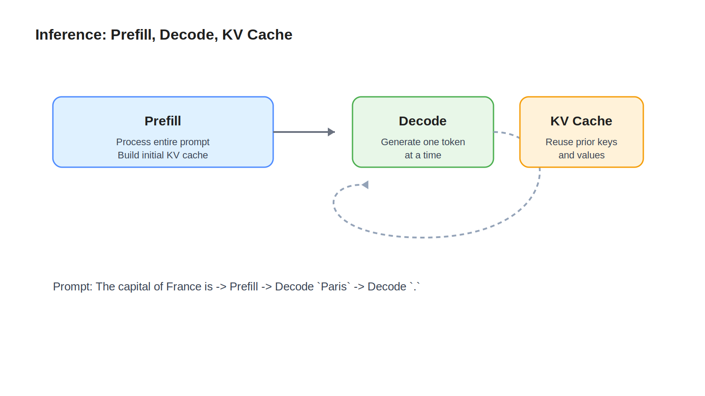

# 08 Inference

## Learning Objectives

- Understand how generation works after a model has been trained.
- Learn the difference between prefill and decode.
- See why KV cache matters for latency.

## Key Concepts

- Inference
- Prefill
- Decode loop
- Sampling or greedy selection
- KV cache
- Latency per token

## Diagram



## Explanation

Inference is the runtime phase where a trained model turns an input prompt into generated output.

The first stage is prefill. During prefill, the model processes the entire prompt sequence and computes hidden states and attention cache entries for all prompt tokens. This stage is usually heavier because it covers the full input length.

The second stage is decode. In the decode loop, the model generates one token at a time. After each token is emitted, the new token is fed back into the model so the next token can be predicted.

KV cache is critical here. In self-attention, each layer produces keys and values for processed tokens. Without caching, the model would recompute those for the full history on every decode step. With KV cache, the model reuses the old keys and values and computes only the new token's contribution. That is a major latency win.

## Example

Prompt:

```text
The capital of France is
```

Inference flow:

1. Prefill processes all prompt tokens.
2. The model predicts the next token, likely ` Paris`.
3. That token is appended.
4. Decode runs again on the new position, using KV cache from prior steps.
5. The model may then emit `.` and stop, depending on decoding rules.

## Key Takeaways

- Inference is token-by-token generation on top of a trained model.
- Prefill handles the initial prompt.
- Decode handles iterative next-token generation.
- KV cache reduces repeated attention computation and improves latency.

## References

- [Summary](09-summary.md)
- [Hugging Face caching documentation](https://huggingface.co/docs/transformers/main/cache_explanation)
- [Transformer inference overview](https://huggingface.co/docs/text-generation-inference/index)
