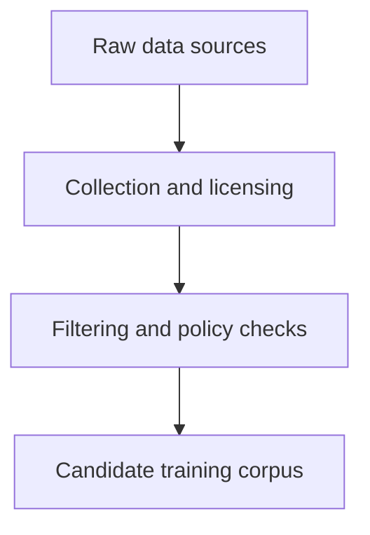
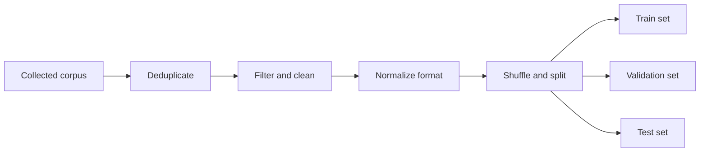
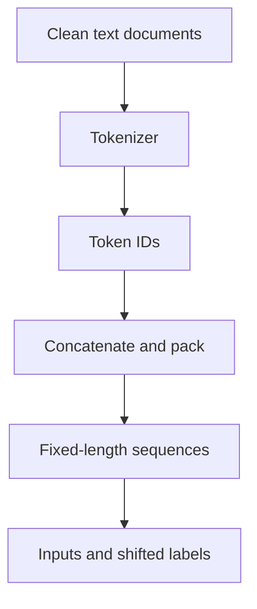
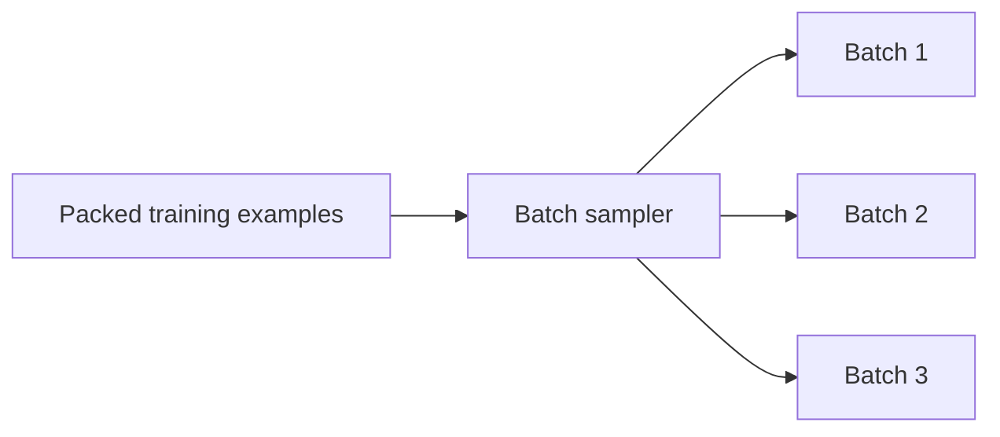
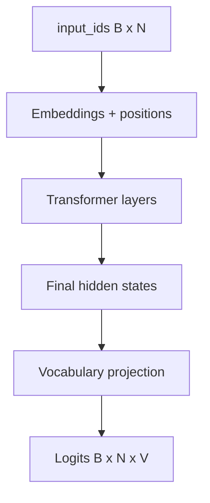
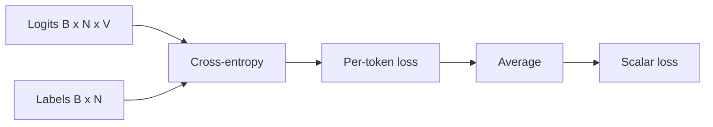
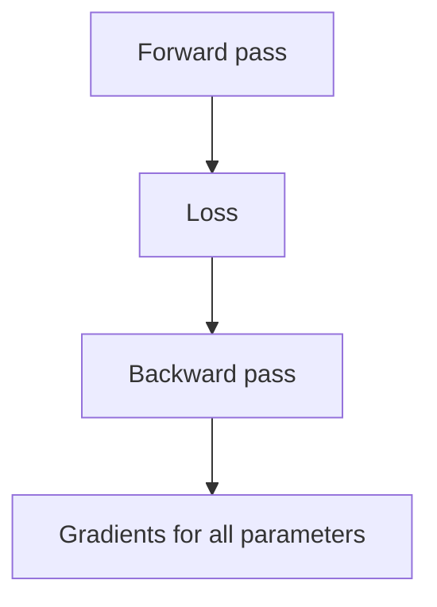
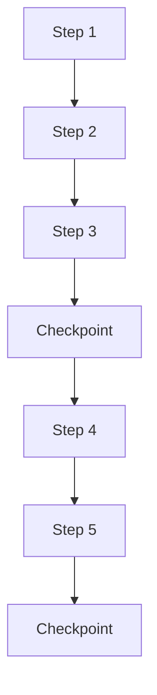
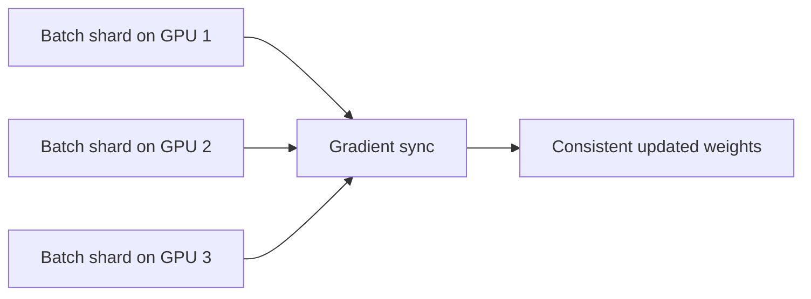
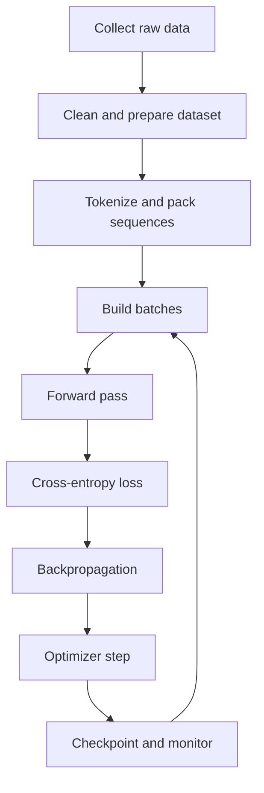

# Chapter 8 — Training Foundation Models

## Learning Objectives

By the end of this chapter, you should understand:

- How raw data becomes a training dataset
- Why data quality and filtering matter as much as raw scale
- How tokenization and batching prepare data for GPU training
- What happens in the forward pass during training
- How cross-entropy loss measures prediction quality
- What backpropagation computes
- How gradient descent and optimizers update model weights
- What epochs, steps, checkpoints, and distributed training mean in practice

---

## Why This Topic Matters

Inference is the part most platform teams operate day to day, but training explains why the model behaves the way it does and why AI infrastructure is expensive.

A foundation model is not created by writing rules. It is created by exposing a large neural network to enormous amounts of tokenized data and repeatedly adjusting weights so the model gets better at next-token prediction.

From an engineering perspective, training matters because it is a large-scale distributed systems problem:

- the data pipeline must ingest and clean huge corpora
- the training loop must keep expensive GPUs busy
- failures must not destroy weeks of progress
- checkpoints, storage, networking, and orchestration become critical
- numerical stability and throughput directly affect cost

You do not need to be an ML researcher to understand this workflow. You do need a solid mental model of the moving parts.

---

## Section 1 — Data Collection

Training starts with data, not with model code.

Foundation models are usually trained on a mixture of large-scale text and code sources such as:

- public web pages
- books and reference text
- code repositories
- documentation
- forums and Q&A content
- licensed proprietary corpora where allowed

What problem exists?

Raw internet-scale data is messy.

It contains:

- duplicates
- spam
- broken markup
- low-quality generated text
- private or sensitive data
- biased or harmful content
- incorrect formatting for training

So data collection is not just "download everything."

It is a selective ingestion process with policy, quality, and legal constraints.



Why should engineers care?

Because training quality is strongly constrained by input quality. Large volumes of bad data do not magically become good training signal.

> [!NOTE]
> **Engineering note**
> In production organizations, data governance is part of the training system. Access control, provenance, and exclusion rules are not optional side work.

---

## Section 2 — Dataset Preparation

After collection, the dataset is prepared for training.

Typical preparation steps include:

- deduplication
- language detection
- quality scoring
- toxicity or policy filtering
- document normalization
- removal of corrupted content
- conversion into a consistent text format
- shuffling and partitioning

Why is deduplication important?

Because repeated copies of the same content can distort the training distribution and waste compute.

Why is normalization important?

Because training pipelines need predictable input formatting, not arbitrary HTML fragments, malformed encodings, or half-broken JSON blobs.

Many pipelines also create train, validation, and test splits:

- **train**: used to update weights
- **validation**: used to monitor performance during training
- **test**: held back for later evaluation



Why should engineers care?

Because this stage is often a large distributed data pipeline in its own right, with storage, batch processing, lineage tracking, and validation requirements.

---

## Section 3 — Tokenization and Packing

Before training, text must be converted into token IDs.

The same idea used in inference applies here, but at far larger scale.

Example:

```text
"Kubernetes schedules pods on nodes"
-> [15432, 9821, 4401, 389, 20123]
```

Tokenized data is often packed into fixed-length training sequences.

Suppose the configured training sequence length is `N = 2048` tokens.

The pipeline may concatenate token streams and slice them into contiguous windows of length 2048.

Typical shapes:

```text
input_ids : [B, N]
labels    : [B, N]
```

For causal language modeling, the labels are usually the same sequence shifted by one token.

Example conceptually:

```text
input  : [A, B, C, D]
label  : [B, C, D, E]
```

The model sees the left side and is trained to predict the right side.



Why should engineers care?

Because sequence length is one of the main cost drivers in training. Longer sequences mean more memory, larger attention matrices, and lower batch capacity per GPU.

---

## Section 4 — Batching

GPUs are efficient when they process many examples together.

So training uses batches.

If:

- `B` = batch size
- `N` = sequence length

then a batch of token IDs has shape:

```text
input_ids : [B, N]
labels    : [B, N]
```

After embeddings:

```text
X : [B, N, d_model]
```

The term **global batch size** usually means the total batch across all GPUs. The term **microbatch** or **per-device batch** means the local batch on one GPU before gradient synchronization.

What problem exists?

Batches that are too small underutilize hardware. Batches that are too large exceed GPU memory.

So training systems tune:

- per-device batch size
- sequence length
- gradient accumulation steps
- number of GPUs



Why should engineers care?

Because throughput and stability are tightly coupled to batch design. This is not just a model concern. It is a hardware utilization concern.

---

## Section 5 — The Training Forward Pass

Now the batch enters the model.

The forward pass is almost the same as the inference path from the previous chapter:

1. token IDs become embeddings
2. positional information is applied
3. the sequence passes through `L` Transformer layers
4. the final hidden states are projected to vocabulary logits

Typical shapes:

```text
input_ids : [B, N]
hidden    : [B, N, d_model]
logits    : [B, N, V]
```

During training, we do this for many positions at once, not just the final position.

The model predicts a distribution for every token position in the batch.



Why should engineers care?

Because training usually computes full-sequence logits for every batch, which is much more compute-intensive than a single next-token inference step.

---

## Section 6 — Cross-Entropy Loss

After the forward pass, the model has logits and the training batch has target labels.

Now we need a way to measure how wrong the model is.

That measure is the **loss**.

For language modeling, the standard choice is **cross-entropy loss**.

You do not need the full derivation. The intuition is enough:

- the model assigns a probability to every vocabulary token
- the correct next token should get high probability
- if the correct token gets low probability, the loss is high
- if the correct token gets high probability, the loss is low

Conceptually:

```text
loss = average negative log probability of the correct next token
```

Shapes before reduction:

```text
logits : [B, N, V]
labels : [B, N]
token losses : [B, N]
```

Then the losses are averaged, often across all non-masked tokens, into one scalar:

```text
loss : []
```



Why should engineers care?

Because the scalar loss is the signal that drives all parameter updates. If the loss pipeline is wrong, the training run is wrong.

> [!IMPORTANT]
> **Common misconception**
> Cross-entropy loss does not tell you whether the model is "true" or "understands" the world. It tells you how well the model predicted the observed next tokens in the dataset.

---

## Section 7 — Backpropagation

Once we have the loss, training computes gradients.

This is the job of **backpropagation**.

What does backpropagation do?

It calculates how much each trainable parameter contributed to the loss, so the optimizer knows how to adjust that parameter.

Conceptually:

```text
gradient = how the loss changes when a parameter changes slightly
```

If a parameter change would increase loss, the optimizer should usually move it in the opposite direction.

The important engineering point is not the calculus. It is the data flow:

1. run the forward pass
2. compute loss
3. propagate gradients backward through the whole computation graph
4. accumulate gradients for all trainable weights



Why should engineers care?

Because backpropagation roughly doubles the amount of major work compared with inference-only forward execution, and it requires storing activations needed for the backward pass. That increases memory pressure significantly.

---

## Section 8 — Gradient Descent and the Optimizer

Gradients alone do not update the model. An optimizer uses them to change the weights.

The core idea of gradient descent is:

```text
new_weight = old_weight - learning_rate * gradient
```

Plain-English explanation:

- `gradient` says which direction increases loss
- subtracting it moves the parameter toward lower loss
- `learning_rate` controls step size

In real LLM training, teams usually use optimizers such as **Adam** or **AdamW**, not plain vanilla SGD.

Why?

Because these optimizers maintain extra running statistics that often improve stability and convergence for very large models.

A simplified training step looks like this:

1. zero or reset gradient buffers as needed
2. run forward pass
3. compute loss
4. run backward pass
5. optimizer updates parameters


Why should engineers care?

Because optimizer state can consume a large amount of memory. For very large models, storing weights, gradients, and optimizer state is itself a major systems challenge.

---

## Section 9 — Steps, Epochs, and Checkpoints

Training is an iterative loop.

Two common terms are:

- **step**: one optimizer update
- **epoch**: one full pass over the training dataset

In foundation model training, people often talk more about **steps** and **tokens processed** than epochs, especially when the dataset is massive or continuously mixed.

Why?

Because a huge training corpus may be sampled, blended, or streamed in ways that make the classic epoch concept less central.

Another critical concept is the **checkpoint**.

A checkpoint is a saved snapshot of training state, usually including:

- model weights
- optimizer state
- training step number
- scheduler state
- random seed or sampler state in some systems

Why are checkpoints necessary?

- training runs can last days or weeks
- hardware or network failures happen
- teams need rollback and resume capability
- later evaluation or fine-tuning may start from a checkpoint



Why should engineers care?

Because checkpointing is a storage and reliability concern as much as a model concern. Large checkpoints can be many gigabytes or more, and writing them efficiently matters.

---

## Section 10 — Distributed Training

Modern foundation models are too large to train efficiently on one GPU.

So training is distributed across many GPUs, often across many machines.

There are several common forms of parallelism:

- **data parallelism**: different GPUs process different batches, then synchronize gradients
- **tensor parallelism**: split tensor computations across GPUs
- **pipeline parallelism**: split layers across stages on different GPUs
- **sequence or context parallelism**: split sequence-related work in some architectures

At a high level:



What problem does distributed training solve?

- more aggregate memory
- more aggregate compute
- faster time to train

What new problems does it create?

- network communication overhead
- synchronization costs
- more complex failure modes
- harder debugging
- checkpointing across shards

Why should engineers care?

Because this is where ML meets classic distributed systems engineering. Networking, storage bandwidth, orchestration, scheduling, and fault tolerance all become first-order concerns.

> [!NOTE]
> **Engineering note**
> A training cluster is not just "a lot of GPUs." It is a coordinated distributed job where data loaders, interconnect bandwidth, checkpoint I/O, and recovery logic can all become bottlenecks.

---

## Section 11 — The Full Training Loop

Put everything together.



This loop runs again and again over massive volumes of data. Over time, the model becomes better at predicting the next token across many domains.

What should you remember most?

- training is repeated prediction plus correction
- the correction signal comes from loss and gradients
- the cost comes from scale: model size, sequence length, data volume, and cluster size

---

## Common Misconceptions

- **"Training means memorizing the dataset exactly."**
  Models can memorize some content, but the main goal is to learn statistical structure that generalizes beyond individual examples.

- **"More data always fixes everything."**
  Data quality, diversity, and filtering matter. More low-quality data can waste compute.

- **"Backpropagation is just an implementation detail."**
  No. It is the mechanism that turns prediction errors into parameter updates.

- **"One epoch is the universal measure of training progress."**
  For large foundation models, steps and total tokens processed are often more informative.

- **"Distributed training is only about adding GPUs."**
  No. Communication, sharding strategy, checkpointing, and fault tolerance are central parts of the system.

---

## Key Takeaways

- Training starts with collecting and preparing a large high-quality corpus.
- Text is tokenized, packed into fixed-length sequences, and grouped into batches.
- The model runs a forward pass to produce logits for many token positions at once.
- Cross-entropy loss measures how well the model predicted the correct next tokens.
- Backpropagation computes gradients, and the optimizer uses them to update weights.
- Training progresses through repeated steps, with checkpoints for recovery and reuse.
- Large foundation models require distributed training across many GPUs and machines.

---

## Next Chapter

After pretraining comes the question most product teams care about: how to adapt and operate the model. The next chapter should cover **post-training, fine-tuning, alignment, and inference-serving tradeoffs**.
