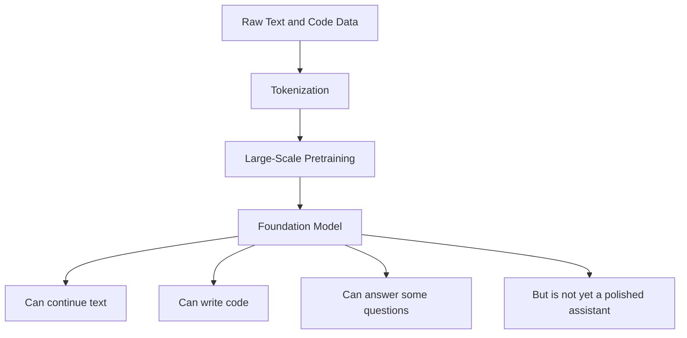
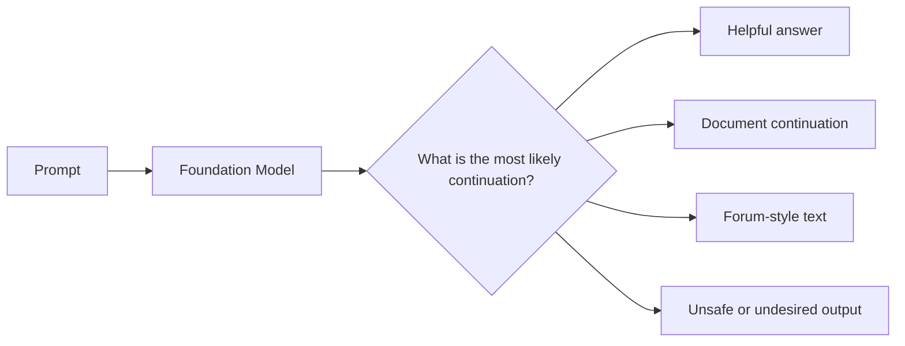
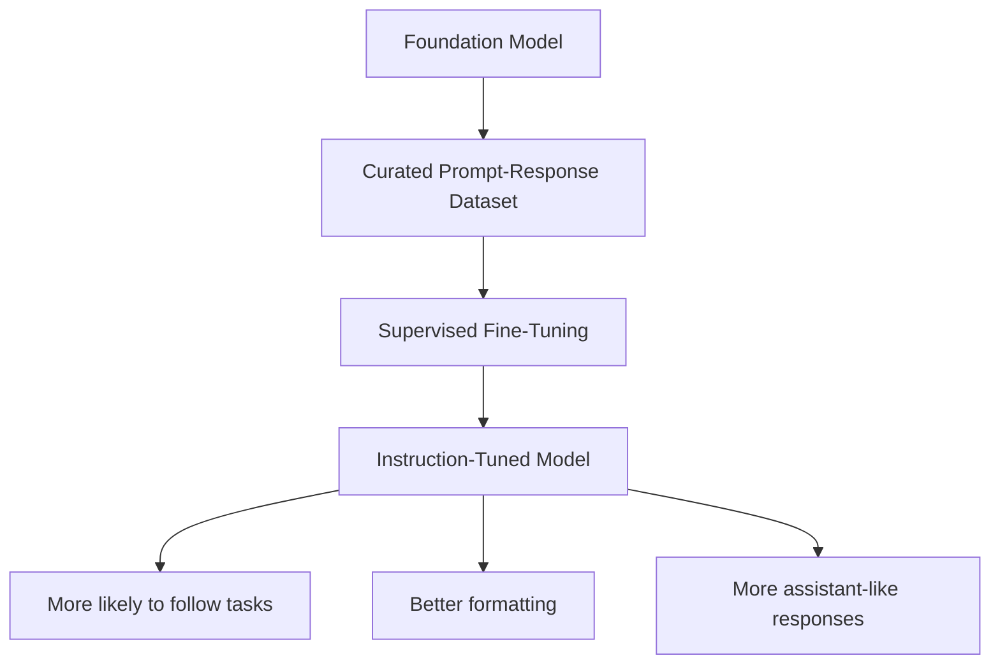
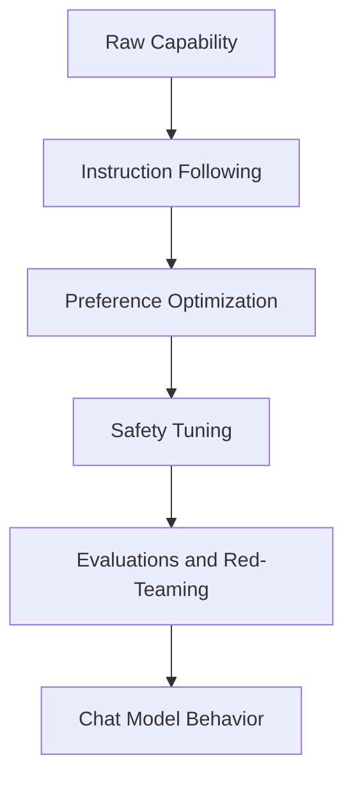
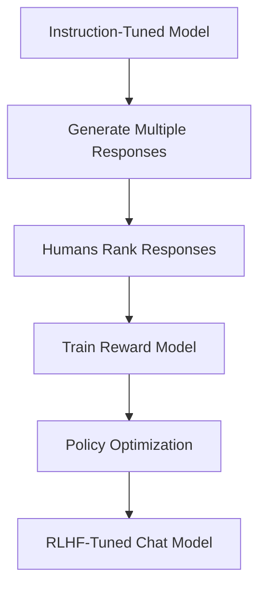
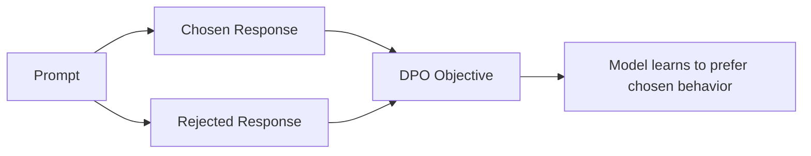
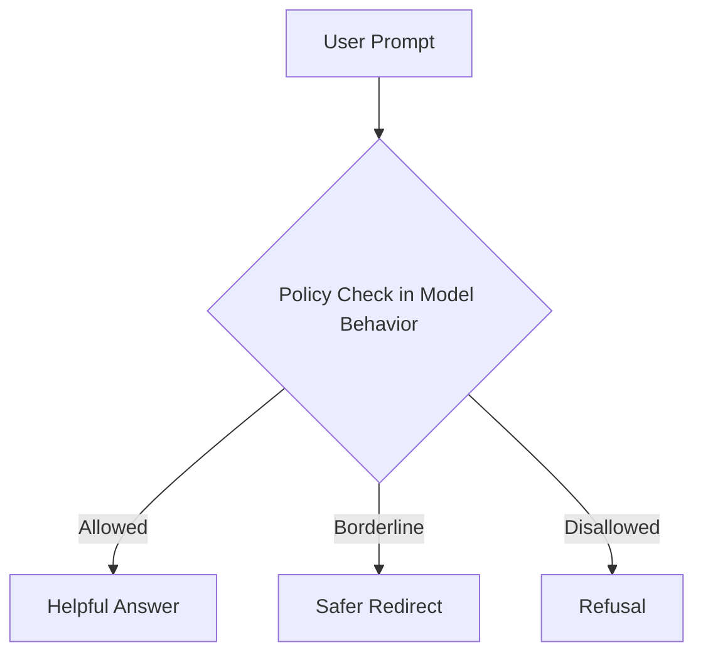
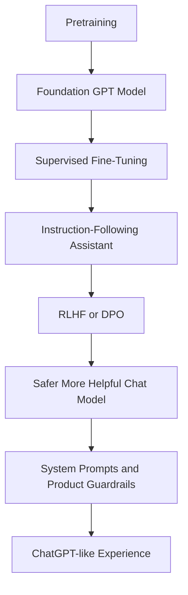

# Chapter 9 — From Foundation Models to Chat Models

## Learning Objectives

By the end of this chapter, you should understand:

- What a **foundation model** is and what pretraining actually teaches it
- Why next-token prediction alone does not produce a good assistant
- The difference between **pretraining**, **supervised fine-tuning**, and **instruction tuning**
- How **RLHF** and **DPO** try to align model behavior with human preference
- What engineers mean by **alignment** and **safety**
- Why `GPT` and `ChatGPT` are related but not identical systems
- The practical tradeoffs between model capability, usefulness, and control

---

## Why This Matters

A common question from experienced engineers is:

**If GPT already knows language, why did anyone need ChatGPT?**

The short answer is that a pretrained model is good at continuing text, but not automatically good at being a safe, helpful, reliable assistant.

A foundation model learns broad statistical structure from massive corpora. That gives it fluency, world knowledge, coding patterns, and general reasoning behaviors. But the raw model is not optimized for production chat behavior. It may:

- continue prompts in the wrong style
- answer as if completing a web page instead of helping a user
- ignore formatting requirements
- produce unsafe or disallowed outputs
- fail to refuse harmful requests consistently
- be inconsistent across similar prompts

Chat models are what you get when teams take a strong pretrained model and further shape its behavior.

This matters because many production AI systems are built on top of this distinction:

- **foundation model** = broad capability
- **chat model** = capability plus instruction following, assistant style, and safety behavior

If you are selecting models, evaluating vendor offerings, or deciding whether to fine-tune internally, you need to understand this lifecycle.

---

## Section 1 — What Is a Foundation Model?

A **foundation model** is a large pretrained model trained on broad data for general-purpose use.

Its main training objective is usually still very simple:

> predict the next token

That objective sounds narrow, but at scale it teaches surprisingly rich behavior. The model learns:

- grammar and syntax
- factual associations
- code patterns
- formatting conventions
- conversational structures
- some reasoning-like patterns



During pretraining, the model sees token sequences like this:

```text
User manual:
To reset the appliance, press and hold the power button for ten seconds...
```

or

```text
def quicksort(arr):
    ...
```

or

```text
Q: What is the capital of France?
A: Paris
```

It is not being explicitly told "be a helpful assistant." It is learning statistical regularities from many text formats.

### Tensor Shapes During Pretraining

For a batch of tokenized sequences:

```text
input_ids         : [B, N]
token_embeddings  : [B, N, d_model]
hidden_states     : [B, N, d_model]
logits            : [B, N, vocab_size]
labels            : [B, N]
loss              : scalar
```

The model predicts a distribution over the vocabulary for each token position.

> [!NOTE]
> **Engineering perspective**
> Pretraining creates the expensive general-purpose asset. Almost everything later in the lifecycle is cheaper than doing this step from scratch.

---

## Section 2 — Why Pretraining Is Not Enough

A pretrained model is good at continuing patterns, not necessarily at satisfying user intent.

For example, if prompted with:

```text
Explain Kubernetes autoscaling in three bullet points.
```

a base model may:

- answer correctly
- continue as an essay instead of bullets
- imitate forum text
- drift into unrelated content
- produce a weird document continuation

Why? Because the model is doing what it was trained to do: continue likely text.



This is the core gap between `GPT` and `ChatGPT`.

`GPT` is the pretrained predictive engine.

`ChatGPT` is a productized assistant behavior built on top of a pretrained engine plus post-training steps.

---

## Section 3 — Supervised Fine-Tuning and Instruction Tuning

The first major post-training step is often **supervised fine-tuning** or **SFT**.

Here, the model is trained on curated prompt-response examples such as:

```text
Prompt: Summarize this incident report in 5 bullets.
Response: ...
```

```text
Prompt: Refuse to provide malware code.
Response: I can't help with that, but I can explain defensive security practices.
```

This teaches the model a new pattern:

- a user gives an instruction
- the model should respond helpfully in assistant style

Instruction tuning is usually a form of SFT focused on instruction-following behavior.



### What Changes in SFT?

The architecture usually does not change. The weights do.

The model is still doing next-token prediction, but now on much more structured data:

- instructions
- ideal answers
- safe refusals
- formatting examples
- multi-turn conversations

### Tensor Shapes During SFT

The shapes look almost the same as pretraining:

```text
conversation_tokens : [B, N]
attention_mask      : [B, N]
hidden_states       : [B, N, d_model]
logits              : [B, N, vocab_size]
labels              : [B, N]
```

What changes is the dataset and often the loss masking. Not every token has to contribute equally to loss. In many chat training setups, the system may compute loss mostly on assistant response tokens rather than the whole conversation transcript.

> [!IMPORTANT]
> **Common misconception**
> Instruction tuning does not add a new "instruction-following module." It adjusts the same model weights so the model becomes more likely to respond in desired patterns.

---

## Section 4 — Alignment

**Alignment** is the broad effort to make model behavior better match human goals and policy constraints.

In practice, alignment usually means improving things like:

- helpfulness
- harmlessness
- honesty or calibrated uncertainty
- refusal behavior
- tone consistency
- policy compliance
- resistance to prompt abuse

Alignment is not one algorithm. It is a collection of techniques, datasets, evaluations, policies, and product decisions.



For engineers, it is useful to think of alignment as a control layer on top of capability.

A more capable model is not automatically more aligned.

A more aligned model is not automatically more capable.

Teams are trying to balance both.

---

## Section 5 — RLHF

One of the best-known post-training methods is **RLHF**: Reinforcement Learning from Human Feedback.

The rough idea is:

1. humans compare multiple model outputs
2. a **reward model** learns which outputs humans prefer
3. the main model is optimized to produce outputs with higher reward



Why do this instead of only SFT?

Because SFT teaches "copy good examples," while RLHF tries to optimize for preference over a wider output space.

For example, humans may prefer answers that are:

- more direct
- less evasive
- more structured
- safer
- more useful under ambiguity

### RLHF Components

- **policy model**: the model being improved
- **reference model**: often used to prevent the policy from drifting too far
- **reward model**: predicts which outputs humans prefer
- **optimizer**: often PPO in earlier RLHF pipelines

### Practical Limitations

RLHF is powerful, but operationally heavy:

- collecting human preference data is expensive
- reward models can encode biases
- RL optimization can be unstable
- reward hacking is possible
- the pipeline is more complex than plain SFT

> [!NOTE]
> **Engineering note**
> RLHF is not just "one more epoch of training." It is a multi-stage system with human labeling, reward modeling, and policy optimization.

---

## Section 6 — DPO

Because RLHF can be complex, many teams use **DPO**: Direct Preference Optimization.

DPO uses preference pairs more directly. Instead of training a separate reward model and then running a reinforcement learning loop, DPO optimizes the model so preferred answers become more likely than rejected answers.

Example preference pair:

- chosen: a concise safe answer
- rejected: a rambling or unsafe answer



Why is DPO attractive?

- simpler pipeline
- no separate online RL loop
- often more stable operationally
- fits well into existing supervised training infrastructure

Conceptually, DPO says:

> for this prompt, increase probability of the chosen answer and decrease probability of the rejected answer

This makes it easier for teams to incorporate preference data without building a full RLHF stack.

> [!IMPORTANT]
> **Common misconception**
> DPO is not "the same as RLHF with a different name." Both use preference data, but the optimization approach is different.

---

## Section 7 — Safety and Policy Shaping

A chat model is not only instruction-following. It is also policy-shaped.

Safety tuning tries to make the model behave appropriately in areas such as:

- self-harm content
- malware and cyber abuse
- harassment
- privacy leakage
- regulated advice
- disallowed sexual content
- prompt injection resistance in some settings



This shaping can happen through:

- curated SFT examples
- preference optimization
- classifier-assisted filtering
- system prompts
- application-layer guardrails
- offline evaluations and red-team feedback

The important engineering point is that safety is rarely only in one layer. Real systems usually combine:

- model behavior tuning
- runtime policy enforcement
- logging and monitoring
- product-specific controls

---

## Section 8 — Why GPT Becomes ChatGPT

Now we can answer the original question directly.

### GPT

A pretrained GPT-style model is primarily optimized to predict likely next tokens from broad internet-scale text and code.

### ChatGPT

A chat model is typically:

- pretrained on large-scale data
- instruction-tuned on prompt-response examples
- preference-optimized with RLHF, DPO, or similar methods
- safety-tuned and evaluated for assistant behavior
- wrapped in product and policy layers



So the transformation is not magical. It is a sequence of deliberate post-training choices.

The model goes from:

- "complete likely text"

to:

- "act like a useful assistant within policy constraints"

---

## Common Misconceptions

### "Pretraining already teaches everything"

No. Pretraining gives broad capability, but not reliable assistant behavior.

### "Instruction tuning and RLHF change the architecture"

Usually they do not. They mostly change the weights and the training data.

### "Alignment means making the model weaker"

Not exactly. Alignment may restrict some outputs, but the goal is not simply less capability. The goal is behavior that is more useful and safer for real users.

### "Safety is only a prompt-level problem"

No. Good systems combine model tuning, product policy, and runtime controls.

### "DPO replaced SFT"

No. DPO usually complements SFT rather than replacing all supervised tuning.

---

## Key Takeaways

- A **foundation model** is broad and powerful, but not automatically a good chat assistant.
- **Pretraining** teaches general language and code patterns through next-token prediction.
- **Supervised fine-tuning** and **instruction tuning** teach the model how to respond to user requests in assistant style.
- **RLHF** uses human preferences indirectly through a reward-learning pipeline.
- **DPO** uses preference comparisons more directly and often with simpler operations.
- **Alignment** is the broader goal of matching model behavior to human intent and policy.
- `GPT` becomes `ChatGPT` through post-training, preference shaping, safety work, and product-layer controls.

---

## Next Chapter

Next: Chapter 10 — Parameter-Efficient Fine-Tuning
