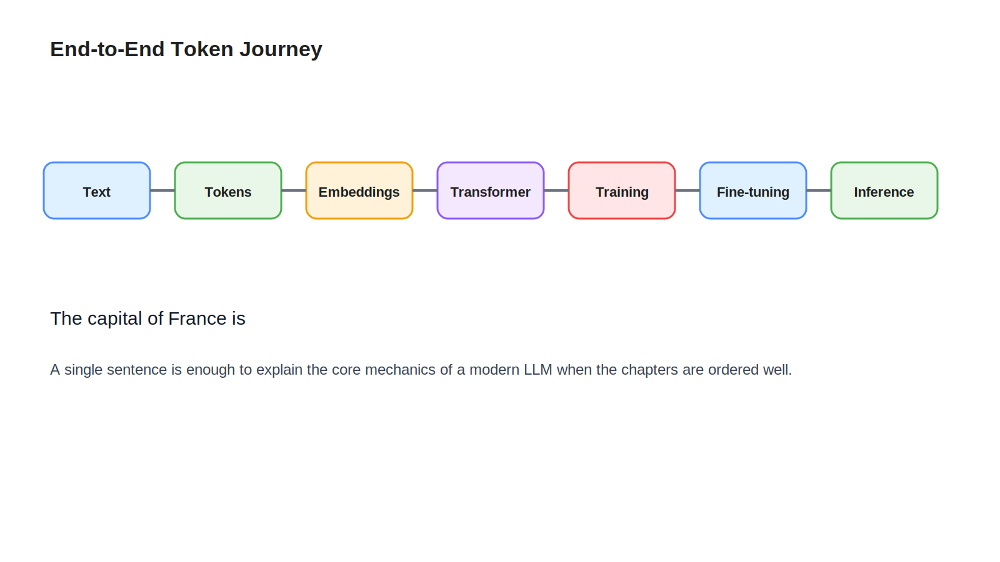

# 09 Summary

## Learning Objectives

- Review the full journey of a token through an LLM.
- Connect the major concepts into one end-to-end mental model.
- Leave with a concise engineering explanation of LLM fundamentals.

## Key Concepts

- End-to-end token journey
- Representation flow
- Training to inference transition
- Performance-critical runtime ideas

## Diagram

## Explanation

We started with plain text and followed it through the full LLM lifecycle.

First, text was tokenized into token IDs. Then token IDs became embeddings, which served as the initial hidden states. Those hidden states moved through transformer layers, where attention and feed-forward blocks repeatedly refined them.

During training, the model learned by making next-token predictions, measuring error with loss, and updating parameters through backpropagation. During fine-tuning, the model was adapted for narrower tasks, sometimes efficiently with LoRA.

During inference, the trained model processed a prompt in prefill mode, then generated one token at a time in decode mode while reusing KV cache.

This is the engineering story of an LLM. It is a layered compute system that turns token sequences into probability distributions and repeats that process until an output sequence is complete.

## Example

The complete journey of `The capital of France is` looks like this:

1. The string is split into tokens.
2. Tokens are converted to token IDs.
3. Token IDs are mapped to embeddings.
4. Embeddings pass through transformer layers.
5. The final hidden state produces logits for the next token.
6. The model selects ` Paris`.
7. Decode continues until the response is finished.

If you can explain those seven steps clearly, you understand the core of this course.

## Key Takeaways

- LLMs are next-token prediction systems built on tokenization, embeddings, and transformer computation.
- Hidden states are the live internal representations that evolve layer by layer.
- Training teaches the model; fine-tuning adapts it; inference serves it.
- Prefill, decode, and KV cache are essential runtime concepts for engineers.

## References

- [Course Overview](00-course-overview.md)
- [README](../README.md)
- [Hugging Face LLM course materials](https://huggingface.co/learn)
