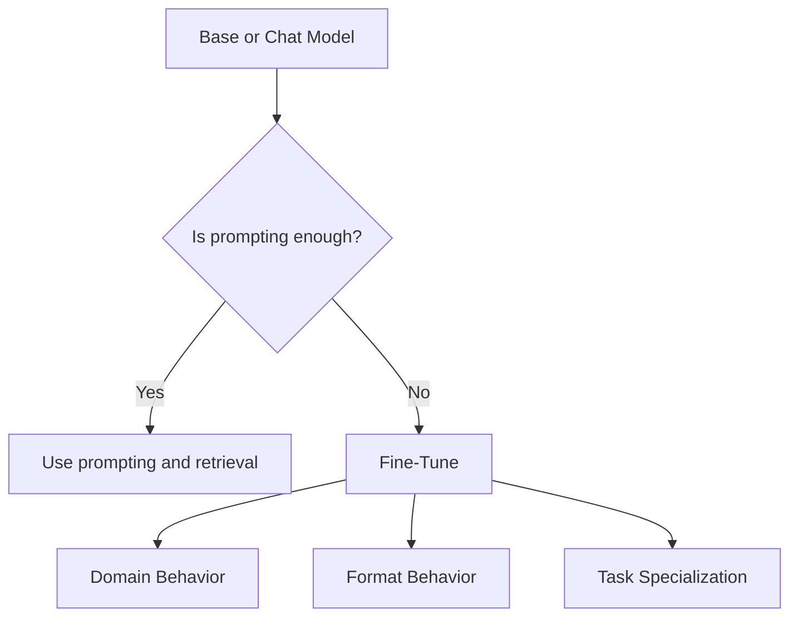
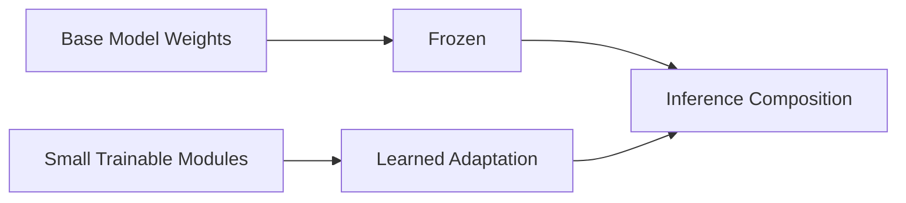
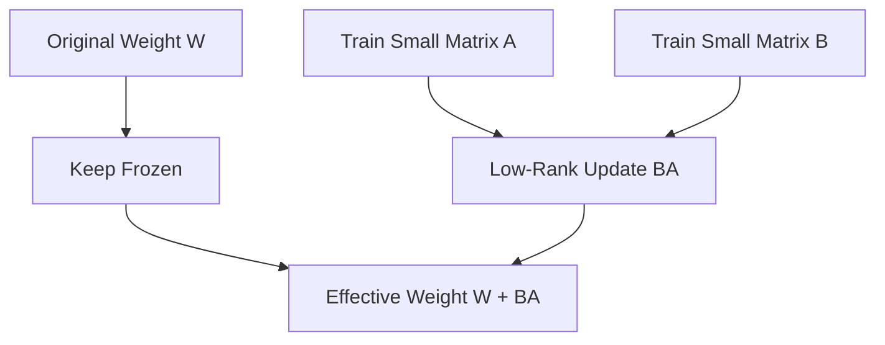
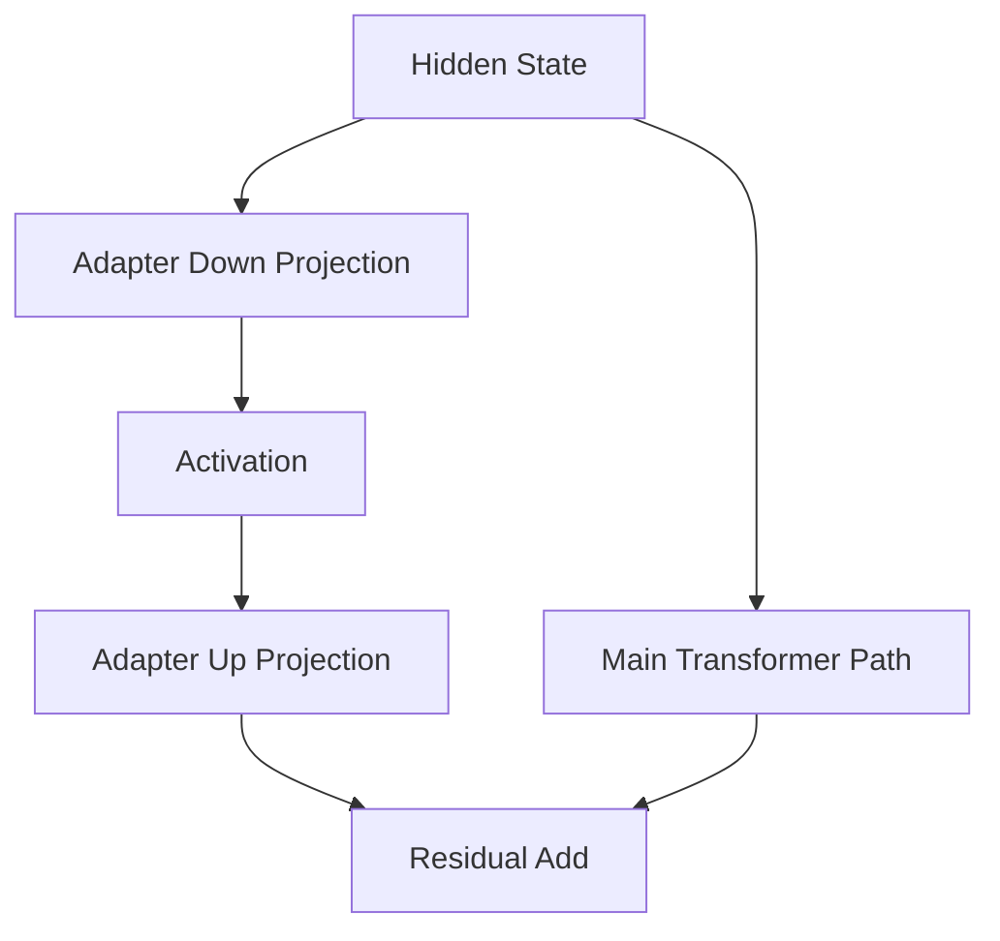
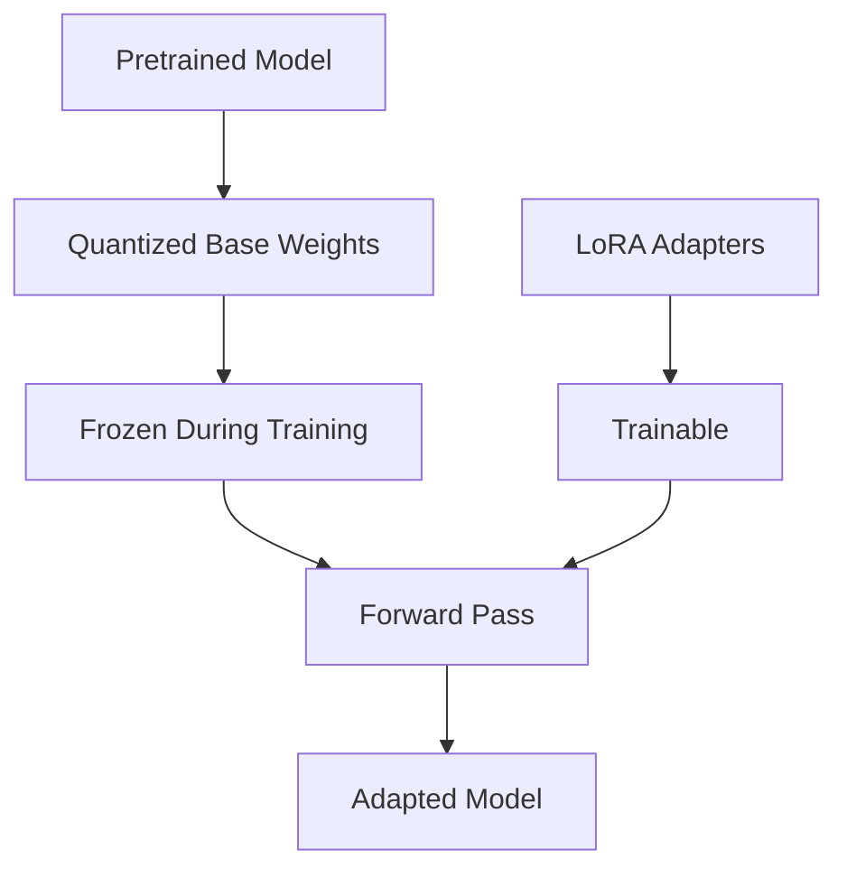
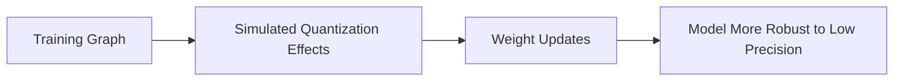
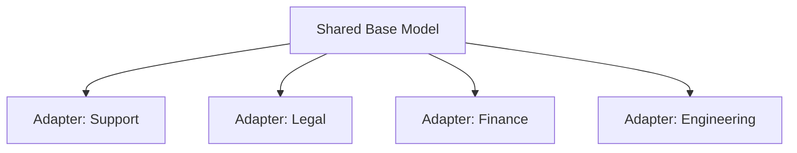
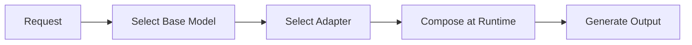

# Chapter 10 — Parameter-Efficient Fine-Tuning

## Learning Objectives

By the end of this chapter, you should understand:

- Why teams fine-tune models instead of relying only on prompting
- The difference between **full fine-tuning** and **parameter-efficient fine-tuning**
- How **LoRA** works at a practical level
- What **adapters** are and how they differ from LoRA
- What **QLoRA** changes operationally
- How **quantization-aware training** fits into the picture
- Why teams use **multiple adapters** for enterprise customization
- The deployment and governance implications of PEFT

---

## Why This Matters

Most enterprises do not want to train a foundation model from scratch.

They want to adapt an existing model to:

- speak in a company-specific style
- follow internal formats
- perform better on domain-specific tasks
- support multiple business units without duplicating the full model
- lower storage and training costs

This is where **parameter-efficient fine-tuning**, or **PEFT**, matters.

Instead of updating all model weights, PEFT updates only a small subset or adds small trainable modules. This changes the economics of customization.

A full model may be tens of gigabytes. A PEFT adapter may be megabytes to a few gigabytes, depending on scale.

That difference affects:

- training cost
- storage footprint
- artifact versioning
- deployment speed
- multi-tenant architecture
- rollback strategy

---

## Section 1 — Why Fine-Tuning Exists

Prompting alone can go surprisingly far, but it has limits.

If your application needs:

- very consistent output structure
- domain vocabulary the model handles poorly
- reusable internal behavior across many requests
- low prompt overhead
- predictable formatting without huge system prompts

then fine-tuning may help.



Fine-tuning does not replace retrieval, guardrails, or application logic. It changes model behavior itself.

Good candidates for fine-tuning include:

- support ticket classification
- strict structured extraction
- internal writing style
- code generation in a company framework
- domain-specific instruction following

Bad candidates include:

- changing rapidly updated factual knowledge
- injecting large private corpora that belong in retrieval
- trying to patch over broken product requirements

> [!NOTE]
> **Engineering note**
> If the problem is "the model needs fresh private data," start with RAG before fine-tuning. If the problem is "the model should behave differently every time," fine-tuning is a better fit.

---

## Section 2 — Full Fine-Tuning vs PEFT

### Full Fine-Tuning

In full fine-tuning, all model parameters are updated.

For a model with parameter matrix `W`, training directly changes `W`.

Pros:

- maximum flexibility
- can produce strong task adaptation

Cons:

- expensive GPU memory usage
- expensive optimizer state
- full model artifact duplication
- operationally heavy promotion and rollback

### Parameter-Efficient Fine-Tuning

In PEFT, the base weights stay frozen or mostly frozen, and only a small number of extra parameters are trained.



This approach is attractive because:

- smaller training jobs
- smaller checkpoints
- easier per-team customization
- safer base model reuse
- lower operational overhead

---

## Section 3 — LoRA

The most common PEFT technique is **LoRA**: Low-Rank Adaptation.

The core idea is simple.

Instead of updating a large weight matrix `W` directly, LoRA learns a low-rank update:

```text
W' = W + delta_W
delta_W = B A
```

Where:

```text
W       : [d_out, d_in]
A       : [r, d_in]
B       : [d_out, r]
delta_W : [d_out, d_in]
r       : low rank, where r << d_in and r << d_out
```

Because `r` is small, the number of trainable parameters is much smaller than full fine-tuning.

### Intuition

LoRA assumes you do not need to rewrite the full matrix. You only need a compact directional adjustment.



### Why Low Rank?

A full matrix update can express many changes, but many useful downstream adaptations seem to live in a much smaller subspace.

LoRA exploits that observation.

### Where Is LoRA Applied?

Typically to linear projections inside the Transformer, often:

- attention query projections
- attention key projections
- attention value projections
- attention output projections
- sometimes FFN projections

### Tensor Shapes in a Batch

For an input activation `x`:

```text
x                : [B, N, d_in]
W                : [d_out, d_in]
A                : [r, d_in]
B                : [d_out, r]
base_output      : [B, N, d_out]
lora_delta       : [B, N, d_out]
final_output     : [B, N, d_out]
```

Conceptually:

```text
base_output = x W^T
lora_delta  = x A^T B^T
final_output = base_output + alpha * lora_delta
```

Where `alpha` is a scaling factor.

> [!IMPORTANT]
> **Common misconception**
> LoRA does not usually create a second independent mini-model. It creates small learned deltas that modify selected linear layers.

---

## Section 4 — Adapters

**Adapters** are another PEFT family.

Instead of modifying a matrix with a low-rank update, adapters insert small trainable modules into the network.

A common pattern is:

```text
hidden_state
-> down projection
-> non-linearity
-> up projection
-> add back to main path
```



Adapters are attractive because:

- they are modular
- they can be enabled or disabled per task
- they fit multi-task deployment well

Compared with LoRA:

- LoRA modifies existing linear transformations
- adapters insert new trainable blocks

In practice, both are used to get cheaper customization than full fine-tuning.

---

## Section 5 — QLoRA

**QLoRA** combines quantization and LoRA so teams can fine-tune larger models on less memory.

The core pattern is:

- keep the base model in a quantized format, often 4-bit
- freeze the quantized base weights
- train LoRA adapters on top



Why is this useful?

Because optimizer state and activations are not the whole memory story. The base model weights are huge. Reducing their precision lowers the memory barrier enough to make fine-tuning feasible on smaller hardware.

QLoRA made it practical for many teams to fine-tune 7B, 13B, and larger models on hardware that would not support full fine-tuning.

### Important Tradeoff

QLoRA improves accessibility, but it does not make training free. You still pay for:

- activations
- gradients for adapter weights
- optimizer state for trainable parameters
- sequence length and batch size
- data pipeline overhead

---

## Section 6 — Quantization-Aware Training

Quantization reduces numerical precision, which can change behavior.

**Quantization-aware training** tries to account for that during training instead of treating quantization only as a post-processing step.

There are multiple variants, but the intuition is:

- training should anticipate the lower-precision arithmetic used later
- the model learns robustness to quantized representations



This matters when teams care about:

- stable low-bit deployment
- edge or constrained environments
- minimizing accuracy loss after quantization

In the PEFT context, quantization-aware methods are relevant because the base model may be quantized during adaptation or serving.

> [!NOTE]
> **Engineering note**
> People often use "QLoRA" and "quantization-aware training" loosely in conversation. They are related but not identical ideas. QLoRA is a specific practical recipe; quantization-aware training is a broader training strategy.

---

## Section 7 — Multiple Adapters

One of the most useful PEFT patterns in enterprise environments is **one base model, many adapters**.

Example:

- legal team adapter
- support team adapter
- finance extraction adapter
- internal code style adapter



This model has strong operational benefits:

- one validated base model
- multiple lightweight task-specific artifacts
- easier per-team ownership
- smaller blast radius for updates
- simpler rollback than replacing a whole model

### Runtime Patterns

At inference time, systems may:

- load one adapter statically per deployment
- switch adapters per request
- merge adapters into the base weights ahead of serving
- compose adapters with routing logic

### Risks

- adapter sprawl
- unclear ownership
- inconsistent evaluation standards
- higher serving complexity if many adapters are hot-swapped
- accidental use of the wrong adapter in production

A mature enterprise setup usually needs:

- adapter registry
- metadata and lineage
- evaluation suite per adapter
- compatibility tracking with base model versions

---

## Section 8 — PEFT Deployment Decisions

PEFT changes architecture decisions, not just training decisions.

### Option 1: Merge Before Serving

You can merge LoRA deltas into full weights and serve the merged model.

Pros:

- simpler serving path
- no runtime adapter composition

Cons:

- lose some modularity
- larger deployed artifact

### Option 2: Apply Adapters at Runtime

You serve the base model plus adapter weights.

Pros:

- flexible multi-tenant behavior
- smaller per-task artifacts
- easy swapping

Cons:

- more runtime complexity
- possible warmup or caching issues
- more serving code paths to test



### When PEFT Works Well

- stable base model
- many related downstream tasks
- tight GPU budget
- need for rapid experimentation
- clear task-specific evaluations

### When Full Fine-Tuning May Still Be Better

- very large behavioral shift needed
- maximum quality is worth the cost
- strict offline batch environment where artifact size matters less
- research settings with abundant compute

---

## Common Misconceptions

### "LoRA is only for small hobby projects"

No. LoRA and related PEFT methods are widely used in serious production workflows.

### "Fine-tuning is always better than prompting"

No. Fine-tuning is a tool, not a default. Many problems are better solved with retrieval, better prompts, or application logic.

### "Quantization means accuracy always collapses"

No. There is usually some tradeoff, but modern quantization methods can preserve strong performance.

### "Multiple adapters are free"

No. They save storage and training cost, but they add governance and serving complexity.

### "PEFT changes the model architecture fundamentally"

Usually no. It changes trainable components and runtime composition, but the base Transformer remains the same.

---

## Key Takeaways

- Fine-tuning exists to make a model behave better for specific tasks, domains, or formats.
- **PEFT** reduces customization cost by training small modules instead of rewriting the entire model.
- **LoRA** learns a low-rank weight update and is one of the most important PEFT techniques.
- **Adapters** insert small trainable modules into the network and are another modular approach.
- **QLoRA** makes larger-model fine-tuning feasible by combining quantized base weights with LoRA training.
- **Quantization-aware training** helps models remain robust under low-precision deployment constraints.
- Enterprises often use **multiple adapters** on top of one approved base model.
- PEFT improves training economics, but it introduces lifecycle, routing, and governance concerns.

---

## Next Chapter

Next: Chapter 11 — Inference
