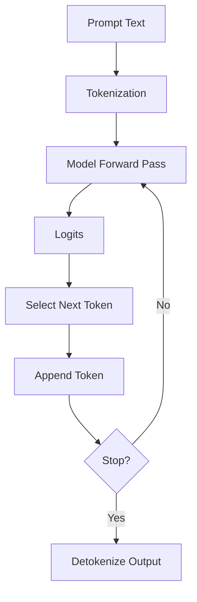
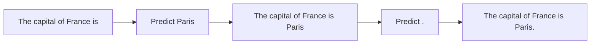
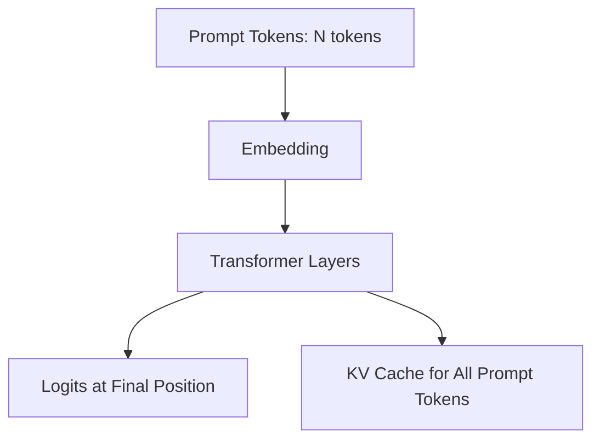
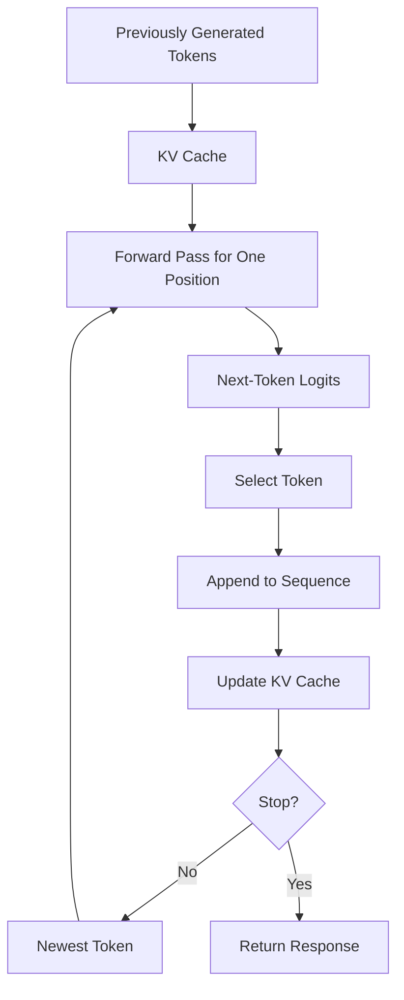
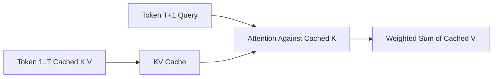
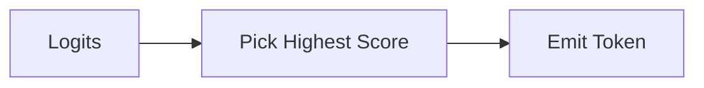
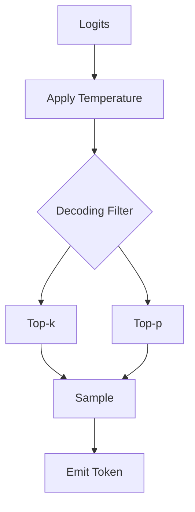
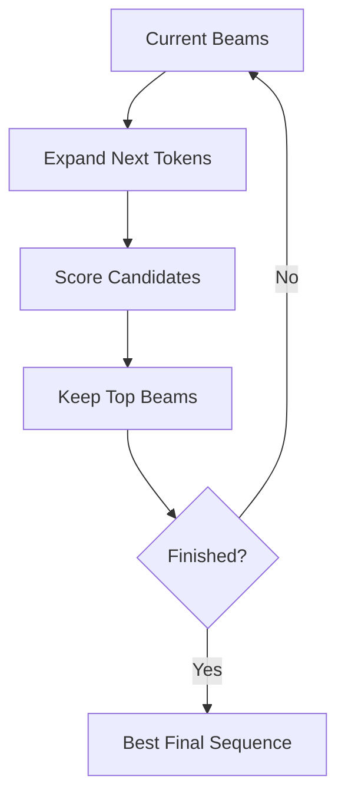
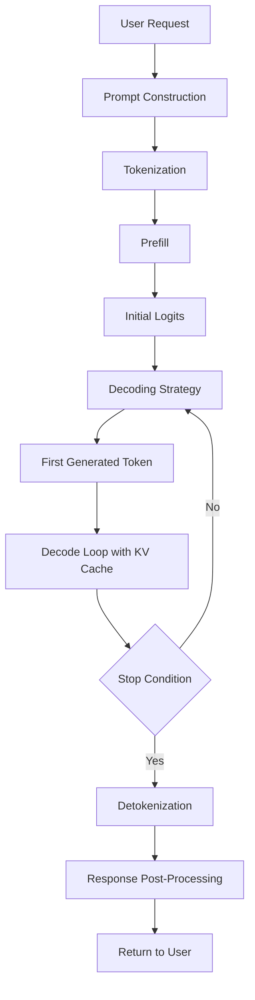

# Chapter 11 — Inference

## Learning Objectives

By the end of this chapter, you should understand:

- What inference is in an autoregressive language model
- The difference between **prefill** and **decode**
- How token-by-token generation actually works
- Why **KV cache** is central to latency
- How decoding strategies such as **greedy**, **temperature**, **top-k**, **top-p**, and **beam search** differ
- What **stop tokens** and termination rules do
- The end-to-end inference pipeline from prompt to final response
- Which parts of inference usually dominate latency and cost

---

## Why This Matters

Inference is where all the expensive training work becomes a product.

This is the stage that users feel directly:

- time to first token
- tokens per second
- output quality
- cost per request
- concurrency limits
- tail latency

If training creates the model artifact, inference is the runtime system that turns that artifact into useful behavior.

Engineers working on APIs, gateways, GPUs, autoscaling, observability, or user experience need a clean mental model of inference because many practical issues trace back to it:

- long prompts increase prefill cost
- long generations increase decode cost
- sampling settings change product behavior
- cache management changes throughput
- stop conditions affect latency and safety

---

## Section 1 — What Inference Is

Inference is the process of running a trained model on input tokens to produce output tokens.

In an autoregressive language model, the model generates text one token at a time.

The workflow is:

1. tokenize the prompt
2. run the prompt through the model
3. get logits for the next token
4. choose the next token with some decoding strategy
5. append that token
6. repeat until a stopping condition is reached



### Tensor Shapes

For a batch during generation:

```text
input_ids     : [B, N]
hidden_states : [B, N, d_model]
logits        : [B, N, vocab_size]
next_logits   : [B, vocab_size]
next_token    : [B, 1]
```

`next_logits` usually comes from the final position only, because that position predicts the next token.

---

## Section 2 — Autoregressive Generation

**Autoregressive** means each new token depends on the tokens that came before it.

If the prompt is:

```text
The capital of France is
```

the model predicts something like:

- next token: ` Paris`
- next token after that: `.`
- then perhaps an end token

Each step changes the future context.



This is why inference latency often scales with output length. You cannot generate token 200 before generating token 199.

That sequential dependency is fundamental.

> [!NOTE]
> **Engineering note**
> Transformers parallelize heavily inside each forward pass, but output generation across time is still inherently sequential.

---

## Section 3 — Prefill

The first inference phase is **prefill**.

During prefill, the model processes the entire prompt sequence and computes hidden states and attention keys and values for all prompt tokens.

If the prompt length is `N`, the model runs across all `N` tokens in parallel for that pass.



### Prefill Shapes

For one layer during prefill:

```text
input_hidden   : [B, N, d_model]
Q              : [B, N, d_k]
K              : [B, N, d_k]
V              : [B, N, d_v]
attention      : [B, heads, N, N]
layer_output   : [B, N, d_model]
kv_cache       : [B, heads, N, d_k or d_v]
```

Why is prefill expensive?

Because every prompt token participates in attention calculations, and attention cost grows with sequence length.

Prefill largely determines:

- time to first token
- prompt processing cost
- context window pressure

Long documents, long chat histories, and large system prompts all make prefill heavier.

---

## Section 4 — Decode

After the first generated token, inference enters the **decode loop**.

Now the model generates one token at a time.

At step `t`, the model only needs to process the new token through the stack, while reusing cached history.



### Decode Shapes

At one decode step:

```text
new_input_ids   : [B, 1]
new_hidden      : [B, 1, d_model]
new_Q           : [B, 1, d_k]
cached_K        : [B, heads, T, d_k]
cached_V        : [B, heads, T, d_v]
attention_scores: [B, heads, 1, T]
new_logits      : [B, vocab_size]
```

Where `T` is the total cached sequence length so far.

Without caching, the model would recompute the entire history every step. That would be far too expensive.

---

## Section 5 — KV Cache

The **KV cache** stores attention keys and values from previous tokens for each layer.

Why only keys and values?

Because in self-attention, each new token's query compares against prior keys, and the resulting weights mix prior values. The old keys and values do not need to be recomputed if the history is unchanged.



### Why It Matters

KV cache:

- reduces repeated compute
- makes decode practical
- improves latency dramatically

But it also consumes memory.

Approximate cache dimensions per layer:

```text
K_cache : [B, heads, T, d_k]
V_cache : [B, heads, T, d_v]
```

As `T` grows, cache memory grows. This is one reason long conversations and long outputs affect serving capacity even if the model weights are fixed.

> [!IMPORTANT]
> **Common misconception**
> KV cache makes decode cheaper, but it does not make long-context inference free. Memory still grows with sequence length.

---

## Section 6 — From Logits to Tokens

The model outputs **logits**, not words directly.

A logit vector has one score per vocabulary token:

```text
logits : [B, vocab_size]
```

Those logits can be converted to probabilities with softmax, then a selection rule chooses the next token.

The selection rule is called the **decoding strategy**.

---

## Section 7 — Greedy Decoding

The simplest strategy is **greedy decoding**.

The model picks the token with the highest probability at each step.

```text
next_token = argmax(logits)
```

Pros:

- simple
- deterministic
- often good for classification or rigid extraction

Cons:

- can be repetitive
- can get stuck in bland outputs
- ignores plausible alternatives



Greedy decoding works well when predictability matters more than creativity.

---

## Section 8 — Temperature, Top-k, and Top-p

Sampling methods introduce controlled randomness.

### Temperature

Temperature rescales logits before softmax.

```text
adjusted_logits = logits / temperature
```

- lower temperature `< 1.0` makes the distribution sharper
- higher temperature `> 1.0` makes it flatter

Low temperature produces more conservative outputs. High temperature produces more variation.

### Top-k

Top-k keeps only the `k` highest-scoring tokens, then samples from them.

If `k = 10`, only the top 10 candidate tokens remain eligible.

### Top-p

Top-p, or nucleus sampling, keeps the smallest set of tokens whose cumulative probability reaches `p`.

If `p = 0.9`, you keep enough top tokens to cover 90% of the distribution, then sample from that set.



### Why These Matter

These parameters directly affect product behavior:

- creativity
- determinism
- verbosity
- hallucination risk
- diversity across repeated runs

For production systems, sampling settings are not cosmetic. They are part of system behavior.

---

## Section 9 — Beam Search

**Beam search** keeps multiple candidate continuations at once instead of committing to one immediately.

At each step:

1. expand the current candidates
2. score them
3. keep only the best `beam_width` candidates



Beam search is useful in some sequence-generation tasks such as translation or structured generation.

But for open-ended chat, it is often less common than sampling because it can produce overly generic or unnatural outputs.

Tradeoffs:

- better global search than greedy
- more compute than single-path decoding
- less diversity than sampling in many cases

---

## Section 10 — Stop Tokens and Termination

Generation must end somehow.

Common stopping conditions include:

- model emits an end-of-sequence token
- model emits a configured stop string or stop token
- maximum output tokens reached
- application policy decides to terminate early

Examples of stop markers might include:

- end-of-text token
- special assistant boundary token
- application-specific delimiter such as `</answer>`

This matters for:

- latency
- cost control
- structured output
- preventing runaway generation

> [!NOTE]
> **Engineering note**
> Max token limits are both a product control and an infrastructure control. They cap cost, latency, and memory growth.

---

## Section 11 — The Complete Inference Pipeline

Putting it all together:



### What Usually Dominates Latency?

- long prompt -> expensive prefill
- long output -> expensive decode duration
- large batch / concurrency -> scheduling pressure
- large model -> more compute per token
- long context -> larger KV cache and memory pressure

### Practical Metrics

Teams commonly track:

- time to first token
- inter-token latency
- output tokens per second
- prompt tokens per second
- GPU memory usage
- cache hit or reuse behavior
- request queue time

These are often more operationally meaningful than abstract model FLOPs.

---

## Common Misconceptions

### "Inference is just one forward pass"

Not for generation. Chat-style generation is a repeated loop of forward passes.

### "Prefill and decode cost the same"

No. Prefill processes the full prompt; decode processes one new token at a time with cached history.

### "Sampling is only for creativity"

No. Sampling settings influence reliability, repetition, and failure modes.

### "Beam search is always better"

No. It depends on the task. For open-ended chat, it is often not the preferred default.

### "KV cache removes the cost of long outputs"

No. It removes redundant recomputation, but cache memory and sequential decoding still matter.

---

## Key Takeaways

- Inference is the runtime process of turning prompt tokens into generated output tokens.
- Autoregressive models generate text one token at a time.
- **Prefill** processes the full prompt and usually determines time to first token.
- **Decode** generates subsequent tokens iteratively, usually using **KV cache**.
- **Greedy decoding**, **temperature**, **top-k**, **top-p**, and **beam search** are different strategies for selecting the next token.
- **Stop tokens** and max token limits are core parts of production control.
- The complete inference pipeline includes prompt construction, tokenization, prefill, decode, stopping, and detokenization.
- Latency, throughput, memory, and cost all depend strongly on prompt length, output length, model size, and cache behavior.

---

## Next Chapter

Next: Chapter 12 — KV Cache
