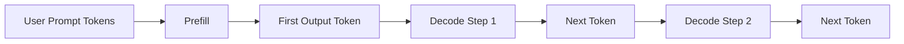
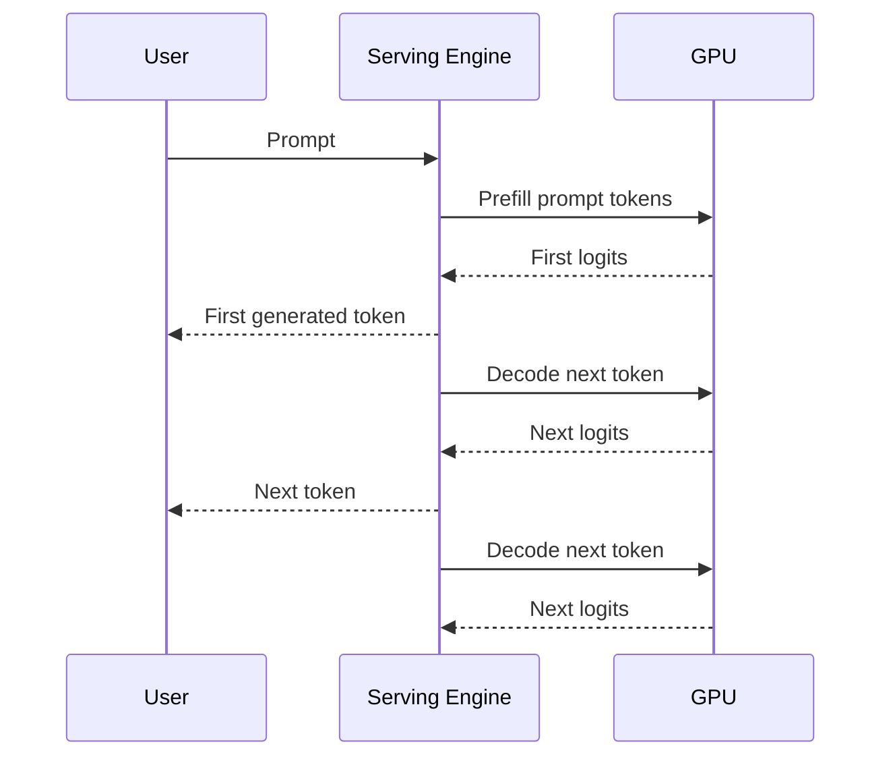
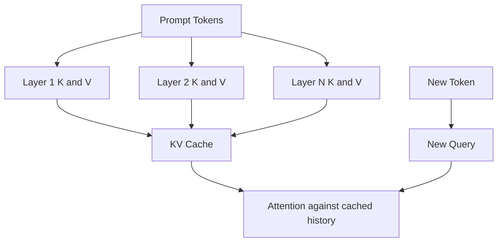
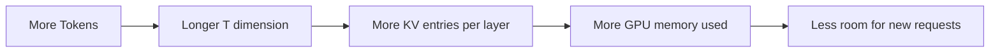
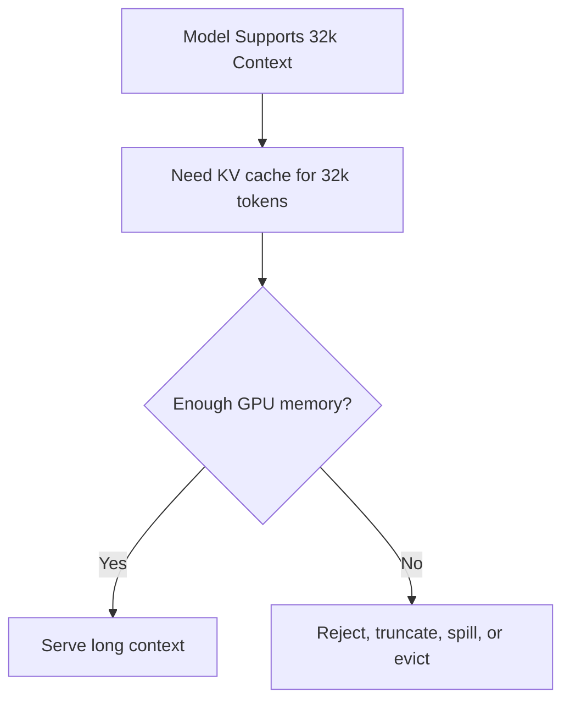
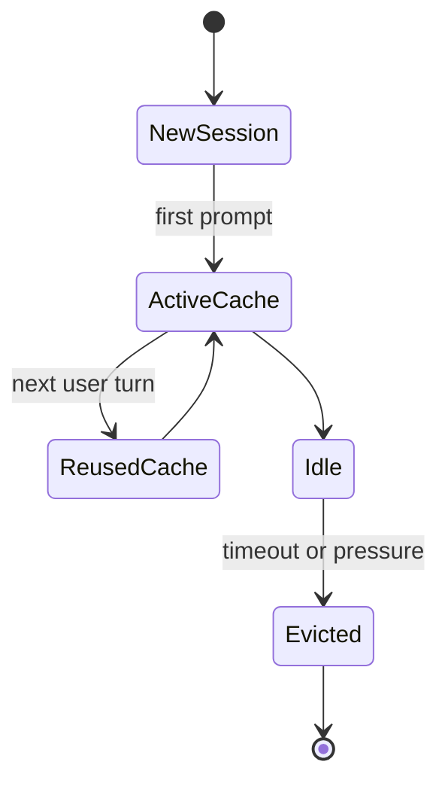
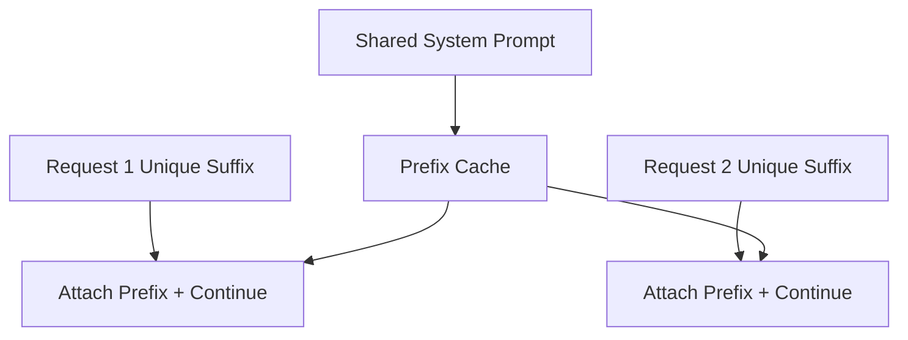

# Chapter 12 — KV Cache: Why Decoding Is Slow and How Serving Systems Avoid Recomputing Work

## Learning Objectives

By the end of this chapter, you should understand:

- Why autoregressive decoding is slower than prompt processing
- What the KV cache stores inside a Transformer
- How KV cache reduces repeated attention computation
- How KV cache grows with sequence length, layers, heads, and batch size
- Why long contexts create GPU memory pressure
- How session management affects cache lifetime
- What cache eviction policies do
- What prefix caching is and when it helps

---

## Why This Topic Matters

When teams first run an LLM in production, one surprise shows up quickly:

**The first token is expensive, and every additional generated token is also expensive.**

This feels unintuitive if you come from regular web services. In a normal API, once the request is parsed and routed, generating the response is usually not a token-by-token GPU loop. In an LLM, it is.

The model generates one token at a time. After every generated token, it must run another forward pass to predict the next one. If the system had to recompute attention over the full conversation from scratch every time, latency would be much worse than it already is.

That is why KV cache exists.

KV cache is one of the most important runtime optimizations in modern LLM serving. It is also one of the biggest reasons that inference systems consume large amounts of GPU memory even when the model weights are already loaded.

For engineers, KV cache connects directly to:

- latency
- throughput
- GPU memory sizing
- context window limits
- multi-turn chat design
- serving engine behavior
- eviction and admission policy
- cost per active session

If you understand KV cache, many production behaviors start making sense.

---

## Section 1 — Why Decoding Is Slow

Inference has two phases:

1. **Prefill**
2. **Decode**

During **prefill**, the model processes the prompt tokens already provided by the user.

During **decode**, the model generates new tokens one at a time.



What problem exists?

In an autoregressive model, token `t+1` cannot be generated until token `t` is known. That means decode is inherently sequential.

Why is prefill different?

Because the input prompt already exists. The model can process all prompt tokens in parallel across layers during the first pass.

Why is decode slower per token?

Because each output step:

- depends on the token generated in the previous step
- requires another pass through the model
- cannot fully parallelize across future tokens that do not exist yet

A simplified timeline looks like this:



This is why engineers often track:

- time to first token
- tokens per second
- prompt tokens per second
- decode tokens per second

Prefill is usually compute-heavy but parallel. Decode is smaller per step but sequential and repeated many times.

> [!NOTE]
> **Engineering reality**
> Many latency complaints are really decode-loop complaints. The model is not "thinking forever" in a human sense. It is repeatedly running a sequential token-generation loop.

---

## Section 2 — What the KV Cache Stores

To understand KV cache, recall what attention uses:

- Query
- Key
- Value

For each layer, the model creates `Q`, `K`, and `V` tensors from token representations.

During decoding, the new token needs to attend to all earlier tokens in the session. Without optimization, the system would recompute the old Keys and Values again and again for the unchanged prefix.

That repeated work is wasteful.

The optimization is simple:

**Store the previously computed Keys and Values, then reuse them for later decode steps.**

That stored data is the **KV cache**.



What is cached exactly?

For each layer, the engine stores previously computed:

- Key vectors for earlier tokens
- Value vectors for earlier tokens

What is not cached in the same way?

- Queries for old tokens are usually not needed for future steps
- final logits are not enough by themselves
- attention outputs are not reusable across arbitrary future tokens

Shapes vary by implementation, but a simplified view is:

```text
K cache per layer: [B, H, T, D_head]
V cache per layer: [B, H, T, D_head]
```

Where:

- `B` = batch size or number of active sequences
- `H` = number of attention heads
- `T` = tokens stored so far
- `D_head` = dimension per head

If the model has `L` layers, the total cache spans all layers:

```text
Total KV cache ~= 2 * L * B * H * T * D_head * bytes_per_element
```

The `2` is because there is both a Key cache and a Value cache.

Why only K and V?

Because when generating the next token, the new token creates a fresh Query and compares it against the stored Keys. The Values are then used to build the context output.

---

## Section 3 — How KV Cache Changes the Decode Path

Without KV cache, generating token `t+1` would require recomputing attention state for tokens `1..t`.

With KV cache, only the new token's state needs to be computed, then appended.

```mermaid
flowchart TD
    subgraph Without KV Cache
        A1[Tokens 1..100] --> B1[Recompute K and V for all 100]
        B1 --> C1[Generate token 101]
        C1 --> D1[Tokens 1..101]
        D1 --> E1[Recompute K and V for all 101]
        E1 --> F1[Generate token 102]
    end

    subgraph With KV Cache
        A2[Tokens 1..100] --> B2[Store K and V once]
        B2 --> C2[Generate token 101]
        C2 --> D2[Compute K and V only for token 101]
        D2 --> E2[Append to cache]
        E2 --> F2[Generate token 102]
    end
```



This does not make decoding free.

The new token still has to:

- pass through every layer
- produce fresh Q, K, and V for that token
- attend to the entire cached history
- run the rest of the block and output projection

But it avoids the worst form of repeated work.

A simplified comparison:

| Step | Without KV Cache | With KV Cache |
| --- | --- | --- |
| Old token K/V recomputation | Repeated every decode step | Reused |
| Per-token decode cost | Much higher | Lower |
| Memory usage | Lower cache memory | Higher cache memory |
| Latency | Worse | Better |

This is the core tradeoff:

**KV cache trades memory for speed.**

> [!IMPORTANT]
> **Common misconception**
> KV cache does not eliminate attention over prior tokens. The new token still attends to the previous sequence. KV cache only avoids recomputing old Key and Value tensors.

---

## Section 4 — Why Memory Growth Becomes a Problem

KV cache grows as the sequence grows.

Every new token adds more entries for every layer. That means a long conversation can consume a large amount of GPU memory even if the model weights stay unchanged.



The main drivers are:

- number of layers
- number of heads
- head dimension
- number of active requests
- context length
- data type size such as FP16 or BF16

A rough example:

```text
Assume:
L = 32 layers
H = 32 heads
D_head = 128
T = 4096 tokens
dtype = FP16 = 2 bytes
B = 1 sequence

Total KV ~= 2 * 32 * 1 * 32 * 4096 * 128 * 2 bytes
          ~= 2 GB
```

This is approximate, but it shows the scale.

For `B = 10` active long sessions, the cache can become a dominant memory consumer.

That leads to practical consequences:

- fewer concurrent users per GPU
- smaller safe batch sizes
- harder admission control
- more cache eviction pressure
- shorter supported context windows in practice than on paper

The advertised context window of a model is not the same as the context window you can serve economically.

> [!NOTE]
> **Engineering reality**
> Teams often size GPUs based on model weights first, then get surprised by runtime memory consumption. For active chat systems, KV cache can become the capacity limit before raw compute does.

---

## Section 5 — Context Window and GPU Memory

A model's **context window** is the maximum number of tokens it can attend to.

That limit is partly architectural and partly operational.

Architecturally, the model was trained and configured to support some maximum length.

Operationally, the serving system must have enough memory to store cache entries for that length.



Why do longer contexts hurt so much?

Because decode cost and cache memory both grow with sequence length:

- attention work for the new token spans more past tokens
- KV cache stores more history

This is why products often apply limits such as:

- max input tokens
- max output tokens
- max total session tokens
- per-tenant memory quotas
- idle timeout for sessions

Long context is useful, but it is not free.

---

## Section 6 — Session Management and Cache Lifetime

In a stateless HTTP service, each request can usually be processed independently.

Chat inference is different. The runtime often needs to keep per-session state alive between turns so the next request can continue from the previous history.

That state includes KV cache.



Important questions for serving design:

- How long do you keep a session's cache after the last request?
- Do you pin active premium users longer than anonymous users?
- What happens if the cache is gone when the next turn arrives?
- Can you rebuild from prompt history, and what latency penalty does that cause?

If the cache is retained, the next turn can continue faster.

If it is evicted, the engine must rebuild by reprocessing the conversation history during prefill.

That is a direct latency and GPU-cost tradeoff.

Common operational patterns:

- idle TTL for session cache
- explicit session close from application layer
- hard memory cap per server
- per-tenant or per-model cache budgets

---

## Section 7 — Cache Eviction and Prefix Cache

Eventually, memory runs out unless something is removed.

That leads to **cache eviction**.

Common eviction strategies include:

- least recently used
- oldest idle session first
- shortest value or smallest benefit first
- priority-based policies by tenant or product tier

Eviction policy matters because rebuilding cache later is expensive.

A related optimization is **prefix caching**.

Many requests share a common prefix, such as:

- system prompts
- tool instructions
- long safety headers
- shared document prefix
- repeated evaluation prompts

If that prefix has already been processed, the system may reuse its cached K/V state for multiple requests.



This can reduce prefill cost significantly when many requests start the same way.

Prefix caching helps most when:

- many prompts share a large identical prefix
- the prefix is stable and byte-for-byte or token-for-token identical
- the serving engine can safely reference shared cached blocks

It helps less when:

- prompts differ early
- chat history is highly personalized
- the application injects dynamic timestamps, IDs, or user-specific text into the front of the prompt

> [!TIP]
> **Engineering note**
> If you want prefix caching to work, prompt templating discipline matters. Small differences near the front of the prompt can destroy reuse.

---

## Common Misconceptions

### "KV cache makes decoding parallel"

No. Decode still generates tokens sequentially. KV cache only avoids recomputing old Keys and Values.

### "If the model weights fit, serving will fit"

Not necessarily. Runtime cache can consume huge additional memory.

### "Context window is just a model feature flag"

No. It is also a memory and capacity planning problem.

### "Evicting cache only affects a single request"

Not always. In chat products, eviction can degrade the next turn for that user and reduce overall system efficiency.

### "Prefix cache is automatic no matter how prompts are built"

No. Reuse usually depends on exact shared prefixes and engine-specific behavior.

---

## Key Takeaways

- Decoding is slow because autoregressive generation is sequential.
- Prefill processes known prompt tokens in parallel, but decode runs one token step at a time.
- KV cache stores Key and Value tensors from prior tokens so the system does not recompute them every step.
- KV cache improves latency by trading GPU memory for speed.
- Cache size grows with layers, heads, sequence length, batch size, and dtype.
- Long context is expensive not only in compute but also in memory capacity.
- Session management determines how long caches live and how often they must be rebuilt.
- Eviction policies and prefix caching are important serving optimizations, not implementation trivia.

---

## Next Chapter

Next: [Chapter 13 — Quantization](../13-quantization/README.md)
