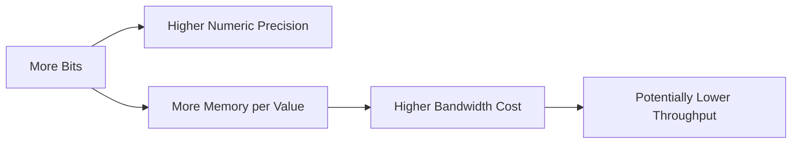
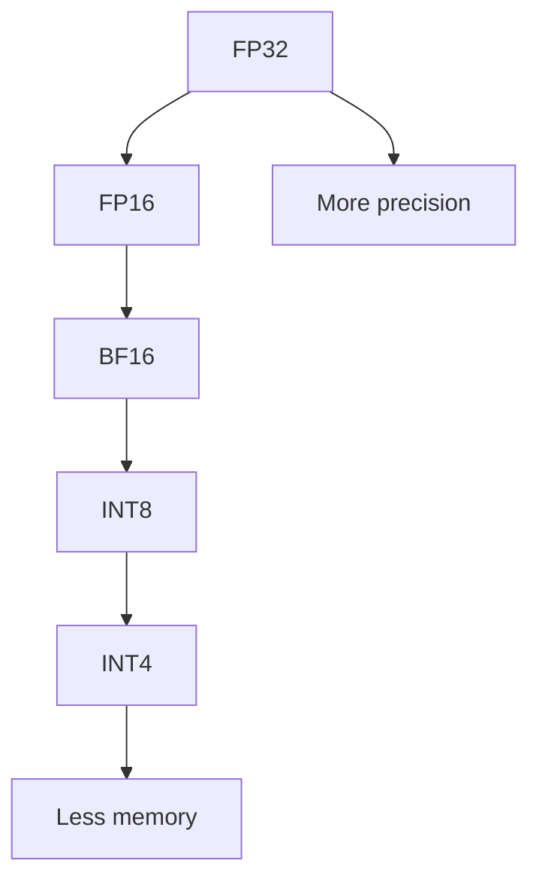
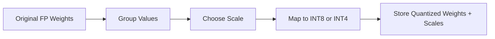
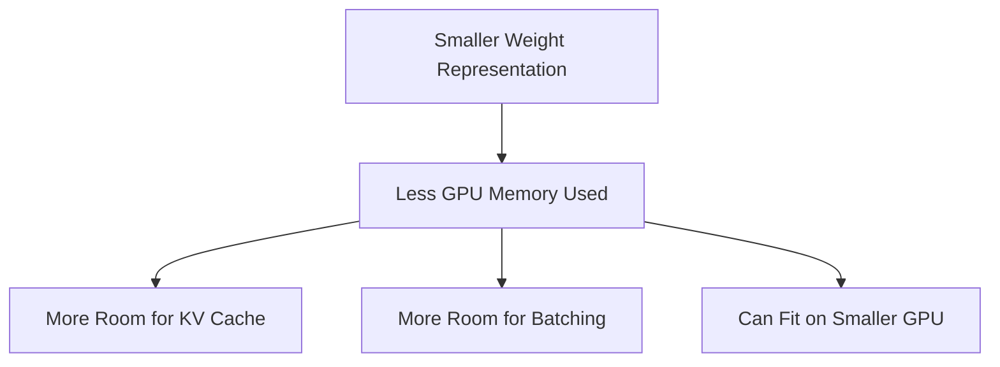
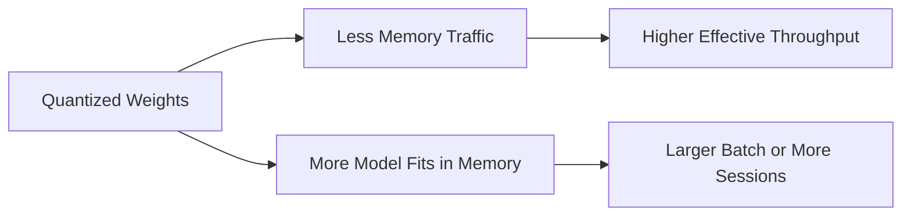
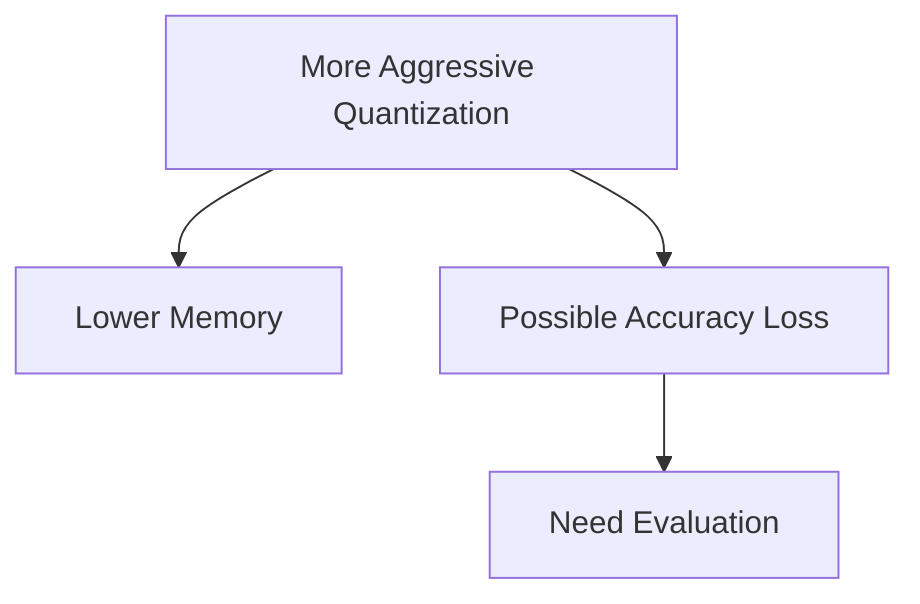
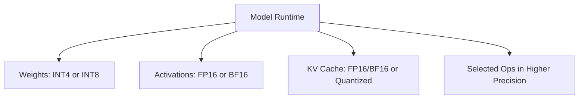
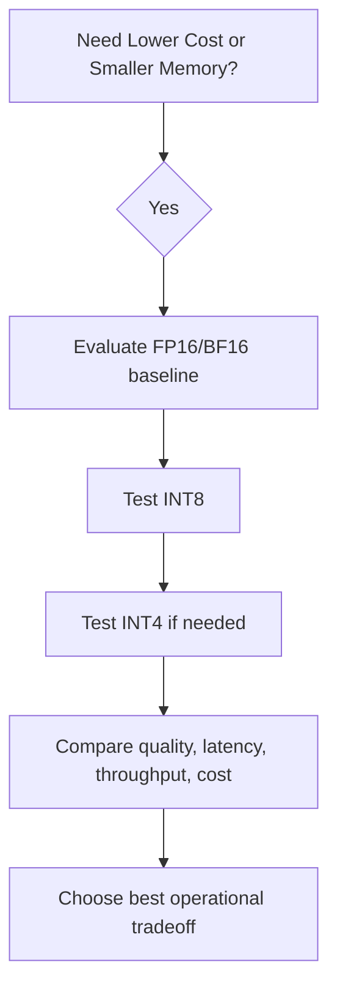

# Chapter 13 — Quantization: Reducing Memory and Cost Without Breaking Model Quality

## Learning Objectives

By the end of this chapter, you should understand:

- What numeric precision means in model inference
- The difference between FP32, FP16, BF16, INT8, and INT4
- Why model weights do not always need full precision
- How quantization reduces memory footprint
- How quantization can improve performance
- Where quantization can hurt accuracy
- Why different parts of the model may use different precisions
- How to reason about quantization as an engineering tradeoff

---

## Why This Topic Matters

Large models are expensive for two simple reasons:

- they contain many parameters
- those parameters must be stored, moved, and multiplied constantly

If a model has billions of weights, the number of bytes used to represent each weight matters a lot.

A 7B parameter model stored in FP32 is very different operationally from the same model stored in INT4.

That difference affects:

- GPU memory requirements
- model startup time
- bandwidth pressure
- batch size
- throughput
- deployment cost
- hardware compatibility

Quantization is the family of techniques used to represent model values with lower precision so the system uses less memory and often runs faster.

This is one of the most practical topics in production LLM engineering because it directly influences whether a workload fits on a given GPU at all.

---

## Section 1 — Why Precision Exists in the First Place

Neural networks do math on large tensors. Those tensors hold values such as:

- model weights
- activations
- KV cache entries
- gradients during training

Those values must be encoded using some numeric format.

The simplest mental model is this:

**More bits usually means more numeric fidelity, but also more memory and more data movement.**



Why does this matter so much?

Because LLM inference is often bottlenecked not only by raw arithmetic, but by memory movement:

- loading weights
- reading activations
- writing cache entries
- moving tensors through GPU memory hierarchy

If you can cut bytes per value in half, you may improve both memory capacity and runtime efficiency.

---

## Section 2 — The Common Data Types

### FP32

FP32 is 32-bit floating point.

It has been the standard default for many ML workloads historically because it provides good numeric range and precision.

Properties:

- 4 bytes per value
- high precision
- high memory usage
- common in training, debugging, reference baselines

### FP16

FP16 is 16-bit floating point.

Properties:

- 2 bytes per value
- half the storage of FP32
- less precision and smaller range than FP32
- common for inference and mixed-precision training

### BF16

BF16 is bfloat16, also 16 bits.

Properties:

- 2 bytes per value
- same storage as FP16
- larger exponent range than FP16
- lower mantissa precision than FP32
- often preferred in modern training and inference stacks because it is numerically more forgiving than FP16

### INT8

INT8 is 8-bit integer representation.

Properties:

- 1 byte per value
- much smaller storage
- often used in quantized inference
- usually requires scale factors to map integers back to approximate real values

### INT4

INT4 uses 4 bits per value.

Properties:

- 0.5 bytes per value
- very compact
- useful for aggressive model compression
- usually has higher risk of quality degradation if applied poorly

A quick comparison:

| Type | Bits | Bytes | Typical Use |
| --- | --- | --- | --- |
| FP32 | 32 | 4 | baseline, training, reference |
| FP16 | 16 | 2 | inference, mixed precision |
| BF16 | 16 | 2 | training and inference on supported hardware |
| INT8 | 8 | 1 | quantized inference |
| INT4 | 4 | 0.5 | highly compressed inference |



> [!NOTE]
> **Important nuance**
> BF16 and FP16 are both 16-bit formats, but they are not interchangeable in behavior. BF16 usually keeps a wider numeric range, which often makes it easier to use safely.

---

## Section 3 — Why Quantization Works At All

If lower precision is worse, why can quantization work?

Because not every individual weight needs perfect fidelity for the model to behave well overall.

A trained model is a large distributed system of parameters. Many weights can be represented approximately while still preserving useful behavior.

The basic idea is:

1. Start with higher-precision model values
2. Map groups of values into a lower-precision representation
3. Store scale information so approximate values can be reconstructed during inference

A simplified INT8 view:

```text
real_value ~= scale * int8_value
```

Instead of storing a 32-bit float for every weight, the system stores:

- smaller integer values
- scale metadata per tensor, per channel, or per group



Why is this acceptable?

Because model quality depends on the collective behavior of many parameters, and some approximation error can be tolerated.

But tolerance is not infinite. Aggressive quantization can distort the model too much.

---

## Section 4 — Memory Savings and Why They Matter

Memory reduction is often the first reason teams quantize.

Approximate weight storage for a 7B parameter model:

| Format | Approximate Weight Memory |
| --- | --- |
| FP32 | 28 GB |
| FP16/BF16 | 14 GB |
| INT8 | 7 GB |
| INT4 | 3.5 GB |

This table is simplified and ignores metadata, fragmentation, runtime overhead, and non-weight tensors, but it is directionally useful.

Why does this matter?

- a model that does not fit in GPU memory cannot be served efficiently
- smaller weights can reduce startup time
- smaller weights may allow larger batches
- smaller weights may leave room for KV cache
- smaller weights can make lower-cost GPUs usable



This is especially important when serving chat models with long contexts. Even if quantization only applies to weights, freeing memory can indirectly improve concurrency because more room remains for runtime cache.

> [!TIP]
> **Engineering note**
> In production, "model fits on GPU" is not enough. You usually need space for activations, runtime buffers, and KV cache too.

---

## Section 5 — Performance Benefits and Limits

Quantization is often described as a speed optimization, but the story is more nuanced.

Potential performance gains come from:

- fewer bytes read from memory
- better cache utilization
- more efficient tensor kernels on supported hardware
- ability to batch more requests because memory pressure is lower



But quantization does not guarantee faster inference in every environment.

Why not?

- some hardware has better support for certain precisions than others
- dequantization overhead may offset some gains
- not all operations run in low precision
- engine implementation quality matters
- memory may not be the main bottleneck for a specific workload

For example:

- FP16 or BF16 may already be highly optimized on a GPU
- INT4 may save memory but depend on specialized kernels
- poor kernel support can make a theoretical win become a practical loss

So the correct question is not "Is INT4 always faster?"

The correct question is:

**On this model, on this hardware, in this engine, under this traffic pattern, what is the best accuracy-cost-latency tradeoff?**

---

## Section 6 — Accuracy Tradeoffs

Lower precision introduces approximation error.

That error can show up as:

- worse perplexity
- lower benchmark scores
- reduced instruction-following quality
- more brittle reasoning
- degraded multilingual performance
- worse code generation or edge-case behavior

Not all models react equally.

Some models quantize well to INT8 with minor loss. Some tolerate INT4 surprisingly well. Others degrade quickly.

The impact depends on:

- model architecture
- quantization method
- calibration data
- which tensors are quantized
- whether activations are also quantized
- the task being evaluated



This is why quantization should be treated as an empirical engineering change, not a purely theoretical one.

Useful evaluation questions:

- Does the model still answer correctly on our internal prompts?
- Does it still follow structured output requirements?
- Does latency improve enough to justify the quality change?
- Are failures concentrated in specific tasks such as math, code, or long-context QA?

> [!IMPORTANT]
> **Common misconception**
> A model that "looks fine in a quick chat test" may still be unacceptable for production tasks that require strict structure, domain language, or tool-calling accuracy.

---

## Section 7 — Not Everything Uses the Same Precision

Modern inference systems often mix precisions.

Examples:

- weights may be INT8 or INT4
- activations may remain FP16 or BF16
- KV cache may use FP16, BF16, or a dedicated cache quantization mode
- some sensitive layers may stay in higher precision

Why mix?

Because different tensors have different sensitivity and runtime behavior.



This means quantization is not one on/off switch. It is a design space.

Common distinctions include:

- weight-only quantization
- weight + activation quantization
- post-training quantization
- quantization-aware training
- group-wise or channel-wise quantization

You do not need all the algorithms for this chapter. The key idea is that practical systems often choose lower precision selectively rather than uniformly.

---

## Section 8 — When Quantization Is Worth It

Quantization is usually a strong option when:

- the model barely fits or does not fit in target GPU memory
- serving cost is too high
- throughput is limited by memory bandwidth
- minor quality loss is acceptable
- you need to increase concurrency

Quantization may be less attractive when:

- the use case is extremely accuracy-sensitive
- hardware support is weak
- the engine's low-precision kernels are immature
- the model is already small enough and latency is dominated elsewhere
- compliance or output correctness requirements are strict

A simple decision flow:



---

## Common Misconceptions

### "Lower precision always means worse serving"

Often false. Lower precision can improve throughput and make deployment possible at all.

### "INT4 is always better than INT8"

Not necessarily. It saves more memory, but may hurt quality more and may depend on better kernel support.

### "BF16 is just a smaller FP32"

It is a different floating-point format with its own tradeoffs, especially around range and precision.

### "If benchmark scores drop only a little, production is safe"

Not necessarily. Structured tasks, code generation, and domain prompts can fail in ways broad benchmarks do not expose.

### "Quantization only matters for model weights"

Weights are the most common focus, but activations and KV cache also matter in end-to-end memory behavior.

---

## Key Takeaways

- Quantization reduces the number of bits used to represent model values.
- FP32, FP16, BF16, INT8, and INT4 represent different points on the precision-memory spectrum.
- Lower precision reduces memory footprint and can improve throughput, especially in bandwidth-sensitive workloads.
- Quantization works because many model values can be approximated without destroying overall model behavior.
- Accuracy can degrade, especially with more aggressive methods such as INT4.
- Practical deployments often use mixed precision rather than one uniform format everywhere.
- The right choice depends on hardware, engine support, task quality requirements, and cost targets.
- Quantization is one of the most important tools for making LLM serving economically viable.

---

## Next Chapter

Next: [Chapter 14 — Model Serving](../14-model-serving/README.md)
