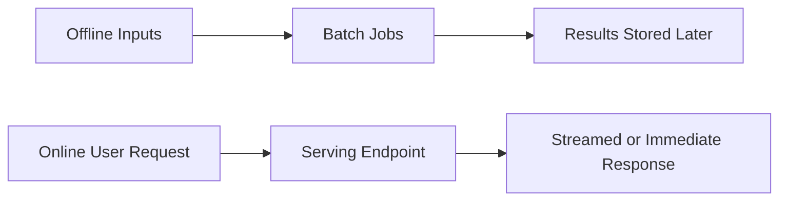
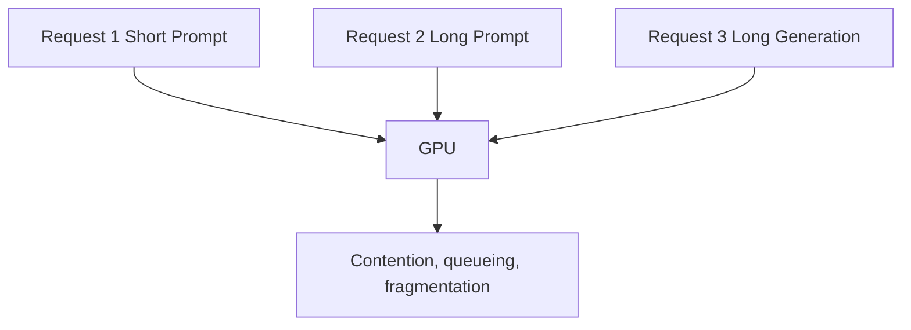
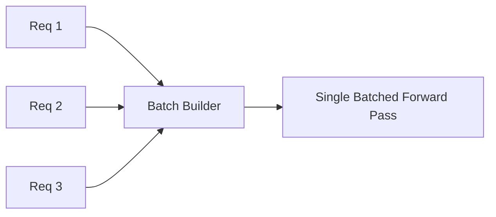
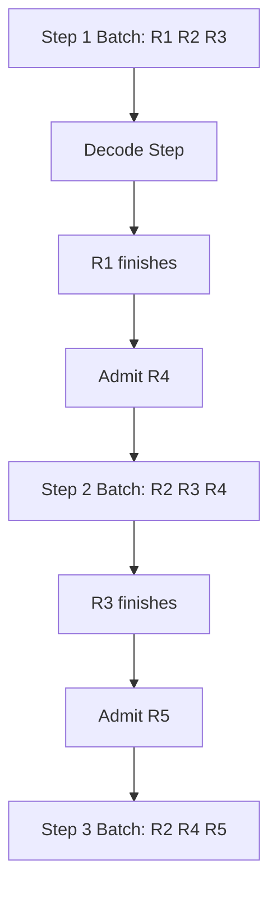
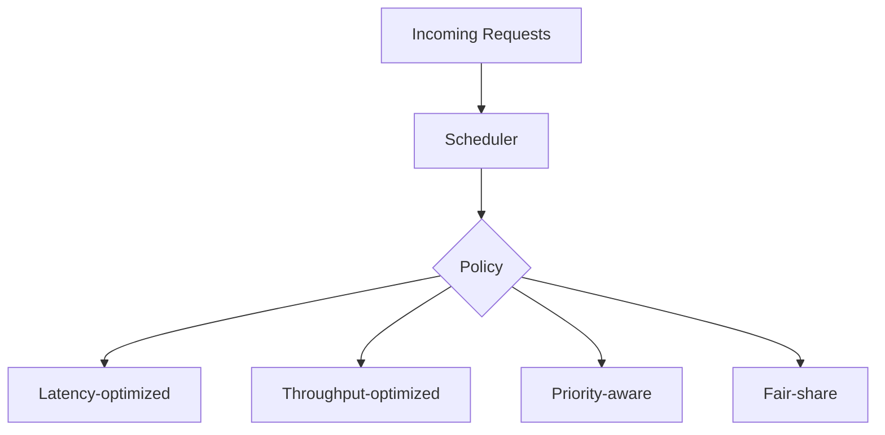
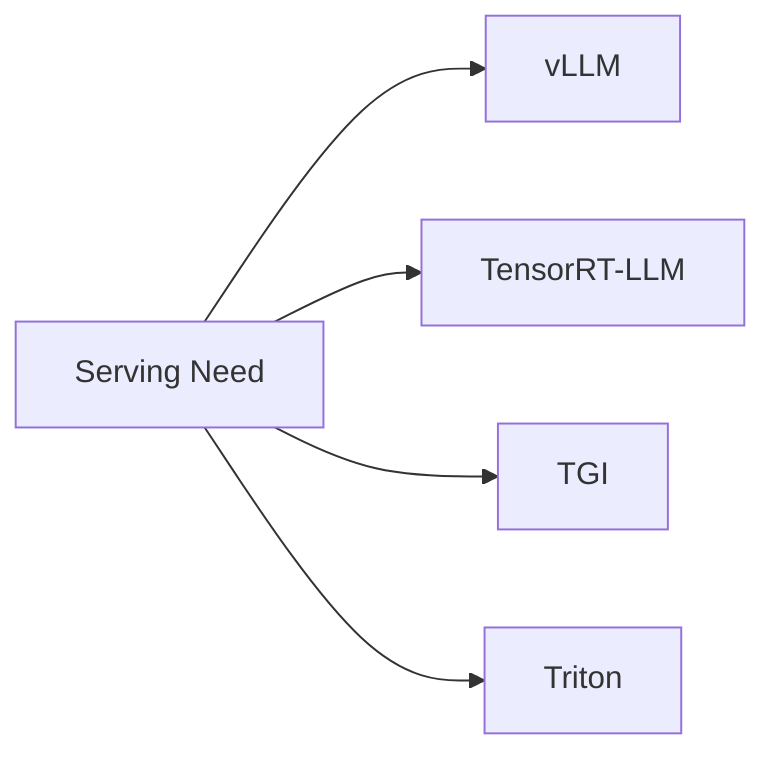
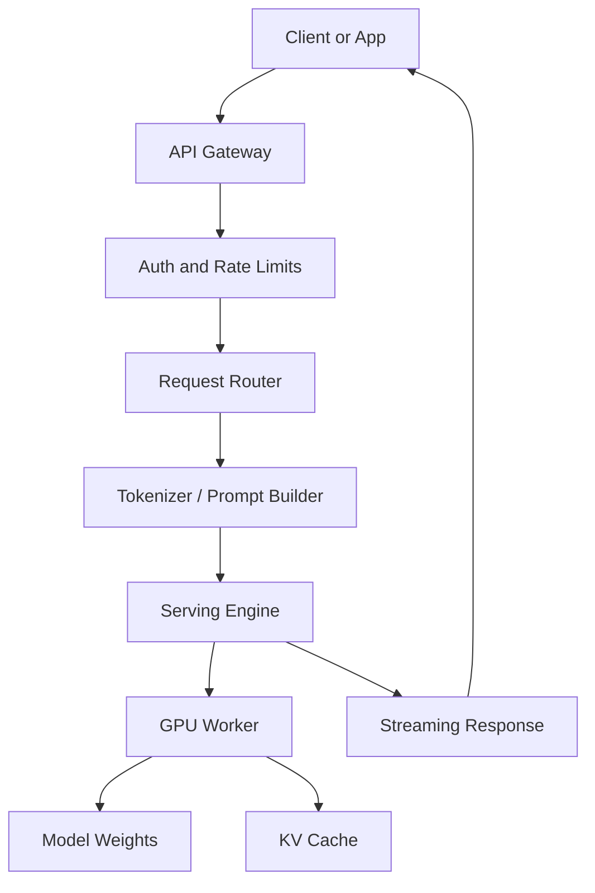
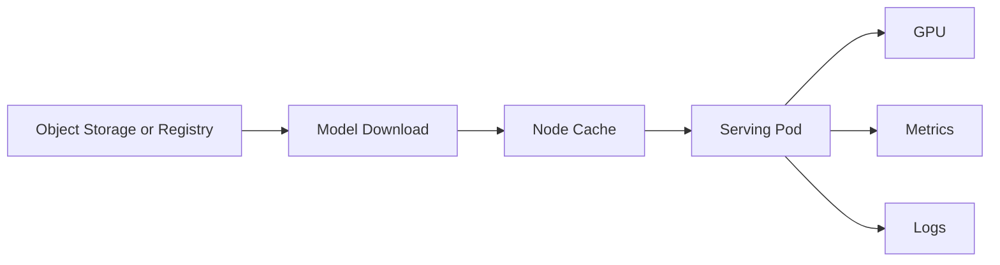

# Chapter 14 — Model Serving: How Inference Engines Turn GPUs Into Multi-User AI Systems

## Learning Objectives

By the end of this chapter, you should understand:

- The difference between offline and online inference
- Why model serving is more than exposing an HTTP endpoint
- How dynamic batching and continuous batching work
- Why request scheduling matters for latency and throughput
- The role of serving engines such as vLLM, TensorRT-LLM, TGI, and Triton
- The basic architecture of a production model-serving system
- Common tradeoffs in throughput, fairness, and memory use

---

## Why This Topic Matters

A trained model is not a product.

Even a model loaded on a GPU is not yet a production system.

To serve real users, you need a runtime that can:

- accept requests
- tokenize prompts
- load or access the model
- manage GPU memory
- schedule work across requests
- batch efficiently
- stream tokens back to clients
- expose metrics and health signals
- recover from failure

This is what model serving does.

For engineers, model serving is where model behavior meets systems behavior. It is where latency, fairness, queueing, concurrency, GPU utilization, and operational complexity all collide.

The difference between a naive inference loop and a mature serving engine can be the difference between:

- 10% GPU utilization and 70% GPU utilization
- poor tail latency and acceptable tail latency
- expensive underused hardware and economically viable production service

---

## Section 1 — Offline vs Online Inference

Not all inference workloads are the same.

A useful first distinction is **offline** versus **online** inference.

### Offline Inference

Offline inference processes work in bulk, often outside a user-facing request path.

Examples:

- batch summarization of documents
- nightly classification jobs
- data enrichment pipelines
- large-scale embedding generation

### Online Inference

Online inference serves live requests from users or applications.

Examples:

- chat completions
- coding assistant requests
- search copilots
- tool-calling APIs
- customer support assistants

Why does this distinction matter?

Because the optimization goals differ.

| Aspect | Offline | Online |
| --- | --- | --- |
| Primary goal | throughput and total cost | latency, concurrency, reliability |
| User waiting live | no | yes |
| Scheduling flexibility | high | lower |
| Batching opportunity | large | variable |
| Retry tolerance | often higher | lower |

An engine can support both, but the serving design choices are often driven by online latency requirements.

---

## Section 2 — Why Simple Request-Per-Process Designs Fail

A naive design looks simple:

1. request arrives
2. run the model
3. return the text

That works for demos. It breaks down under concurrent traffic.

Problems appear quickly:

- GPU memory is shared and limited
- requests have different prompt lengths
- requests generate different output lengths
- decoding is sequential
- some requests arrive while others are mid-generation
- batching opportunities change every few milliseconds

If the system processes requests one by one, throughput is terrible.

If it batches poorly, some requests wait too long.

If it batches too aggressively, tail latency becomes unacceptable.

So serving systems need smarter scheduling.

> [!NOTE]
> **Engineering reality**
> Serving is a queueing problem as much as a modeling problem. The GPU is a shared finite resource, not an infinitely scalable function call.

---

## Section 3 — Dynamic Batching

**Dynamic batching** groups multiple requests together at runtime so one model execution can process them as a batch.

Instead of running one prompt at a time, the server waits briefly and combines compatible requests.

Why does this help?

GPUs prefer larger parallel workloads. A batch can improve utilization because many tensor operations run more efficiently across multiple sequences.

But dynamic batching is not free.

Tradeoffs:

- waiting a little can improve throughput
- waiting too long increases latency
- different prompt lengths create padding and inefficiency
- batch composition changes over time

Common tuning levers:

- max batch size
- max waiting time
- max total tokens in a batch
- separate queues by model or priority

Dynamic batching is common in general inference systems, but LLM generation introduces an extra challenge: requests do not all finish at the same time.

That is where continuous batching becomes important.

---

## Section 4 — Continuous Batching

In regular batch inference, a batch starts together and often finishes together.

LLM decoding is different:

- one request may finish after 20 output tokens
- another may continue for 400 tokens
- new requests may arrive while old ones are still decoding

If the server waits for the whole batch to finish before admitting new work, GPU utilization drops.

**Continuous batching** solves this by letting requests enter and leave the active batch over time.

This is one of the major ideas behind high-performance LLM serving.

Why does it matter?

Because decode is iterative. If the system can refill vacant slots as requests finish, it keeps the GPU busy.

Continuous batching improves:

- throughput
- average utilization
- concurrency efficiency

But it adds scheduler complexity:

- active sequence tracking
- KV cache management
- fairness decisions
- admission control
- memory accounting by token, not only by request count

> [!IMPORTANT]
> **Common misconception**
> Continuous batching is not just "bigger batching." It is a scheduling model designed for iterative token generation where requests join and leave continuously.

---

## Section 5 — Request Scheduling and Fairness

Once many requests compete for a shared model, scheduling becomes a product decision as much as an infrastructure decision.

The scheduler must answer questions like:

- Which request gets admitted next?
- Should short requests be favored to reduce tail latency?
- Should long prompts be delayed because prefill is expensive?
- Should premium tenants get higher priority?
- How do we prevent one long generation from monopolizing memory?

Common concerns:

- **Head-of-line blocking**: one expensive request delays others
- **Starvation**: low-priority or long requests never get enough service
- **Fairness**: all tenants should make progress
- **SLA alignment**: interactive requests may need stricter latency goals than batch jobs

Typical inputs to scheduling:

- prompt length
- generated tokens so far
- remaining max tokens
- tenant priority
- memory availability
- current batch composition

This is why serving stacks often expose controls for:

- max concurrency
- queue size
- priority classes
- token budget per request
- preemption or cancellation

---

## Section 6 — The Major Serving Engines

Several popular systems appear repeatedly in production LLM stacks.

### vLLM

vLLM is widely used for high-throughput LLM serving. It is known for efficient memory handling and continuous batching. It became especially popular because it improved utilization for autoregressive generation workloads.

### TensorRT-LLM

TensorRT-LLM focuses heavily on NVIDIA-optimized inference performance. It uses specialized kernels and graph optimizations for supported hardware and deployment patterns.

### TGI

Text Generation Inference, often called TGI, is a serving stack associated with Hugging Face ecosystems. It supports text generation APIs and production deployment patterns for many transformer models.

### Triton Inference Server

Triton is a broader inference serving platform. It supports multiple backends and workloads beyond LLMs. It is often used where teams want a unified serving framework across model types.

A simplified comparison:

| Engine | Common Strength |
| --- | --- |
| vLLM | efficient LLM serving, continuous batching, strong ecosystem adoption |
| TensorRT-LLM | NVIDIA-specific performance optimization |
| TGI | practical text-generation serving in Hugging Face-oriented stacks |
| Triton | broader inference platform across model types and backends |

There is no universal winner.

Selection depends on:

- hardware environment
- target models
- latency versus throughput goals
- operational simplicity
- ecosystem fit
- need for custom backends or multi-model serving

---

## Section 7 — Reference Serving Architecture

A production serving path usually includes more than the engine itself.

Common components:

- **API Gateway**: auth, rate limits, logging, policy
- **Router**: chooses model or cluster
- **Prompt Builder**: applies templates, tools, system messages
- **Serving Engine**: batching, scheduling, memory management
- **GPU Worker**: executes the model
- **Model Storage**: source of weights
- **Metrics and Observability**: request counts, queue depth, TTFT, tokens/sec, GPU memory

A more operational view:

This is why "serving a model" is not just starting a Python process with `generate()`.

---

## Section 8 — Operational Tradeoffs

Serving systems live under constant tradeoffs.

### Throughput vs Latency

Bigger batches often improve throughput but can increase waiting time.

### Fairness vs Efficiency

Favoring short requests may improve latency metrics while making long jobs wait too long.

### Memory Utilization vs Admission Rate

Admitting too many long-context sessions can cause memory pressure and destabilize the service.

### Simplicity vs Performance

A highly optimized engine may be harder to operate, tune, or debug.

Useful production metrics include:

- time to first token
- tokens per second
- queue depth
- active sequence count
- GPU utilization
- GPU memory used
- request timeout rate
- cancellation rate
- prompt length and output length distributions

> [!TIP]
> **Engineering note**
> Look at token distributions, not just request counts. Ten "short answer" requests and ten "generate 2,000 tokens" requests are very different loads.

---

## Common Misconceptions

### "Serving is just wrapping the model with an API"

No. Real serving includes scheduling, batching, memory management, and observability.

### "Batching always improves user experience"

Not necessarily. Throughput may improve while latency worsens.

### "All requests cost roughly the same"

False. Prompt length, output length, and context reuse all change cost significantly.

### "Continuous batching only matters at huge scale"

It matters whenever multiple decode requests compete for the same GPU.

### "The best engine is universal"

No. Engine choice depends on model, hardware, traffic pattern, and operator priorities.

---

## Key Takeaways

- Offline and online inference have different optimization goals.
- LLM serving is fundamentally a shared-resource scheduling problem.
- Dynamic batching groups requests together to improve GPU utilization.
- Continuous batching is especially important for iterative token generation.
- Request scheduling affects latency, throughput, fairness, and cost.
- vLLM, TensorRT-LLM, TGI, and Triton each occupy different parts of the serving landscape.
- Production serving architecture includes gateways, routing, storage, tokenization, metrics, and GPU workers, not only the model runtime.
- Good serving systems are defined by how they behave under concurrency, not how they perform in a single-request demo.

---

## Next Chapter

Next: [Chapter 15 — Model Storage](../15-model-storage/README.md)
