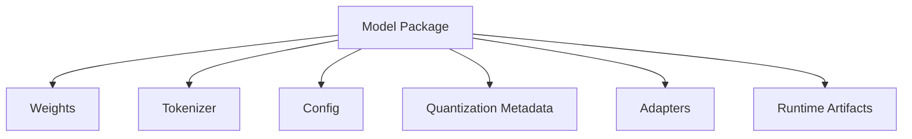
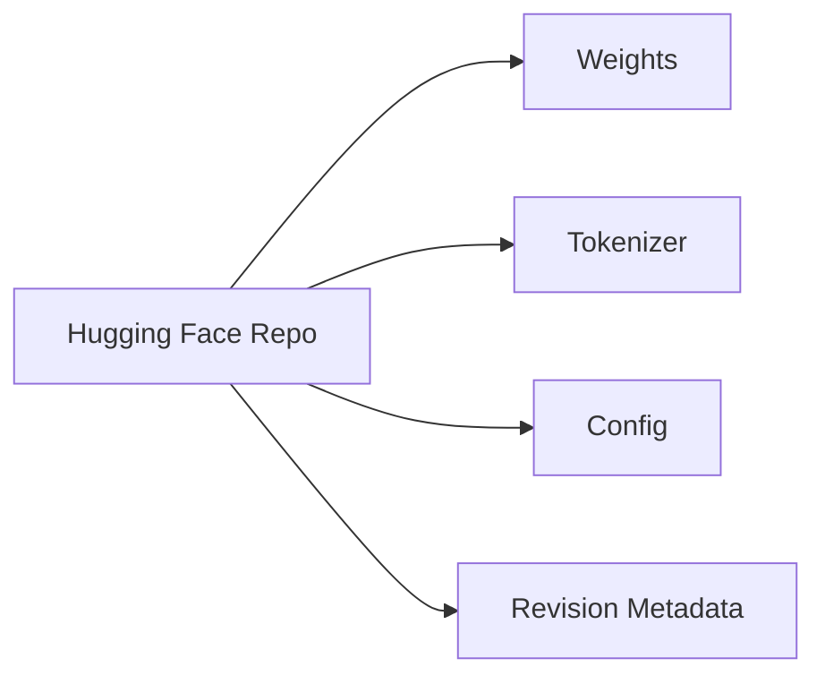
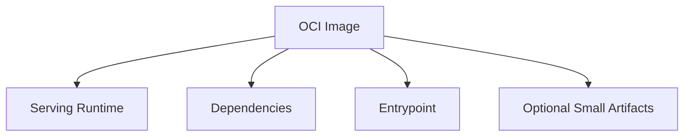
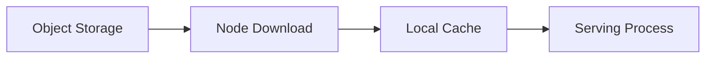
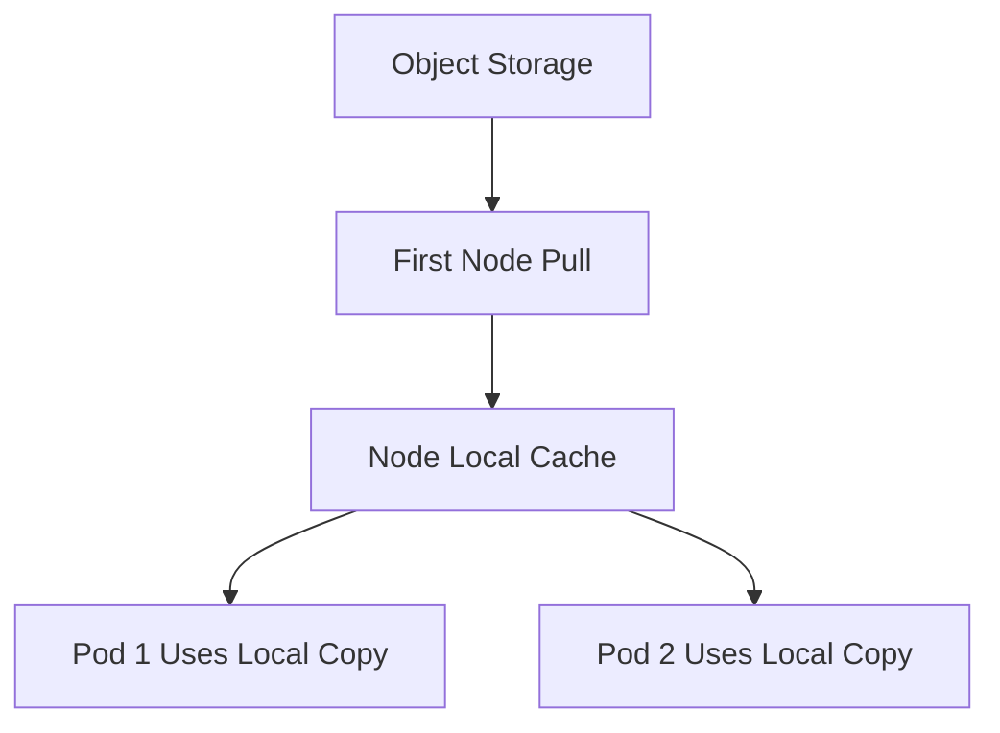
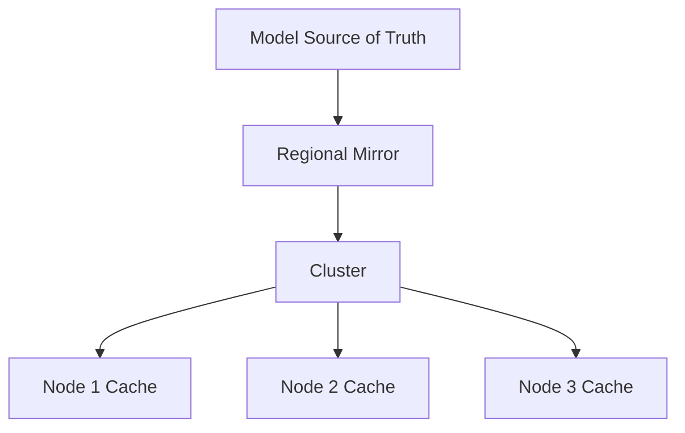
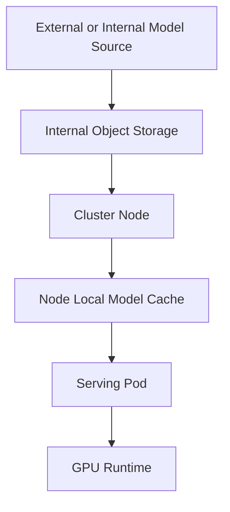

# Chapter 15 — Model Storage: Getting Large Model Artifacts to the Right GPU at the Right Time

## Learning Objectives

By the end of this chapter, you should understand:

- Why model storage is a production concern for LLM systems
- The role of Hugging Face repositories in model distribution
- How OCI images can package model-serving artifacts
- When persistent volumes make sense
- Why object storage is common for model weights
- How node-local caching improves startup and reduces network load
- What model distribution patterns look like in GPU clusters
- How teams optimize cold start and startup time

---

## Why This Topic Matters

A model is not a small application binary.

It may be:

- several gigabytes
- tens of gigabytes
- split into many files
- versioned separately from application code
- stored in a remote registry or object store
- needed on multiple GPU nodes quickly

That makes storage and distribution a first-class systems problem.

If model placement is slow or unreliable, everything above it suffers:

- pod startup takes too long
- autoscaling reacts too slowly
- rolling updates become risky
- nodes saturate the network
- GPUs sit idle waiting for downloads
- failed cache reuse increases cost

For experienced infrastructure engineers, model storage is where familiar concerns return in a new form:

- artifact distribution
- cache locality
- cold-start reduction
- bandwidth bottlenecks
- version control
- immutability
- node-level versus shared storage tradeoffs

---

## Section 1 — What Exactly Needs to Be Stored?

When people say "the model," they often mean several different artifacts.

A deployment may require:

- weight files
- tokenizer files
- model configuration
- generation configuration
- quantization metadata
- adapter weights such as LoRA
- runtime engine artifacts
- container image
- cache state built at runtime

These artifacts may live in different places.

For example:

- application code in an OCI container registry
- model weights in Hugging Face or object storage
- runtime caches on local disk
- adapters on persistent volumes

That separation is one reason model deployment feels different from ordinary microservice deployment.

---

## Section 2 — Hugging Face as a Distribution Source

Hugging Face is one of the most common sources of open model artifacts.

It provides repositories that can contain:

- model weights
- tokenizer files
- config files
- README and license metadata
- multiple revisions and branches

Why is this useful?

Because it gives teams a standard way to fetch, version, and reference model assets.

Common operational concerns when using it directly:

- egress and download time
- authentication for gated models
- availability dependency on external service
- repeat downloads across nodes
- need to pin exact revisions for reproducibility

In many production environments, teams do not want every serving pod to pull directly from the public internet during startup.

Instead, they mirror or pre-stage artifacts into internal storage.

> [!NOTE]
> **Engineering reality**
> "Works from `huggingface-cli download`" is not a production storage strategy. You still need policy, caching, repeatability, and startup control.

---

## Section 3 — OCI Images and What They Solve

OCI images are familiar to platform teams. They package application code and runtime dependencies into versioned artifacts that can be distributed through container registries.

For model workloads, OCI images can package:

- serving binaries
- Python environment
- inference engine
- startup scripts
- sometimes small model artifacts
- sometimes metadata about which model to fetch

Why not just bake the full model into the image?

Sometimes teams do, but there are tradeoffs:

Advantages:

- one artifact to deploy
- familiar registry flow
- immutable versioning

Disadvantages:

- very large image size
- slow image pull
- inefficient layer reuse for model updates
- registry pressure
- awkward handling of multiple model variants

OCI images are usually best for packaging the serving application and environment, while large weight files are often stored elsewhere.

Still, there are cases where image-based model packaging is reasonable:

- small models
- edge deployments
- tightly controlled appliance-style environments
- infrequent model updates

---

## Section 4 — Object Storage and Why It Is Common

Object storage is a natural fit for large model weights.

Examples include S3-compatible stores, cloud blob stores, or internal object services.

Why object storage works well:

- durable
- scalable
- good for large artifacts
- easy to version with path conventions
- accessible from many nodes
- cheaper than high-performance block storage for bulk artifacts

Common patterns:

- store each model under a versioned path
- store sharded weights as multiple objects
- use checksums or manifests
- mirror external sources internally
- separate base model and adapters

Object storage is usually the source of truth, not the fastest runtime path. That is why caching layers matter.

---

## Section 5 — Persistent Volumes vs Node-Local Cache

Two common ways to make models available to pods are:

- shared persistent volumes
- node-local cached copies

### Persistent Volumes

A persistent volume can expose model files to pods through a mounted filesystem.

Benefits:

- simpler sharing across pods
- central lifecycle management
- no per-pod re-download needed if storage is already mounted

Costs:

- shared storage may become a bottleneck
- remote filesystem performance may be worse than local disk
- many concurrent readers can create hotspots

### Node-Local Cache

A node-local cache stores model artifacts on the machine running the GPU workload.

Benefits:

- fast local reads after initial download
- reduced repeated network fetches
- good fit when multiple pods on the same node reuse the same model

Costs:

- cache warm-up required
- node replacement loses cache
- disk capacity must be managed
- version eviction becomes necessary

A practical pattern is:

- object storage as source of truth
- node-local cache for fast reuse
- optional PV for specific workflows that need shared access semantics

> [!TIP]
> **Engineering note**
> For hot models, node-local cache often gives a better startup and runtime experience than forcing every read through shared network storage.

---

## Section 6 — Model Distribution Across a Cluster

In a GPU cluster, the storage problem becomes a distribution problem.

You may need the same model on:

- one node
- a pool of inference nodes
- multiple regions
- multiple availability zones

Operational questions include:

- Do nodes pull on demand or are models preloaded?
- Do you keep one model per node or many?
- How do you prevent a scale-out event from triggering a download storm?
- How do you verify the artifact version actually loaded?
- How do you rotate models safely?

Useful strategies:

- prewarm caches on selected nodes
- use daemon-style prefetch jobs
- pin popular models in local storage
- stagger rollouts to avoid synchronized downloads
- use content-addressed or checksum-validated paths

A model rollout is partly a deployment event and partly a storage traffic event.

---

## Section 7 — Startup Optimization and Cold Starts

Cold start matters more for LLM serving than for ordinary small services because startup may involve:

- pulling container images
- downloading many GB of model files
- loading weights into memory
- building runtime structures
- allocating GPU memory
- warming kernels or compile caches

Startup optimization techniques include:

- keeping model files on node-local SSD
- separating model download from pod startup
- using warm pools of ready pods
- using smaller or quantized models where acceptable
- precompiling engine artifacts
- layering container images to maximize reuse
- avoiding repeated authentication and metadata fetches during hot paths

The right optimization depends on where time is really spent:

- network transfer
- decompression
- filesystem mount latency
- weight deserialization
- GPU memory initialization
- engine startup overhead

> [!IMPORTANT]
> **Common misconception**
> Long startup is not always caused by large images alone. In many cases, image pull is only one part of the cold-start path, and model fetch or weight loading dominates.

---

## Section 8 — Putting It Together

A common production pattern looks like this:

Roles of each layer:

- **External source or Hugging Face**: origin for open or vendor-distributed artifacts
- **Internal object storage**: controlled durable source for production deployment
- **Node-local cache**: fast reusable copy near the GPU
- **OCI image**: serving runtime, dependencies, entrypoint
- **Serving pod**: orchestration boundary
- **GPU runtime**: actual model execution

This layered approach usually beats trying to force one storage mechanism to solve every problem.

---

## Common Misconceptions

### "The container image is the model deployment artifact"

Only partly. The full deployment often includes large external weight files and runtime metadata.

### "Shared persistent volume is always simplest"

It may be simple logically, but can become a throughput bottleneck under many concurrent readers.

### "Downloading from Hugging Face during startup is good enough"

Usually not for production. It creates external dependency, variability, and repeat-download inefficiency.

### "Cold start is only a Kubernetes scheduling issue"

No. It is often dominated by artifact transfer and model loading.

### "If the model is stored durably, distribution is solved"

Durability and fast placement are different problems. Source of truth storage does not guarantee fast startup on target nodes.

---

## Key Takeaways

- Model artifacts are large enough that storage and distribution become core platform concerns.
- A deployed model usually includes more than weights: tokenizer, config, metadata, adapters, and runtime artifacts also matter.
- Hugging Face is a common artifact source, but production systems often mirror artifacts internally.
- OCI images are useful for packaging serving runtimes, but large model weights often live outside the image.
- Object storage is a common source of truth for model files because it is durable and scalable.
- Node-local caches reduce repeated downloads and improve startup time for hot models.
- Persistent volumes can help in some cases, but shared storage can become a bottleneck.
- Cold-start optimization requires looking at the full path from image pull to model load to GPU readiness.

---

## Next Chapter

Next: Chapter 16 — Distributed Inference
