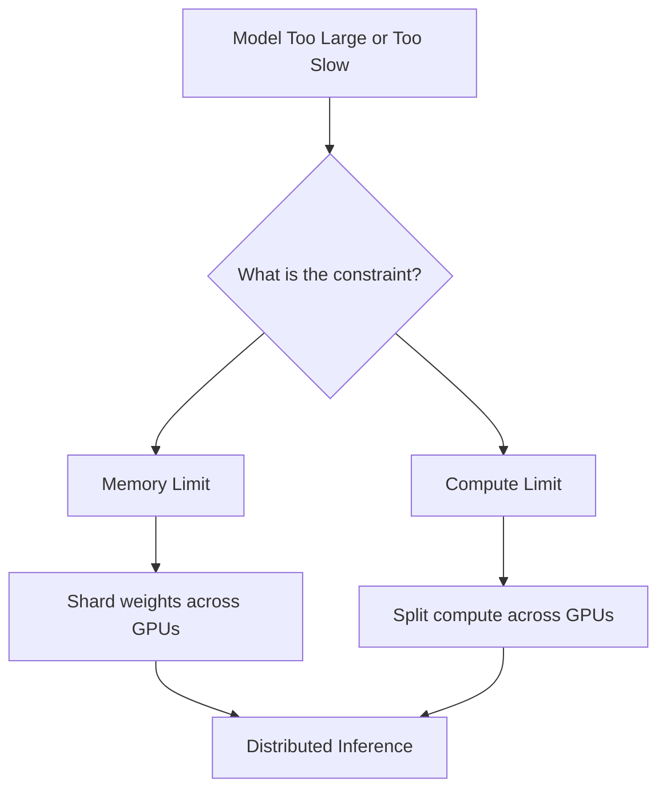
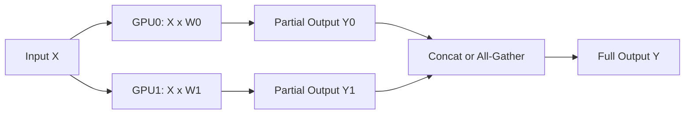
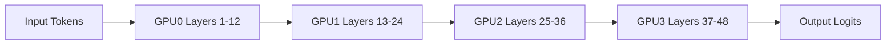
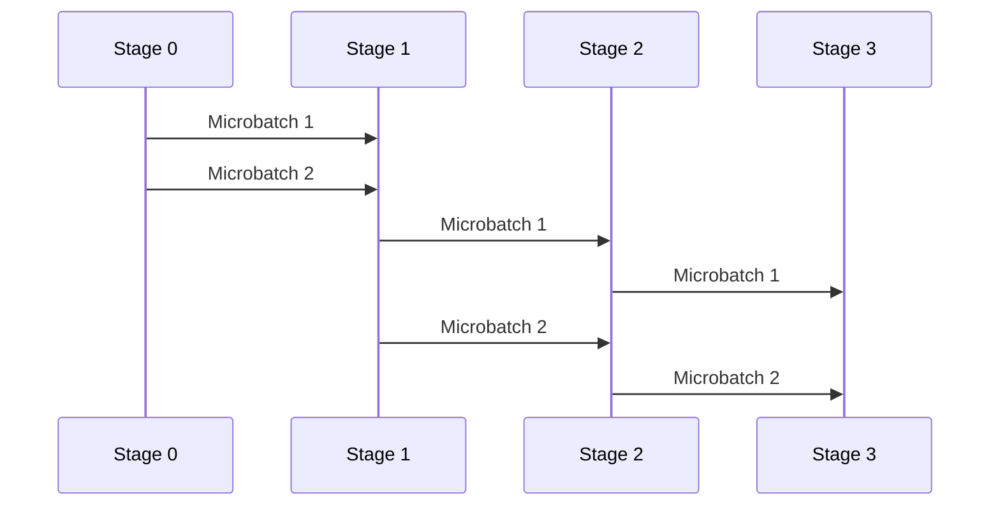
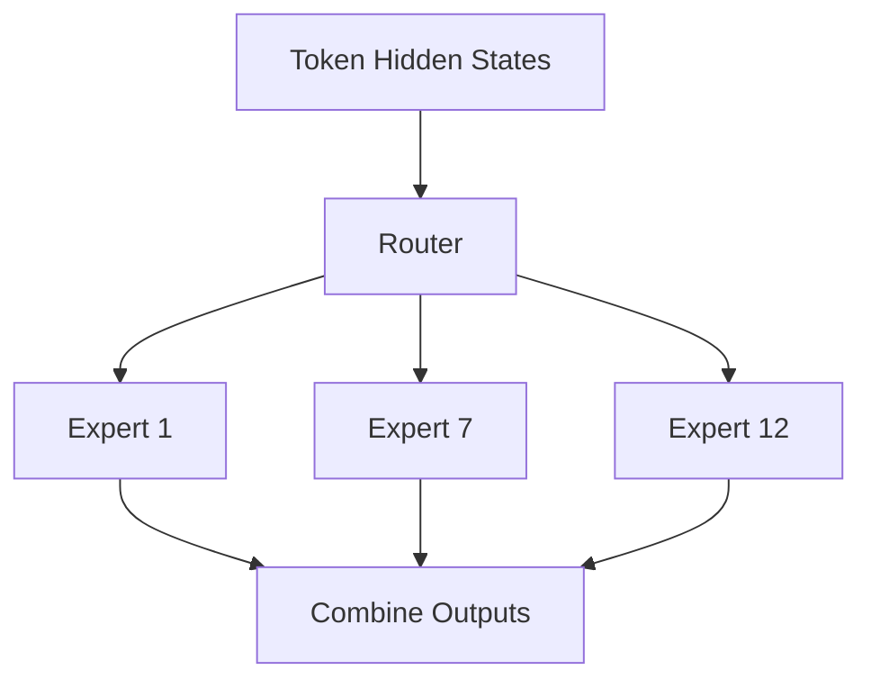
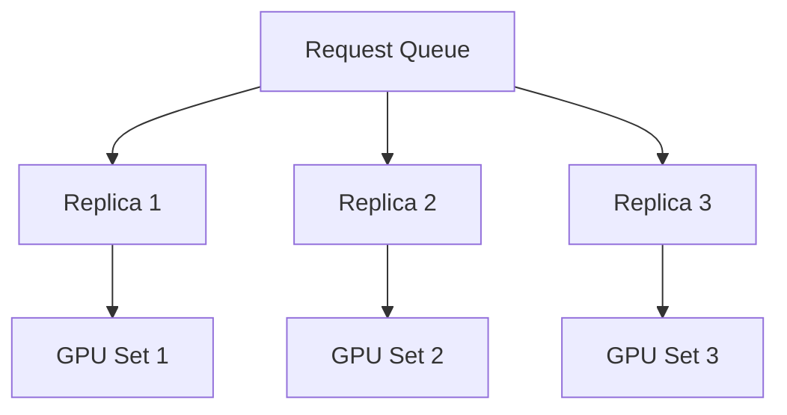
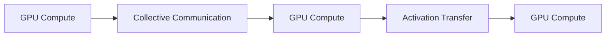

# Chapter 16 — Distributed Inference: Running Large Models Across GPUs

## Learning Objectives

By the end of this chapter, you should understand:

- Why a single GPU is often not enough for modern LLM serving
- The difference between single-GPU and multi-GPU inference
- What **tensor parallelism**, **pipeline parallelism**, **expert parallelism**, and **data parallelism** mean
- How token generation flows through a distributed serving stack
- Why **communication overhead** can dominate performance
- What **NCCL** does in GPU clusters
- How to reason about latency, throughput, memory, and failure modes in distributed inference systems

---

## Why This Matters

A lot of AI platform work becomes real at the point where the model no longer fits comfortably on one GPU.

Maybe the model weights are too large. Maybe the KV cache grows too large under high concurrency. Maybe latency targets force you to spread work across multiple devices. Maybe you want to run a mixture-of-experts model that already assumes distributed execution.

At that point, "just start another pod" is not the full answer.

Distributed inference introduces a different class of engineering problems:

- partitioning model weights
- coordinating GPUs
- moving tensors across NVLink, PCIe, or InfiniBand
- dealing with stragglers and synchronization
- keeping throughput high while preventing communication from becoming the bottleneck

This chapter is about those tradeoffs.

> [!NOTE]
> **Why this matters in production**
> Distributed inference usually appears when models become expensive enough that bad architecture choices turn directly into GPU waste, queue growth, and missed latency SLOs.

---

## Section 1 — Start with Single-GPU Inference

Before discussing distributed systems, start with the simplest case.


In single-GPU inference:

- one process owns the model
- one GPU holds the weights
- requests are scheduled locally
- tensor operations stay on one device
- no inter-GPU communication is required for the forward pass

This is operationally attractive because it is simple:

- easy to deploy
- easy to debug
- fewer synchronization issues
- predictable failure domain
- lower communication overhead

But it has hard limits.

### Memory Limit

If model weights plus runtime memory exceed device memory, the model does not fit.

A practical memory budget often looks like:

```text
total_gpu_memory
= model_weights
+ KV_cache
+ activations
+ runtime_buffers
+ fragmentation
```

For inference, the model weights are fixed, but the KV cache grows with:

- sequence length
- batch size
- number of layers
- hidden size
- number of attention heads

A simplified KV cache shape is often reasoned about as:

```text
KV cache per layer:
K: [batch, heads, seq_len, head_dim]
V: [batch, heads, seq_len, head_dim]
```

Across many requests, this becomes one of the main memory consumers.

### Compute Limit

Even if the model fits, one GPU may not deliver the throughput you need.

Common symptoms:

- time to first token is too high
- tokens per second is too low
- request queue grows during traffic bursts
- long contexts starve smaller interactive requests

Single-GPU inference is still the baseline. If it works for your size, latency, and cost target, it is often the best option.

> [!IMPORTANT]
> **Common misconception**
> Multi-GPU inference is not automatically faster. If communication costs are high enough, a badly distributed model can be slower than a well-tuned single-GPU deployment.

---

## Section 2 — Why Multi-GPU Inference Exists

You move to multi-GPU inference for two broad reasons:

- **capacity**: the model or cache does not fit on one device
- **performance**: one device cannot meet throughput or latency goals



Once multiple GPUs participate in one model request, you need a partitioning strategy. The most common ones are:

- tensor parallelism
- pipeline parallelism
- expert parallelism
- data parallelism

In practice, large deployments often combine them.

---

## Section 3 — Tensor Parallelism

Tensor parallelism splits the computation of a layer across multiple GPUs.

Instead of placing the full weight matrix on one device, you shard it.

For a linear layer:

```text
Y = XW
X: [batch, hidden]
W: [hidden, out]
Y: [batch, out]
```

With tensor parallelism across 2 GPUs, `W` might be column-sharded:

```text
GPU0: W0 = [hidden, out/2]
GPU1: W1 = [hidden, out/2]

Y0 = XW0
Y1 = XW1
Y  = concat(Y0, Y1)
```



This lets you serve models that are too large for one GPU and can also reduce per-device compute time.

### Where Communication Appears

The cost is synchronization.

After local computation, GPUs often need to exchange partial results through:

- `all-reduce`
- `all-gather`
- `reduce-scatter`

For attention and MLP blocks, these communication points happen repeatedly across layers.

### When Tensor Parallelism Works Well

It works best when GPUs are connected with fast links such as:

- NVLink inside a node
- high-bandwidth InfiniBand across nodes

It works less well when devices are separated by slow interconnects, because every layer can require communication.

> [!NOTE]
> **Engineering note**
> Tensor parallelism is usually easier to justify inside a single node than across nodes. Crossing the network for every layer is expensive.

---

## Section 4 — Pipeline Parallelism

Pipeline parallelism splits the model by layers instead of splitting each layer.

Example:

- GPU0 runs layers 1-12
- GPU1 runs layers 13-24
- GPU2 runs layers 25-36
- GPU3 runs layers 37-48



This reduces weight duplication because each GPU stores only part of the model.

It also changes the communication pattern. Instead of synchronizing within every layer, activations move from one stage to the next.

### Microbatching and Pipeline Bubbles

Pipeline parallelism can improve hardware utilization by sending multiple microbatches through the stages.



But there is a catch: the pipeline is only fully utilized once all stages are busy. Idle time at the beginning and end is called the **pipeline bubble**.

Pipeline parallelism is often easier to reason about than tensor parallelism, but it can increase token latency because each request must move through more staged boundaries.

### Good Fit

Pipeline parallelism is useful when:

- the model is very deep
- inter-stage transfers are cheaper than per-layer collectives
- weight memory is the main problem

### Tradeoff

It can be worse for highly interactive generation where per-token latency matters more than aggregate throughput.

---

## Section 5 — Expert Parallelism

Expert parallelism is most relevant for **mixture-of-experts** models.

In an MoE model, not every token uses every expert. A router sends each token to a small subset of experts.



This changes the scaling model.

Instead of one giant dense block active for every token:

- many experts exist
- only a few are used per token
- total model capacity increases without activating all parameters at once

### Why This Helps

You can build models with huge parameter counts while keeping per-token compute lower than a dense model of the same total size.

### Why This Gets Hard

Inference now needs:

- routing decisions
- dispatch of token tensors to the right GPUs
- load balancing across experts
- gathering expert outputs back together

A useful shape intuition is:

```text
hidden_states: [tokens, hidden]
router_scores: [tokens, num_experts]
top_k_experts: [tokens, k]
expert_inputs: variable-sized groups per expert
```

The main challenge is that traffic can become uneven. If too many tokens route to the same experts, some GPUs become hot while others idle.

> [!IMPORTANT]
> **Common misconception**
> MoE models are not "free sparse speedups." They trade dense compute for routing, dispatch, balancing, and more complicated failure and observability behavior.

---

## Section 6 — Data Parallelism for Inference

Data parallelism means replicating the model across multiple GPUs or nodes and sending different requests to different replicas.



For inference, this is often the easiest way to scale throughput.

Each replica is independent:

- same model weights
- separate request batches
- minimal cross-replica communication during normal serving

This is why teams often prefer **data parallel replicas of a tensor-parallel group**.

For example:

- 4 GPUs cooperate as one tensor-parallel model replica
- 8 such replicas serve traffic in parallel

That architecture gives you:

- model fit across 4 GPUs
- throughput scaling across 8 replicas

### Limits of Pure Data Parallelism

Data parallelism alone does not help if a single model instance cannot fit on one device or one local GPU group. It helps throughput, not per-instance memory fit.

---

## Section 7 — Communication Is the Real System

In distributed inference, communication is not a side detail. It is part of the runtime.



You should think in terms of both:

- **computation graph**
- **communication graph**

Common communication operations:

- **broadcast**: send the same tensor to many devices
- **all-reduce**: combine tensors from all devices and return the result to all
- **all-gather**: collect tensor shards from all devices
- **reduce-scatter**: reduce then shard the result

### What Hurts Performance

- slow interconnects
- oversized tensors crossing device boundaries
- too many synchronization points
- imbalanced workloads
- small inefficient collectives
- cross-node traffic in latency-sensitive paths

A useful mental model is:

```text
end_to_end_latency
= local_compute
+ waiting
+ communication
+ scheduling_overhead
```

Engineers often tune compute first and discover the job is now communication-bound.

> [!NOTE]
> **Engineering note**
> If GPU utilization is low but latency is still high, the cluster may be waiting on communication, not compute.

---

## Section 8 — NCCL

**NCCL** is NVIDIA's communication library for multi-GPU and multi-node collectives.

It is the standard communication layer used by many serving and training systems for operations such as:

- all-reduce
- all-gather
- reduce-scatter
- broadcast

NCCL is important because distributed inference stacks depend on it to move tensors efficiently across:

- GPUs in the same host
- GPUs connected by NVLink
- GPUs on different hosts over InfiniBand or Ethernet

### What NCCL Gives You

- topology-aware communication
- optimized collective implementations
- integration with CUDA streams
- support for common GPU communication patterns

### What NCCL Does Not Solve

NCCL does not fix bad architecture. It cannot compensate for:

- the wrong parallelism strategy
- poor placement decisions
- overloaded network links
- uneven expert routing
- oversized batches that blow out cache or queueing latency

When a distributed inference deployment misbehaves, NCCL is often visible in the stack traces and dashboards, but the root cause may be at a higher level.

---

## Common Misconceptions

### "More GPUs always means lower latency"

Not necessarily. More GPUs can mean more synchronization and more time spent waiting.

### "Data parallelism and tensor parallelism are basically the same"

They solve different problems. Data parallelism scales replicas. Tensor parallelism splits one computation.

### "If the model fits, distributed inference is unnecessary"

Not always. A model may fit on one GPU and still miss throughput targets badly.

### "NCCL is only a training concern"

No. Large inference clusters depend heavily on NCCL for collectives.

---

## Key Takeaways

- Single-GPU inference is the simplest and often best option when it fits.
- Multi-GPU inference exists because of memory limits and performance goals.
- Tensor parallelism splits layer computation across GPUs.
- Pipeline parallelism splits the model by layers or stages.
- Expert parallelism is central to MoE models and adds routing complexity.
- Data parallelism scales throughput by replicating model instances.
- Communication overhead is often the real bottleneck in distributed inference.
- NCCL is a critical runtime dependency for distributed GPU collectives.
- The best architecture is usually a hybrid chosen around model size, interconnect speed, latency targets, and cost.

---

## Next Chapter

Next: [Chapter 17 — LLMs on Kubernetes](../17-llms-on-kubernetes/README.md)
