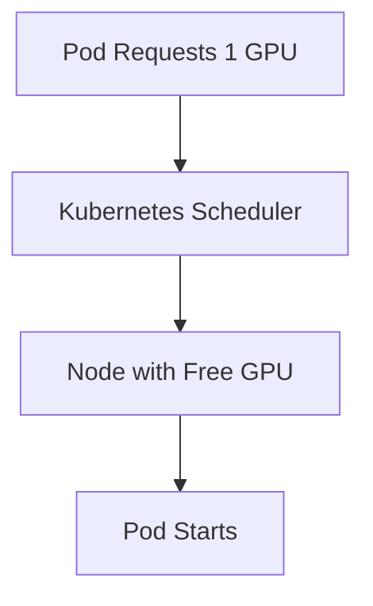
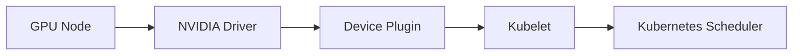
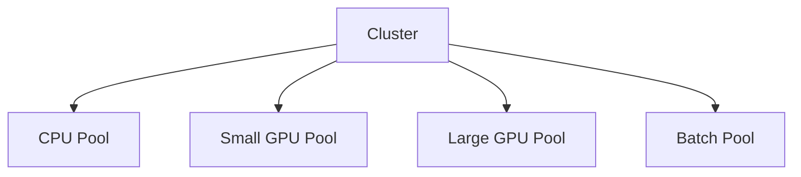
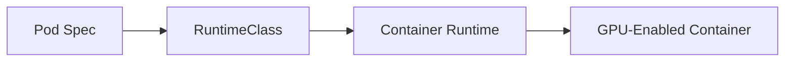
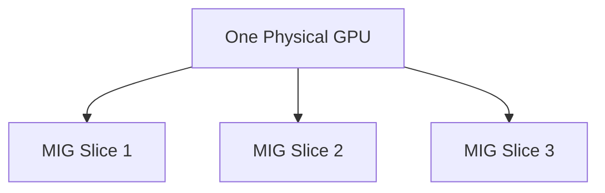
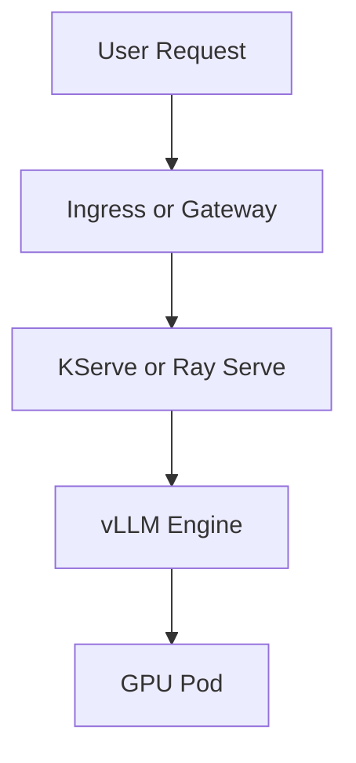
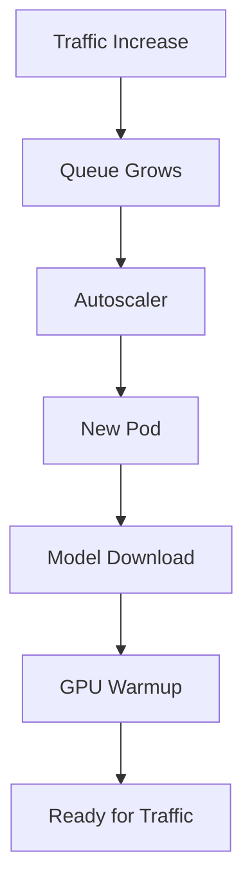
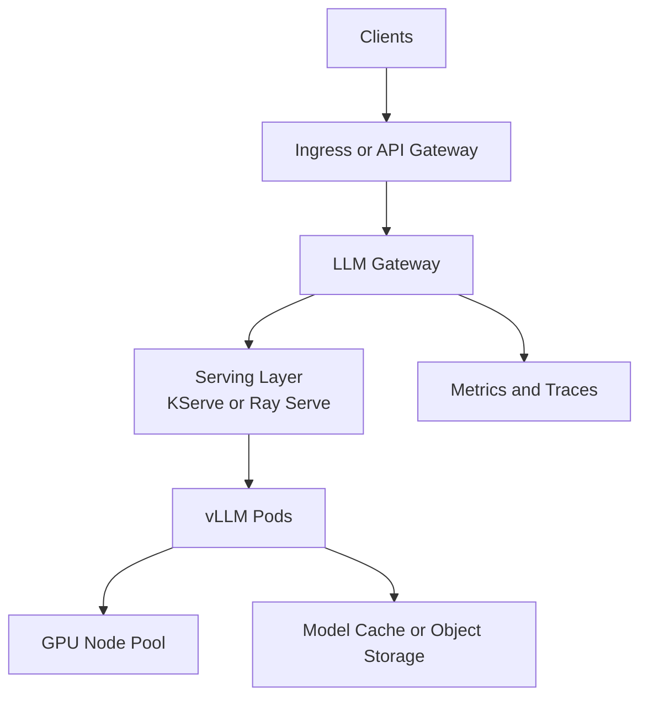

# Chapter 17 — LLMs on Kubernetes: Scheduling GPUs for Real Workloads

## Learning Objectives

By the end of this chapter, you should understand:

- How Kubernetes schedules GPU workloads
- What **device plugins** do
- Why **node pools** matter for AI infrastructure
- When to use **RuntimeClass**
- What **MIG** and GPU **time sharing** are
- How KServe, Ray Serve, and vLLM fit into Kubernetes-based AI serving
- How autoscaling works for model-serving workloads
- The main operational risks when running LLMs on Kubernetes

---

## Why This Matters

Kubernetes is already where many infrastructure teams operate. The natural next step is to run AI workloads there too.

That sounds convenient until GPUs enter the picture.

GPUs are not generic CPU resources. They are expensive, scarce, topology-sensitive devices with vendor-specific runtime behavior. A single bad scheduling decision can strand capacity, hurt performance, or break placement for large models.

Running LLMs on Kubernetes means combining two very different worlds:

- Kubernetes wants declarative, replaceable, horizontally scalable workloads
- LLM serving wants huge model artifacts, warm caches, careful GPU placement, and predictable latency

This chapter explains how those worlds fit together.

> [!NOTE]
> **Why this matters in production**
> If your platform team already knows Kubernetes, you do not want a separate ad hoc AI fleet unless you truly need one. But you also do not want to pretend GPU serving behaves like stateless web APIs.

---

## Section 1 — The Basic Scheduling Model

At the simplest level, Kubernetes schedules GPU workloads by resource request.

A pod asks for something like:

```yaml
resources:
  limits:
    nvidia.com/gpu: 1
```

Then the scheduler places that pod on a node advertising one allocatable GPU.



This is conceptually simple, but several hidden pieces make it work:

- the node must expose GPU resources
- the container runtime must support GPU access
- drivers must be installed
- the pod must land on compatible hardware

Without those pieces, a GPU request is just a number with no actual device attached.

---

## Section 2 — Device Plugins

Kubernetes does not natively understand vendor-specific accelerators in detail. That is the job of a **device plugin**.

A device plugin runs on nodes and tells Kubernetes:

- what devices exist
- how many are healthy
- how to allocate them to containers



For NVIDIA environments, the device plugin is usually the standard integration layer for exposing `nvidia.com/gpu`.

### Why It Matters

Without a device plugin:

- GPUs are invisible to the scheduler
- pods cannot request them properly
- device allocation becomes manual and error-prone

### What It Does Not Do

A device plugin does not solve:

- model placement
- topology-aware multi-GPU grouping
- storage warmup
- serving framework behavior
- autoscaling policy

It is the hardware exposure layer, not the full AI platform.

> [!IMPORTANT]
> **Common misconception**
> Installing the NVIDIA device plugin does not mean your cluster is "AI ready." It only means Kubernetes can see the devices.

---

## Section 3 — Node Pools and Hardware Segmentation

Most real AI clusters need different node classes.

Examples:

- CPU-only nodes for gateways and orchestration
- smaller GPU nodes for embeddings or rerankers
- large multi-GPU nodes for LLM inference
- storage-heavy nodes for indexing pipelines

This is where **node pools** matter.



Node pools let you isolate workloads by:

- cost profile
- hardware type
- driver version
- availability zone
- tenancy boundary
- preemptible vs on-demand behavior

### Practical Reasons to Separate Pools

- A 70B model should not compete with a small embedding service for the same hardware.
- Driver or CUDA version changes are easier to roll out to a subset of nodes.
- Spot or preemptible GPU pools may be acceptable for batch inference but not for user-facing chat latency.

### Scheduling Controls

You typically combine node pools with:

- labels
- taints
- tolerations
- node affinity
- topology spread constraints

These become especially important when a workload needs:

- 4 GPUs in one node
- the same GPU family across replicas
- local NVMe for model caching

---

## Section 4 — RuntimeClass and GPU Runtimes

A **RuntimeClass** lets you choose the container runtime behavior for a pod.

In GPU environments, this matters because AI workloads often need a runtime configured for accelerator access.



Typical reasons to use `RuntimeClass` include:

- selecting a GPU-capable runtime
- separating sandboxed vs performance-oriented runtimes
- standardizing runtime behavior for AI workloads

This becomes operationally useful when different workload classes need different runtime guarantees. For example:

- user-facing LLM serving might prioritize low-overhead runtime access
- untrusted multi-tenant execution might need stronger isolation

### Engineering Tradeoff

More isolation usually means more overhead or more operational complexity. In GPU serving, that tradeoff should be evaluated carefully because latency-sensitive systems feel small overheads.

---

## Section 5 — MIG and Time Sharing

GPUs are expensive enough that platform teams try hard not to waste them.

Two common approaches are **MIG** and **time sharing**.

### MIG

**MIG** stands for Multi-Instance GPU. It allows certain GPUs to be partitioned into isolated hardware slices.



Each slice gets a portion of:

- compute
- memory
- hardware isolation

This is useful for small or predictable workloads such as:

- embedding services
- moderation models
- lightweight rerankers
- development environments

### Time Sharing

Time sharing lets multiple workloads share a GPU by taking turns rather than getting dedicated hard partitions.

This can increase utilization but also introduces variability.

### When to Use Which

Use MIG when you want:

- stronger isolation
- deterministic partitioning
- cleaner multi-tenancy for smaller models

Use time sharing when you want:

- flexible overcommit
- better utilization for bursty light workloads
- simpler packing for non-critical tasks

### When Not to Use Them

For large latency-sensitive LLM serving, both approaches can be problematic if they create unpredictable contention or insufficient memory.

> [!NOTE]
> **Engineering note**
> The main question is not "can this share a GPU?" The main question is "can this share a GPU without violating latency, memory, or isolation expectations?"

---

## Section 6 — KServe, Ray Serve, and vLLM

These names appear together often, but they solve different layers of the problem.

### vLLM

**vLLM** is an inference engine optimized for LLM serving. It focuses on efficient token generation, especially around:

- KV cache management
- continuous batching
- high throughput generation
- OpenAI-compatible APIs in many deployments

vLLM is the engine that actually runs the model.

### KServe

**KServe** is a Kubernetes-native serving framework. It helps manage model-serving workloads with features such as:

- model deployment patterns
- serverless-style interfaces
- traffic management integration
- autoscaling workflows

KServe is about operating inference services on Kubernetes.

### Ray Serve

**Ray Serve** is a distributed serving framework built around the Ray ecosystem. It is especially useful when you need:

- distributed orchestration
- model graphs
- application-level routing
- integration with larger Ray-based pipelines



### How They Fit Together

A common stack is:

- Kubernetes as the platform
- KServe or Ray Serve as the serving control plane
- vLLM as the LLM runtime inside the pod

That is a layered model, not three competing equivalents.

> [!IMPORTANT]
> **Common misconception**
> vLLM is not a full Kubernetes platform. KServe is not an LLM kernel. Ray Serve is not just a GPU scheduler. They sit at different abstraction levels.

---

## Section 7 — Autoscaling for LLM Workloads

Autoscaling AI workloads is harder than autoscaling stateless HTTP services.

A web API might scale on CPU or request count. LLM systems often need to consider:

- queue length
- tokens per second
- running sequence count
- GPU memory pressure
- time to first token
- model load time



The warmup path is the problem.

A newly created LLM pod may need to:

- start the container
- mount or download model weights
- load tens of GB into GPU memory
- initialize NCCL or distributed groups
- warm caches

That means reactive autoscaling can be slow.

### Practical Autoscaling Signals

Useful signals often include:

- pending request count
- token backlog
- active batch size
- average decode throughput
- P95 time to first token
- GPU utilization

### Horizontal vs Vertical Scaling

Horizontal scaling means more replicas.

Vertical scaling means larger GPU nodes or more GPUs per model replica.

Both matter. If the model needs 4 GPUs per replica, scaling is constrained by whether the cluster can place another 4-GPU pod.

### Cold Start Reality

Cold starts are much more painful than in ordinary microservices. For expensive models, many teams intentionally keep baseline warm capacity online even when utilization is lower than ideal.

---

## Section 8 — Practical Kubernetes Architecture for LLM Serving

A realistic deployment often looks like this:



Key platform decisions include:

- where model artifacts are stored
- how pods warm local caches
- how GPU classes are separated
- which workloads get dedicated node pools
- how multi-GPU placement is enforced
- how rolling upgrades avoid dropping long-running generations

### Failure Modes to Expect

- unschedulable pods because the GPU shape is too specific
- node churn causing repeated model reloads
- autoscaling that adds pods too slowly
- overpacked shared GPUs causing latency spikes
- storage bottlenecks during model download storms

These are platform problems, not just model problems.

---

## Common Misconceptions

### "Kubernetes makes GPU scheduling automatic"

It makes it declarative, not effortless.

### "One GPU request equals one useful serving replica"

Only if the model fits, placement succeeds, and the runtime is configured correctly.

### "MIG is always better utilization"

It is better only when the workload matches the partitioning model.

### "Autoscaling solves cost automatically"

Poor autoscaling can increase cost by thrashing large model pods or keeping cold capacity too low.

---

## Key Takeaways

- Kubernetes can run LLM workloads well, but GPUs require more care than standard CPU services.
- Device plugins expose GPUs to Kubernetes; they do not provide the full AI platform.
- Node pools are essential for cost control, placement, and workload isolation.
- RuntimeClass helps standardize runtime behavior for GPU workloads.
- MIG and time sharing are useful for some workloads, but large interactive LLM serving often needs dedicated predictable capacity.
- vLLM is the inference engine, while KServe and Ray Serve help operate serving workloads on Kubernetes.
- Autoscaling LLM workloads must account for model load time, GPU placement, and token-based traffic patterns.
- Good Kubernetes architecture for AI combines scheduling, serving, storage, observability, and cost controls.

---

## Next Chapter

Next: Chapter 18 — Building AI Applications
