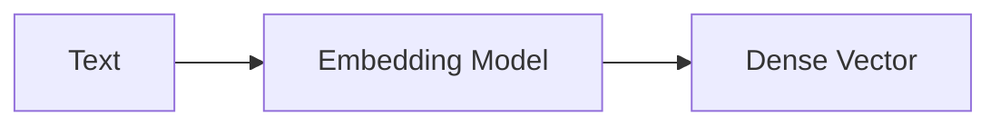
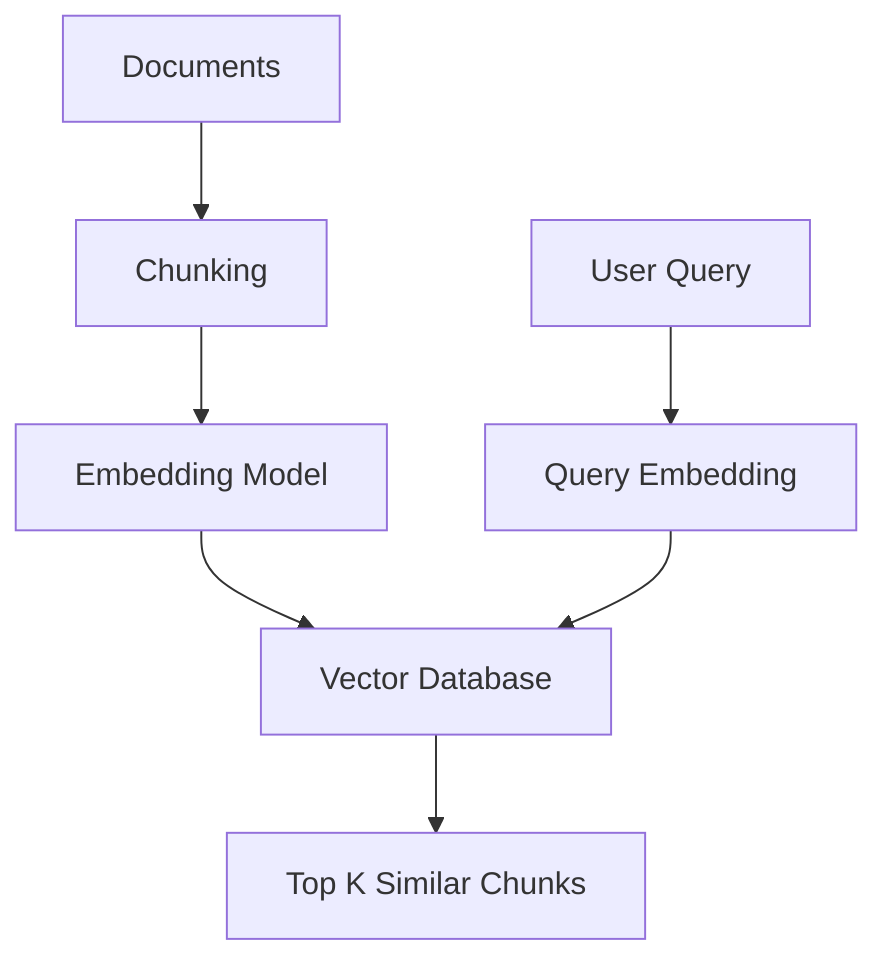
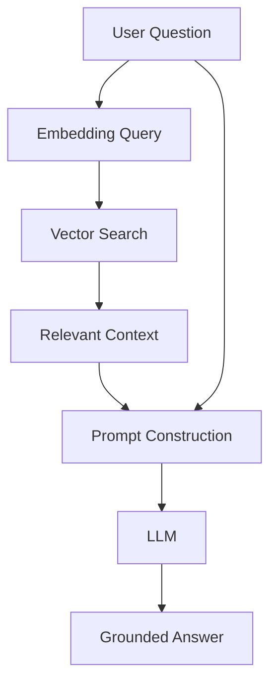
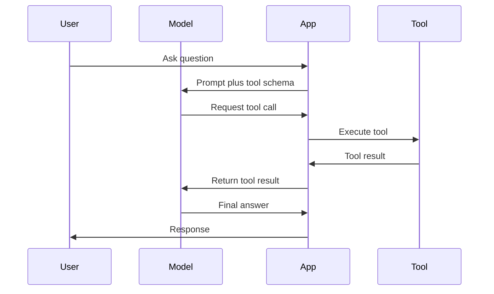
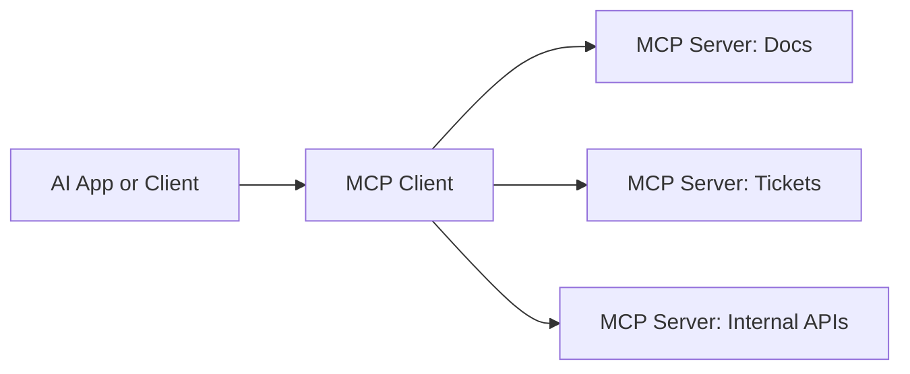
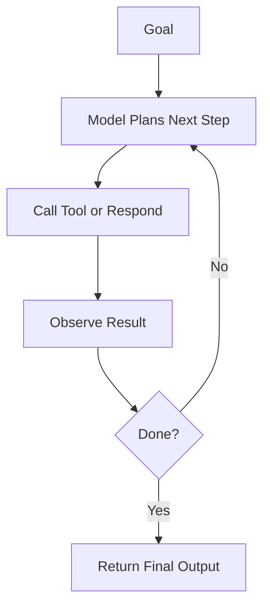
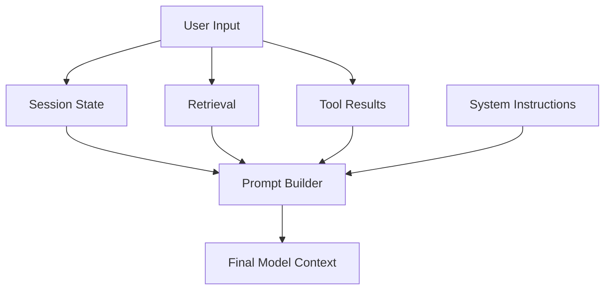

# Chapter 18 — Building AI Applications: From Prompts to Working Systems

## Learning Objectives

By the end of this chapter, you should understand:

- What **embedding models** do
- How **vector databases** are used in AI systems
- What **RAG** is and when it helps
- How **function calling** works
- What **MCP** is for
- What engineers usually mean by **AI agents**
- Why **prompt engineering** is really an interface design problem
- How to build good **context construction** pipelines for production applications

---

## Why This Matters

A model endpoint by itself is not an application.

Useful AI products usually combine:

- one or more models
- business rules
- retrieval systems
- external tools
- prompt templates
- context assembly logic
- observability and safety controls

This is where application engineers enter the picture.

You do not need to train a model to ship a valuable AI workflow. But you do need to understand how to turn a generic LLM into a system that can answer with the right context, call the right tools, and stay inside product boundaries.

This chapter focuses on those application-layer building blocks.

> [!NOTE]
> **Why this matters in production**
> The biggest quality problems in AI applications are often not caused by the base model. They come from missing context, weak retrieval, poor tool definitions, bad prompt structure, or unclear orchestration logic.

---

## Section 1 — Embedding Models

An embedding model turns text into a dense numeric vector that captures semantic similarity.

Instead of generating text, it produces a representation like:

```text
query_embedding: [1536]
document_embedding: [1536]
```

Or for batched requests:

```text
input_texts: [batch]
output_embeddings: [batch, dim]
```



### Why This Is Useful

Embeddings let you compare meaning numerically.

If two vectors are close in embedding space, their texts are likely related in meaning even if they do not share exact words.

That enables:

- semantic search
- document retrieval
- clustering
- deduplication
- recommendation
- memory lookup for AI systems

### Practical Example

A user asks:

> "How do I rotate database credentials safely?"

A keyword search may miss documents titled "secret rotation playbook." An embedding search can still retrieve them because the semantic content is related.

### Engineering Considerations

- embedding dimension affects storage and retrieval cost
- chunking strategy changes search quality
- model choice affects domain fit
- re-embedding large corpora is an operational event, not a minor config change

> [!IMPORTANT]
> **Common misconception**
> Embeddings are not just "compressed text." They are learned semantic representations optimized for similarity tasks.

---

## Section 2 — Vector Databases

A vector database stores embeddings and lets you search for nearest neighbors efficiently.



Each stored record usually includes:

- the vector
- the original text chunk
- metadata such as source, owner, time, tags, permissions

### Why Not Just Use SQL?

You can store vectors in several kinds of systems, including relational databases with vector extensions. The important capability is **approximate nearest neighbor search**, not the marketing label.

A vector retrieval record often looks like:

```text
{
  id,
  embedding: [dim],
  text_chunk,
  metadata
}
```

### Production Design Questions

- How large should chunks be?
- What metadata filters must apply before retrieval?
- How do you handle document permissions?
- How do you update or delete stale vectors?
- What latency target does the retrieval path need to meet?

A vector store is not magic memory. It is an index that must be maintained with the same discipline as other production data systems.

---

## Section 3 — RAG

**RAG** stands for Retrieval-Augmented Generation.

The basic idea is simple:

- retrieve relevant external context
- put that context into the prompt
- ask the model to answer using that context



RAG helps with two common problems:

- the model does not know your private data
- the model's built-in knowledge may be stale

### What Good RAG Actually Requires

Good RAG is not "add a vector database and hope."

You need:

- sensible chunking
- good embedding quality
- permission-aware retrieval
- prompt instructions that use retrieved text correctly
- citation or grounding behavior where needed
- fallback behavior when retrieval is weak

### Context Window Reality

Retrieved context consumes tokens.

That means context construction is a budgeting problem:

```text
total_context_budget
= system_prompt
+ conversation_history
+ retrieved_documents
+ tool_results
+ user_input
```

If you retrieve too much, you waste tokens and hurt relevance. If you retrieve too little, the answer becomes incomplete.

> [!NOTE]
> **Engineering note**
> The best retrieval systems optimize for answer usefulness, not just vector similarity score.

---

## Section 4 — Function Calling

Sometimes the model should not answer from language alone. It should call a tool.

Examples:

- look up a ticket
- fetch a customer record
- run a SQL query through a controlled interface
- trigger a workflow
- send a message
- create a calendar event

This is where **function calling** comes in.



The model does not directly execute code. Your application executes the tool call after validating it.

### Why This Matters

Function calling turns the model from a text generator into a reasoning layer that can interact with systems of record.

### Engineering Rules

- define strict tool schemas
- validate arguments before execution
- enforce permissions in application code, not in the prompt
- log tool use separately from final answers
- bound retries and recursion

> [!IMPORTANT]
> **Common misconception**
> A tool-capable model is not a trusted automation engine. The application remains responsible for execution safety and authorization.

---

## Section 5 — MCP

**MCP**, or Model Context Protocol, is a standard way to expose tools and context sources to models and AI applications.

Instead of inventing a custom integration per tool, MCP gives a common protocol shape for capabilities such as:

- tools
- resources
- prompts
- structured context access



### Why Engineers Care

MCP reduces integration sprawl.

Without a standard protocol, every AI application ends up building one-off glue for:

- document stores
- issue trackers
- internal APIs
- shell or code tools
- knowledge systems

With MCP, those systems can be exposed in a reusable way.

### What MCP Is Not

MCP is not the model itself.

It is not a replacement for authz, business rules, or application orchestration. It is a structured integration layer.

---

## Section 6 — AI Agents

The term **agent** is overloaded, so use it carefully.

In practical engineering terms, an AI agent is usually an application loop where the model can:

- reason about a task
- choose tools
- observe results
- decide what to do next
- continue until a stop condition is reached



### When Agents Help

Agents are useful when the task requires:

- multi-step tool use
- branching decisions
- iterative information gathering
- action based on intermediate results

### When Agents Are Overused

Many problems do not need an agent. They need:

- one retrieval step
- one tool call
- one response

If the workflow is deterministic, encode it directly. Do not create an open-ended loop unless there is real benefit.

### Failure Modes

- runaway tool loops
- hidden latency from many serial steps
- difficult debugging
- inconsistent outputs
- high token cost

> [!NOTE]
> **Engineering note**
> "Agentic" often means "less predictable." Only pay that complexity cost when the task actually needs flexible planning.

---

## Section 7 — Prompt Engineering and Context Construction

Prompt engineering is often described too casually. In production, it is a form of interface design.

You are specifying:

- the model's role
- task boundaries
- required output format
- allowed tools
- relevant context
- refusal behavior
- domain constraints

The real system is usually a **context construction pipeline**.



### Good Context Construction Has Rules

- include only relevant history
- separate instructions from retrieved content
- mark tool results clearly
- trim low-value context aggressively
- preserve permission boundaries
- make the final prompt auditable

### A Practical Prompt Stack

A useful order is often:

1. system instructions
2. developer or application rules
3. user request
4. retrieved context
5. tool outputs
6. output schema

This structure helps reduce ambiguity.

### Why Applications Fail Here

Common failure patterns:

- mixing instructions and evidence into one blob
- including too much chat history
- retrieving semantically related but decision-irrelevant text
- forgetting metadata filters
- asking for strict JSON while providing an ambiguous task description

The prompt is not just words. It is the final assembled execution context.

---

## Common Misconceptions

### "A better model will fix a weak application design"

Sometimes, but often the real issue is missing context or poor tool design.

### "RAG means the model will stop hallucinating"

No. RAG improves grounding but does not guarantee correctness.

### "Agents are the most advanced pattern, so we should use them"

Only if the workflow needs iterative reasoning and tool selection.

### "Prompt engineering is just clever phrasing"

In production it is mostly about structure, constraints, and context assembly.

---

## Key Takeaways

- Embedding models convert text into vectors for semantic comparison.
- Vector databases support retrieval over those embeddings, but quality depends heavily on indexing and metadata strategy.
- RAG helps inject current or private knowledge into model responses.
- Function calling lets applications connect model reasoning to real tools and systems.
- MCP provides a reusable protocol for exposing tools and context to AI clients.
- AI agents are useful for multi-step adaptive workflows, but they add latency and unpredictability.
- Prompt engineering is best understood as context and interface design.
- The highest-leverage application work often comes from better context construction, not from switching models.

---

## Next Chapter

Next: [Chapter 19 — Production AI Platform Architecture](../19-production-ai-platform-architecture/README.md)
