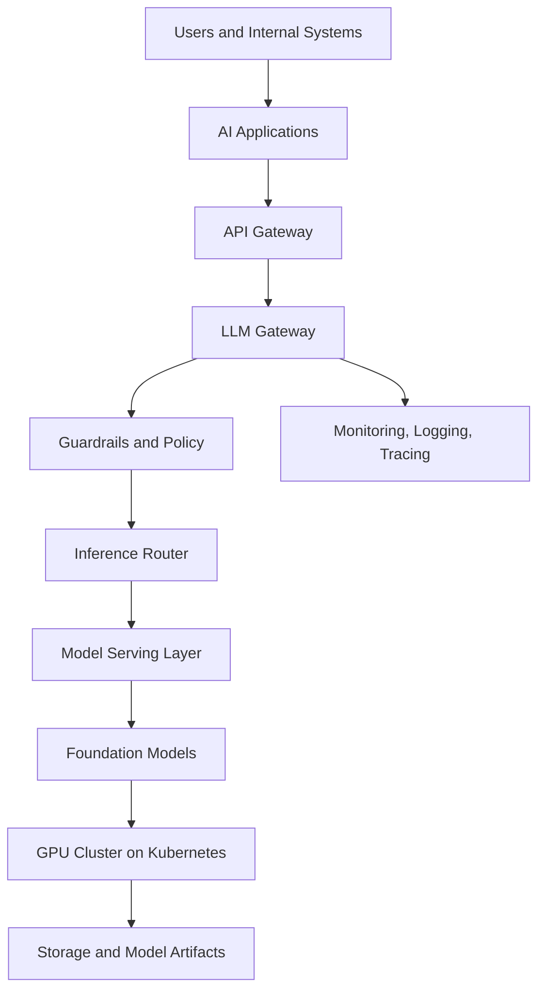
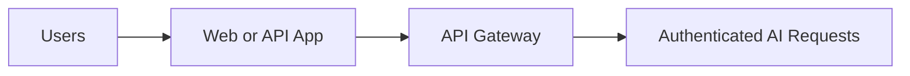
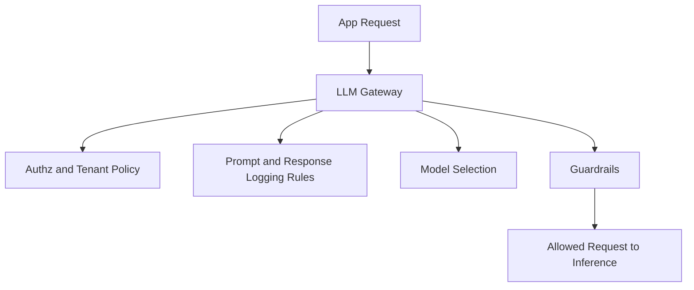
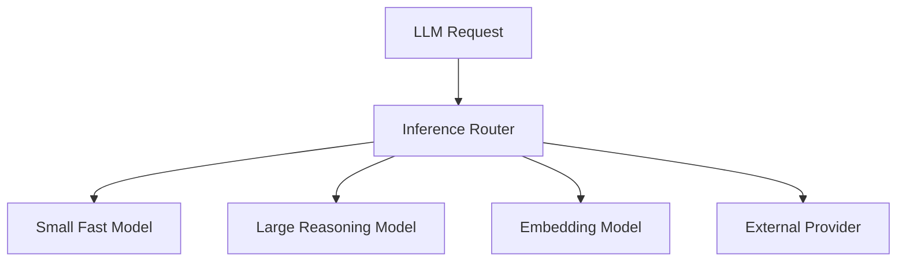
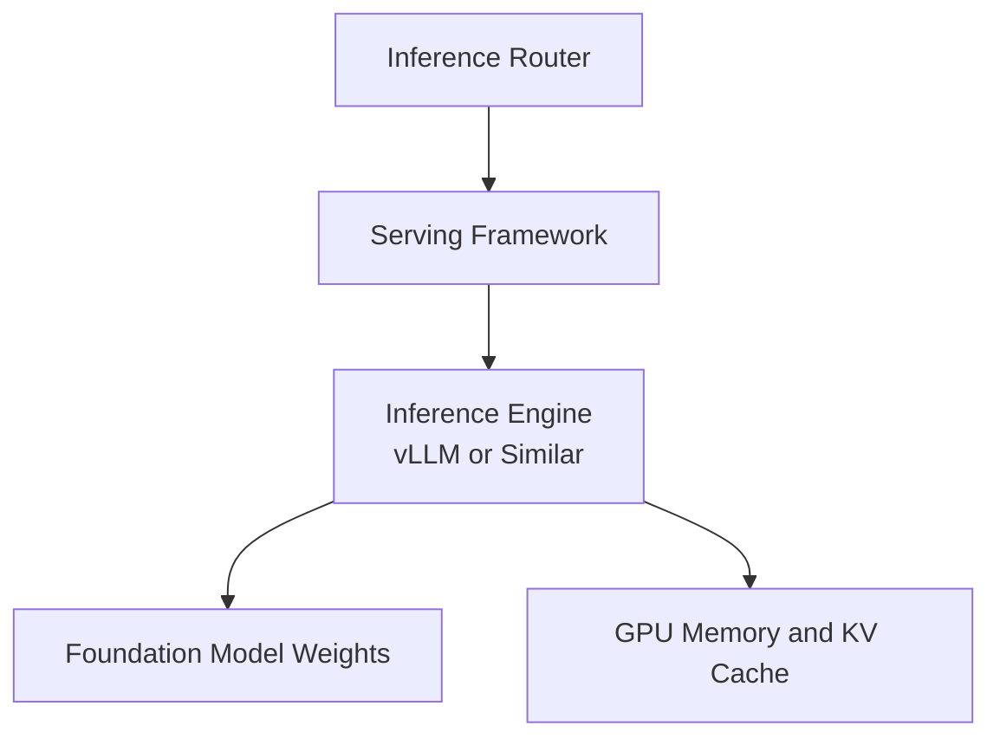
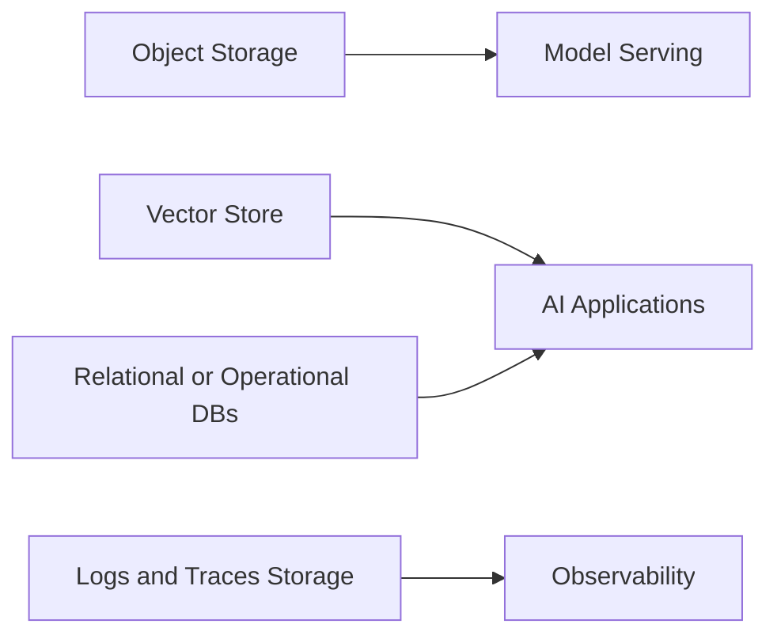
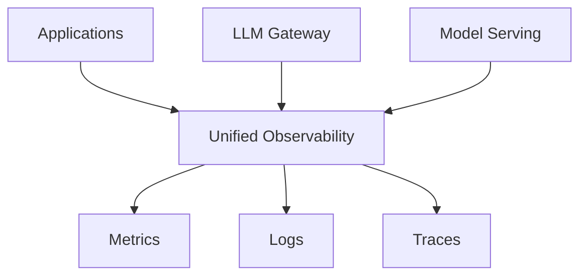
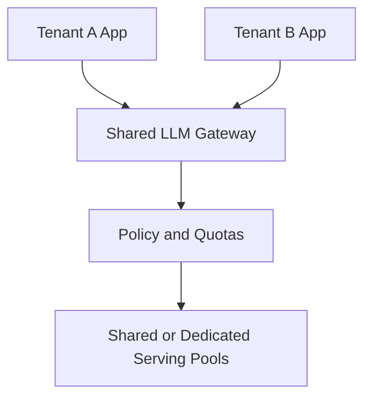
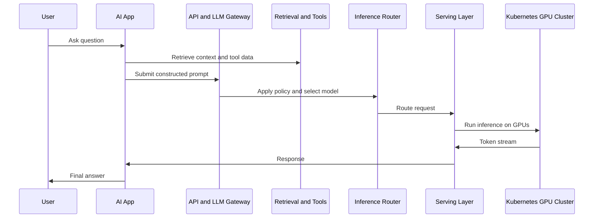

# Chapter 19 — Production AI Platform Architecture: The Complete Enterprise Stack

## Learning Objectives

By the end of this chapter, you should understand:

- How the major layers of an enterprise AI platform fit together
- The role of the API gateway, LLM gateway, guardrails, inference router, and model-serving layer
- How foundation models connect to GPU clusters, storage, and Kubernetes
- Where monitoring, logging, tracing, and security fit
- How autoscaling, cost optimization, and multi-tenancy shape architecture decisions
- How CI/CD and GitOps apply to AI platforms
- How the earlier chapters connect into one operational system

---

## Why This Matters

Up to this point, each chapter has explained an important part of the system:

- how models represent and process text
- how attention and transformer layers work
- how serving and observability behave
- how distributed inference and Kubernetes operations scale
- how AI applications add retrieval, tools, and agent workflows

This chapter puts the whole picture together.

The main architectural lesson is simple:

**An enterprise AI platform is not a single model endpoint. It is a layered system of application logic, routing, policy, serving, infrastructure, and operations.**

If any layer is weak, the platform becomes expensive, unsafe, unreliable, or difficult to evolve.

---

## Section 1 — The End-to-End Architecture

Start with the full picture.

This stack separates concerns cleanly:

- **AI applications** own product behavior
- **API gateway** owns external access patterns
- **LLM gateway** owns model-facing control logic
- **guardrails** enforce policy and safety checks
- **inference router** chooses where requests go
- **model serving** runs the actual inference engines
- **foundation models** are the weight artifacts being executed
- **GPU infrastructure** supplies the compute
- **storage** provides weights, caches, logs, and datasets
- **observability** spans every layer

The rest of the chapter walks through these components.

---

## Section 2 — Users, Applications, and the API Gateway

Users rarely talk to a raw model endpoint directly. They interact with applications such as:

- internal copilots
- support assistants
- search and knowledge tools
- code assistants
- workflow automations
- batch enrichment pipelines

Those applications typically sit behind a standard **API gateway**.

The API gateway is still useful in AI systems for familiar reasons:

- authentication
- TLS termination
- rate limiting
- tenant identification
- request quotas
- request logging
- traffic shaping

### Why the API Gateway Is Not Enough

An ordinary API gateway usually does not understand:

- model selection
- token limits
- prompt logging policy
- inference cost controls
- safety checks on outputs
- provider-specific routing logic

That is why many platforms add an **LLM gateway** behind the normal API edge.

---

## Section 3 — The LLM Gateway and Guardrails

The **LLM gateway** is the policy-aware control plane for model access.

Typical LLM gateway responsibilities:

- choose allowed models for a tenant or product
- enforce max tokens and context limits
- apply prompt templates or system policy
- redact or block sensitive content
- route to internal vs external models
- attach tracing and cost attribution metadata

### Guardrails

Guardrails are the policy layer that evaluates or constrains inputs and outputs.

Examples:

- PII detection
- prompt injection defenses
- output moderation
- domain-specific refusal rules
- schema validation
- tool-use restrictions

### Important Boundary

Guardrails improve safety, but they do not replace application authorization. If a user is not allowed to see a document or invoke an action, that must be enforced in application and backend systems, not only in the prompt.

> [!IMPORTANT]
> **Common misconception**
> A guardrail system is not a complete security model. It is one layer in a defense-in-depth architecture.

---

## Section 4 — The Inference Router

The **inference router** decides which model-serving backend should handle a request.

Routing decisions may depend on:

- task type
- tenant policy
- latency target
- context size
- model health
- GPU availability
- cost budget
- region or data residency

### Practical Routing Patterns

- route short classification to smaller cheaper models
- route long-context analysis to larger context-capable models
- route embeddings to dedicated embedding services
- fail over to another provider or cluster when local capacity is constrained

### Why This Layer Matters

Without routing, every product team tends to hardcode model choices. That makes upgrades, cost control, and incident response much harder.

The inference router turns model choice into platform policy instead of application duplication.

---

## Section 5 — Model Serving, Foundation Models, and the GPU Cluster

The serving layer is where requests become tensor execution.

This layer includes:

- serving frameworks
- inference engines
- batching logic
- token streaming
- model loading
- multi-GPU coordination
- adapter management
- health management

The **foundation model** is the artifact being served. It may be:

- an open-weight model
- a fine-tuned variant
- a quantized model
- a mixture-of-experts model
- a model plus LoRA adapters

### Kubernetes and GPU Cluster Integration

From Chapter 17, Kubernetes is often the platform underneath this layer.

That means the GPU cluster must support:

- device plugins
- GPU-aware scheduling
- node pools
- storage access for large weights
- multi-GPU placement
- autoscaling hooks

From Chapter 16, large models may require:

- tensor parallel groups
- pipeline stages
- expert dispatch
- NCCL communication

The serving layer is where those infrastructure concerns become visible in latency and throughput.

---

## Section 6 — Storage, Data, and State

AI platforms touch more storage systems than many teams expect.

Common storage categories:

- object storage for model weights and artifacts
- local node cache for fast reloads
- vector databases for retrieval
- operational databases for application state
- feature or metadata stores
- log and trace backends
- evaluation datasets

### Why Storage Design Matters

Bad storage choices show up as:

- long model cold starts
- repeated network downloads
- stale retrieval data
- poor permission filtering
- expensive observability retention

For many enterprises, the AI platform is partly a data-access architecture problem disguised as a model-serving problem.

---

## Section 7 — Observability: Monitoring, Logging, and Tracing

AI systems need standard observability plus AI-specific telemetry.

### Monitoring

Examples:

- request rate
- error rate
- P95 latency
- time to first token
- tokens per second
- queue depth
- GPU utilization
- memory pressure
- cache hit rate

### Logging

Examples:

- request metadata
- model ID
- routing decisions
- tool calls
- guardrail outcomes
- sanitized prompt or response records where policy permits

### Tracing

Tracing is critical because an AI request often spans:

- application logic
- retrieval
- tool execution
- gateway policy
- model inference
- streaming response delivery

Without tracing, slow requests become guesswork.

> [!NOTE]
> **Engineering note**
> Token-level systems often fail in ways that look small at the HTTP layer but become obvious when you can see queue time, decode rate, and tool latency in a trace.

---

## Section 8 — Security, Multi-Tenancy, and Governance

Enterprise AI platforms must assume shared usage.

### Security Controls

You need layered controls for:

- authentication
- authorization
- secret management
- network isolation
- encryption in transit and at rest
- data residency
- auditability
- model and artifact integrity

### Multi-Tenancy

Multi-tenancy questions include:

- which tenants can access which models
- whether serving capacity is shared or dedicated
- whether vector indexes are shared or isolated
- how quotas and budgets are enforced
- how logs are partitioned and retained

### Governance

Governance matters because AI platforms create new operational and compliance surfaces:

- prompt retention
- generated content retention
- model version approval
- evaluation gates
- usage reporting
- human review flows for sensitive use cases

---

## Section 9 — Autoscaling, Cost Optimization, and Capacity Planning

AI platforms are expensive enough that architecture and finance become tightly coupled.

### Autoscaling

Autoscaling may happen at several layers:

- gateway replicas
- retrieval services
- serving pods
- GPU node pools
- batch workers

### Cost Optimization Levers

- route simple tasks to smaller models
- cache repeated responses where appropriate
- use quantized models when quality allows
- separate latency-critical from batch workloads
- keep hot model sets small
- right-size context budgets
- use MIG or shared GPUs for lightweight workloads
- use dedicated GPUs for large interactive models

### Capacity Planning

Useful planning metrics include:

- peak concurrent generations
- average prompt length
- average completion length
- tokens per second per replica
- GPU memory per model
- reload time per model
- cost per 1K or 1M tokens by workload class

The important platform lesson is that token volume is often a better planning unit than request count alone.

---

## Section 10 — CI/CD and GitOps for AI Platforms

AI platforms still need disciplined delivery.

### CI/CD Scope

You may need pipelines for:

- application code
- prompt or policy configuration
- serving manifests
- gateway rules
- model metadata
- evaluation suites
- infrastructure modules

### GitOps

GitOps is especially useful for Kubernetes-based AI platforms because it gives:

- declarative environment state
- auditable configuration changes
- predictable rollouts
- safer cluster operations across teams

### What Changes Need Extra Care

Not all AI changes are equivalent.

Examples of risky changes:

- switching base model versions
- changing retrieval chunking
- modifying tool schemas
- changing guardrail thresholds
- altering routing policy
- changing quantization or parallelism strategy

These may not look large in Git, but they can change product behavior significantly. Good platforms pair deployment pipelines with evaluation and staged rollout controls.

> [!IMPORTANT]
> **Common misconception**
> Treating model or prompt changes like ordinary static config is risky. Many "small" AI changes need evaluation gates and controlled rollout just like code changes.

---

## Section 11 — How the Whole System Fits Together

A full request often looks like this:

That flow summarizes the full platform:

- application logic constructs the right context
- gateways enforce access and policy
- routing chooses the best backend
- serving executes the model efficiently
- Kubernetes and GPU infrastructure provide capacity
- observability captures what happened
- security and governance constrain the system safely

This is the real enterprise AI platform architecture.

---

## Common Misconceptions

### "An AI platform is just a model endpoint behind an API"

No. Real platforms include retrieval, routing, policy, storage, observability, security, scaling, and application orchestration.

### "Guardrails solve security by themselves"

No. Guardrails are one layer. Authorization, tenancy isolation, secret handling, and backend policy enforcement still matter.

### "Kubernetes solves the AI platform problem automatically"

No. Kubernetes provides orchestration, but the platform still needs model-aware serving, storage, GPU management, routing, and cost controls.

### "Switching models is just a config change"

Sometimes it is syntactically small, but operationally it can change latency, prompt fit, cost, routing behavior, evaluation outcomes, and safety posture.

---

## Key Takeaways

- Enterprise AI platforms are layered systems, not single model endpoints.
- The API gateway and LLM gateway serve different purposes; both are useful.
- Guardrails add policy and safety controls, but they are not a full security model.
- The inference router centralizes model-selection and cost-control decisions.
- The serving layer connects model artifacts to inference engines, GPUs, and Kubernetes operations.
- Storage design matters for model artifacts, retrieval systems, observability, and state.
- Monitoring, logging, and tracing are all required to operate AI systems safely.
- Security, governance, multi-tenancy, autoscaling, and cost optimization are first-class platform concerns.
- CI/CD and GitOps still apply, but model, prompt, and routing changes often need stronger evaluation controls.
- This chapter is the synthesis point: applications, models, infrastructure, and operations all have to work together.

---

## Next Chapter

This chapter closes the core sequence. The next useful step is to revisit earlier chapters and map each concept to your own platform: model choice, serving layer, Kubernetes design, retrieval architecture, guardrails, and observability.
